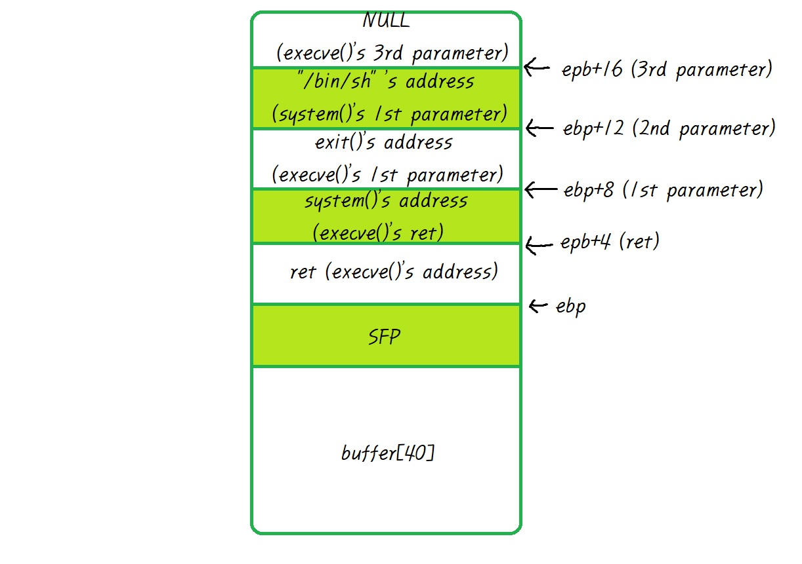
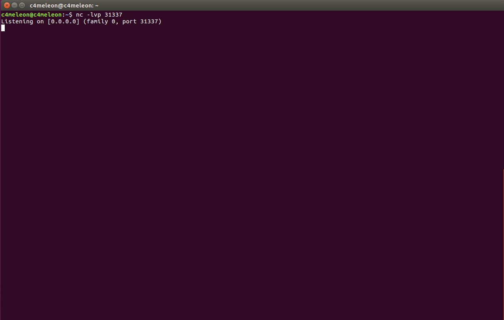

 Hacker School LOB는 Lord Of Bof의 약어로 BOF 원정대라는 뜻을 담고 있는 War-game이다.

---

 

gremlin
=======

 gate, gate 계정으로 로그인하여 파일 목록을 확인해보면 gremlin 실행 파일과 소스 파일을 볼 수 있다. 소스 코드를 분석하여 프로그램의 동작 원리와 어떤 취약점이 있는지 찾아보자.

 

 코드에 코멘트를 달아 놓았으니 그림을 참고하여 한 줄씩 보면 이해하기 편할 것이다.

 초반이라 그런지 이전에 풀었던 BOF와 비슷한 형식으로 코드가 간단한 편이다.

 정리하자면 256 bytes 크기의 buffer를 할당 받고, 실행 인자의 내용을 buffer에 붙여 넣고 출력한다. 실행 인자가 없다면 조건문 검사를 통해 error 코드를 출력한다.

 

 위 코드를 참고하여 BOF에서 배운 내용으로 쉽게 취약점을 찾을 수 있다. strcpy 함수를 사용하여 buffer에 데이터를 넣을 때 실행 인자의 크기가 buffer보다 크다면 overflow가 발생한다. 즉, buffer와 ret의 거리 만큼을 overflow하고 ret를 쉘 코드로 변조 해주면 될 것이다.

 gdb를 이용하여 스택의 구조를 알아보고 buffer와 ret의 거리를 알아내자.

 

 주석을 참고하여 c코드와 비교하며 보면 이해하기 쉬울 것이다.

 주목해야 할 점은 스택에 0x100(256) bytes가 할당 되었다는 것이다. 어디서 많이 본 숫자이지 않은가? 위 c코드에서 변수 buffer의 크기가 정확하게 256 bytes이다. 이 점으로 미루어보았을 때 dummy byte가 존재하지 않는다고 유추 할 수 있다. 결정적으로 코드를 쭉 보다보면 함수의 인자로 ebp-256의 주소가 전달되는 것을 알 수 있다. 이 주소에 어떤 값이 있을까? 바로 buffer변수이다.

 그럼 현재까지 우리가 알고 있는 정보로 stack을 그려보자.

 

 그림을 보면 ret위에 함수의 인자들이 쌓여있고, dummy byte 없이 ebp-256 지점이 buffer의 시작점인 것을 알 수 있다. 우리의 목적은 buffer와 ret 사이의 간격을 알아내는 것이다. 현재 buffer는 ebp-256, ret는 ebp+4 지점에 위치하고 있다. 즉, buffer와 ret 사이의 공간 260 bytes 만큼을 덮어쓰고 ret를 쉘 코드의 주소로 변조해주면 된다.

 쉘 코드를 환경변수에 등록하고 환경변수의 주소를 얻어 공격에 사용하는 기법으로 공격해보자.

 

 먼저, 환경변수에 쉘 코드를 등록한다.

 

 이 후 환경변수의 주소를 얻는 프로그램을 작성하여 컴파일 한다.

 

 그 다음은 간단하다. 컴파일한 프로그램을 실행시켜 환경변수의 주소를 얻어내고 buffer[256] + SFP = 260 bytes를 덮어써 RET에 접근한다. 그리고 RET는 환경변수의 주소로 변조시켜준다.

 그럼 위와 같이 간단하게 공격에 성공하여 비밀번호를 획득할 수 있다.

---

 

cobolt
======

 이번에도 역시 파일 목록을 확인한 결과 cobolt 실행 파일과 cobolt.c 소스코드 파일 2개를 볼 수 있다. 소스코드부터 바로 열어보자.

 

 이전과 똑같은 형식의 코드이다. 다른 점이 있다면 buffer의 크기가 256 bytes에서 16 bytes로 줄었다는 것이다. 왜 이런 문제를 내었을까? 한 번 생각해보자.

 buffer overflow 공격은 말 그대로 버퍼를 overflow 시켜 스택의 다양한 주소에 접근하여 원작자가 원치 않는 동작을 시키는 것을 말한다. 이 과정에서 우리는 버퍼에 쉘 코드를 담고 ret를 쉘 코드로 변조하며 공격을 시도할 수 있다. 이 때에 버퍼의 크기를 줄여 쉘 코드가 담기지 않을 정도의 크기를 가진 버퍼가 된다면 그 버퍼는 buffer overflow 공격에 사용하기 어려울 것이다. 이러한 특성 때문에 위와 같이 버퍼의 크기를 줄인다는 것은 buffer overflow 공격을 예방하는 일종의 보호기법이라고 볼 수 있다.

 하지만 우리는 앞에서부터 이미 buffer가 아닌 환경변수에 쉘 코드를 담음으로써 buffer의 크기와 상관없이 공격을 할 수 있었다. 위와 같은 보호 기법을 우회한 셈이다. 그럼 문제는 간단하다. 그저 buffer와 RET의 거리를 알아내고 dump 시켜 RET를 우리 것으로 만들면 된다.

 바로 디버깅 해보자.

 

 이전과 어셈블리 코드도 거의 동일하다. 다른 점은 앞에서 언급하였듯이 buffer의 크기 밖에 없다. 물론 dummy byte도 존재하지 않는 다는 것을 알 수 있다.

 보기 쉽게 스택을 그려보자.

 

 RET까지의 거리는 buffer[16] + SFP = 20 bytes이다. 그 말은 즉, 20 bytes 만큼을 dump 한 후에 우리가 앞에서 해왔던 방식으로 환경변수에 쉘 코드를 등록하고 환경변수의 주소로 RET를 덮어주면 된다는 것이다. 이로써 buffer의 크기가 줄어든 것과는 상관없이 공격을 할 수 있게되었다.

 

 역시나 앞과 마찬가지로 환경변수를 등록하고 환경변수의 주소로 RET를 dump한 결과 공격에 성공한 것을 볼 수 있다.

---

 

goblin
======

 파일 목록에서 goblin 실행 파일과 goblin.c 소스코드를 볼 수 있다. 한 번 열어보자.

 

 이전과 buffer의 크기가 동일하지만 입력 방식이 실행 인자 전달에서 프로그램 실행 후 사용자 입력으로 변경 되었다. 앞의 FTZ편에서 프로그램 실행 후에 입력을 처리하는 방법을 배웠다.

 cat 명령어를 이용하여 원하는 문자열을 덧붙여주는 것이다.

 디버깅부터 해보자.

 

 코드는 main의 인자와 에러 검출 코드가 없어져 훨씬 간단하다. 역시나 dummy byte가 존재하지 않는다.

 

 스택은 위와 같다. RET까지 거리는 역시 buffer[16] + SFP = 20 bytes이다.

 정리하면 20 bytes를 dump 시키고 RET를 쉘 코드가 담긴 환경 변수의 주소로 변조한다. 하지만 이 모든 과정은 cat 명령어를 이용하여 프로그램을 실행 시키고 진행되도록 한다.

 먼저, 환경변수의 주소를 얻는 과정까지 해보자.

 

 환경변수의 주소를 얻었다. 그럼 이제 cat을 이용하여 공격을 시도해보자. 20 bytes를 dump하고 환경변수의 주소로 RET를 덮어주면 된다.

 

 먼저 원하는 문자열을 괄호안에 입력하고 문자열의 끝에 ;과 cat을 입력한다. 그 후 |를 이용하여 프로그램을 실행시킨다.

 

 위와 같이 공격에 성공하였다.

---

 

orc
===

 orc 실행 파일, orc.c 소스코드 파일을 볼 수 있다.

 

 코드를 보면 큰 동작은 이전의 코드들과 비슷하다. 하지만 보호 기법 두 가지가 적용되어 있다. egghunter 부분을 이용하여 환경변수를 모두 0으로 만들어버린다. 그리고 if 조건문으로 argv의 48번째 값(배열은 0부터 시작)이 bf가 아니면 프로그램이 종료된다.

 우리가 앞에서부터 해왔던 환경변수를 이용한 공격을 할 수 없다. 또한 argv의 48번째 값을 bf로 맞추어야 한다는 조건이 생긴다.

 일단 디버깅을 하여 스택의 구조부터 파악해보자.

 이전 단계들에서는 전체 어셈블리 코드를 한 줄씩 모두 해석하였다. 하지만 이번 단계를 비롯하여 앞으로는 어셈블리의 코드양이 크게 증가하기 때문에 전체 코드를 모두 해석하기에는 많은 시간이 걸린다. 그러므로 스택에 공간을 할당하는 주요 부분만 빠르게 gdb를 통해 보고 코드 분석은 넘어가도록하자.

 

 위 코드를 보면 스택에 44 bytes 만큼의 공간이 할당 되었다는 것을 알 수 있다. 그리고 우리가 열어본 c코드를 참고하여 이 44 bytes는 buffer[40] + i = 44 bytes 라는 것을 마찬가지로 깨달을 수 있다.

 

 현재 스택의 모습이다. RET까지의 거리를 알고 있는데 쉘 코드를 담을 곳이 없다. 여기서 우리가 할 수 있는 것은 buffer에 쉘 코드를 담고 buffer 어딘가의 주소로 RET를 변조하는 것, 실행 인자에 쉘 코드를 담아 실행 인자의 주소로 RET를 변조하는 것, 두 가지가 있다. 첫 번째 방법은 결국 buffer는 실행 인자의 내용을 복사하는 것이므로 결국 두 번째 방법과 같은 원리가 된다.

 그럼 실행 인자에 쉘 코드를 담아야하는데 문제가 있다. 먼저 buffer 40 bytes를 dump 시켜줘야하므로 40 bytes를 사용하고, 조건문에 의해 argv[1]의 48번째 값은 bf여야 한다. 그렇기에 실행 인자 argv[1] 또한 쉘 코드를 담기 적절하지 않다. 그렇다면 이건 어떤가? argv[1]에는 조건을 만족하는 값을 넣어주고 argv[2]에 쉘 코드를 넣고 argv[2]의 주소로 RET를 덮어쓰는 방법이다.

 

 그럼 스택은 위와 같을 것이다.

 이제 argv[2]의 위치를 알아내면 된다. 그 전에 다시 한 번 현재까지 내용을 정리해보자.

 argv[1]는 buffer[40] + SFP = 44 bytes를 dump 해야한다. 그리고 RET는 우리가 찾아낸 argv[2]의 주소가 되어야 한다. 이 때 48번째 값이 bf여야한다. 그리고 argv[2]에는 쉘 코드가 담겨있으면 된다.

 최종적으로 argv[1] = 44 bytes + RET, argv[2] = shellcode가 된다. 본격적으로 gdb를 이용하여 argv[2]의 주소를 찾아내보자.

 

 먼저 strcpy 함수가 호출되는 시점에 break point를 걸어준다. 코드를 보면 strcpy 함수의 인자로 argv[1]이 전달되기 때문에 현재 시점에 bp를 걸고 스택을 보면 쉽게 argv[1]의 주소를 찾을 수 있을 것이다. 그리고 이 주소를 기준으로 argv[2]의 주소를 찾아내면 된다.

 

 x/100x $ebp 명령어를 이용해 스택을 본 결과 argv[2]의 값 A(41)의 시작 위치를 알 수 있었다. 좀 더 정확한 위치를 찾아 이 주소로 RET를 바꿔주기만 하면 이번 문제가 해결될 것이다.

 

 argv[2]의 시작 주소를 찾아내었다. 이제 이 주소를 RET로 변경해주고 argv[2]에는 쉘 코드를 담으면 된다.

 

 앞에서 설명한 것과 똑같다. buffer[40] + SFP = 44 bytes를 \x90으로 dump 시키고 RET를 argv[2]의 주소로 변조시킨다. 이 때 48번째가 bf이기 때문에 조건에 걸리지 않고 통과할 수 있다. 이후에는 그저 쉘 코드를 담아주기만 하면 된다.

 

 공격에 성공한 것을 확인할 수 있다.

---

 

wolfman
=======

 실행 파일과 소스 파일을 확인하고 열어보았다.

 

 변경된 부분에 주석을 추가하였다. 나머지는 이전과 같다. buffer를 모두 0으로 초기화 시킨다. 이유는 buffer에 사용자가 의도한 값이 담기는 것을 방지하기 위해서인데 예를 들면 쉘 코드와 같은 값을 말하는 것이다. 그러나 우리는 앞에서 buffer에 쉘 코드를 담지 않고, argv[2] 인자에 쉘 코드를 담았기 때문에 전혀 방해를 받지 않고 전과 같은 방식으로 공격을 하면 된다.

 공격 방법은 동일하므로 argv[2]의 주소만 찾아주면 된다. 방법은 이전과 같다.

 

 strcpy 함수 호출 지점에 bp를 걸고 argav[1] 인자와 argv[2]인자를 전달시켜 실행 시켰다.

 

 

 이번에는 x/200x $ebp 명령어를 사용하여 argv[2]의 시작점을 얻어내었다.

 

 그리고 이전과 마찬가지로 buffer[40] + SFP = 44 bytes를 dump하고 argv[2]의 주소로 RET를 변경하였다. argv[2]에는 쉘 코드를 담았다.

 

 실행 결과 정확하게 동작하는 것을 확인할 수 있다.

---

 

darkelf
=======

 언제나 그렇듯 실행 파일과 소스 파일이 있다. 소스 파일을 열어보자.

 

 이번에도 역시 이전과 동일한 코드이다. 길이를 검사하는 조건문 하나가 더 생겼는데 주석을 달아 놓았다.

 역시 우리는 꾸준히 48 글자 이하로 argv[1]에 전달 하였고, argv[2]를 사용하였으므로 이전과 동일하게 진행하면 된다.

 

 strcpy 함수에 bp를 걸고 argv[1], argv[2]를 전달한다.

 

 

 ebp를 확인하여 argv[2]의 주소를 얻어낸다.

 

 공격은 이전과 동일한 방식에 argv[2]의 주소만 바꿔주었다.

 

 이후 공격에 성공한 모습이다.

---

 

orge
====

역시 실행파일과 소스코드가 있다. 소스 코드를 열어보자.

 

 이전과 동일한 코드이고 바뀐 부분은 주석을 달아 놓았다. 내용을 살펴보면 argv[0] 인자의 길이를 검사하고 argv[0]의 길이가 77과 같다면 에레 메세지를 출력하고 프로그램을 종료시킨다.

 앞서 argv[1]과 argv[2]에 접근하여 공격을 수행하였다. argv[1]과 argv[2]는 실행 인자로써 우리가 \`\` 기호를 활용하여 인자를 전달 할 수 있었다. 그렇다면 argv[0]은 무엇인지 어떻게 접근 해야하는지 알아보자.

 msdn에는 'argv[0]은 프로그램을 호출하는 데 사용하는 명령'이라고 설명되어 있다. 이게 무슨 소리일까? 아직은 잘 모르겠다.

 위 설명 내용을 천천히 살펴보자. '프로그램을 호출하는 데 사용하는 명령이다.' 부분을 이렇게 바꿔보면 어떨까? '프로그램을 실행시키는데 사용되는 명령이다.' 뜻은 같지만 비교적 조금 더 직관적이다. 그렇다면 우리는 프로그램을 실행 시킬 때 어떤 명령어를 사용할까?

 

 예를 들어 test라는 프로그램을 실행시킨다면 명령어는 위와 같이 './test' 이다. 이제 msdn을 풀어써보자.

 test라는 프로그램을 실행시키는 명령어는 ./test이다. 즉, test 프로그램의 argv[0]은 ./test와 같다. 그렇다면 argv[0]은 대게 이런 모양 일 것이다.

> ./프로그램이름

 다시 문제로 돌아와서 그렇다면 현재 orge 프로그램의 argv[0] 길이는 ./orge이므로 6이 된다. 코드에서는 77의 길이를 만족하여야 한다고 하였으므로 조건문에 걸려 에러 메시지와 함께 프로그램이 종료 될 것이다.

 우리가 바꿀 수 있는 부분은 프로그램 이름 부분이다. ./을 제외하고 프로그램 이름을 orge에서 75글자의 문자로 바꾸면 조건문을 무사히 빠져나올 수 있게 된다.

 이를 가장 쉽게 해결하는 방법은 파일의 이름을 바꾸는 것이 있다. 그러면 파일의 이름 길이가 달라져 결국 argv[0]에도 영향을 끼치게 된다. 하지만 권한의 문제로 파일의 이름을 변경 할 수 없을 때가 있을 수도 있다. 이럴 때에는 어떻게 해야할까? 전에 BOF에서 파일 링크에 대해 배운 적이 있다. 바로 이 링크를 통해 위와 같은 문제를 해결 할 수 있다. 링크를 걸고 링크 파일을 실행 시켜주면 자신이 원하는 길이의 파일명으로 원본 파일을 실행 할 수 있을 것이다. 그렇게 되면 디렉토리 권한에 크게 관여받지 않고 argv[0]에 영향을 끼칠 수 있다.

 우리는 권한을 가진 tmp 파일에서는 이름을 변경하는 방법으로, 그리고 실제 홈 디렉토리에서는 링크를 거는 방법으로 문제를 해결 해보자.

 

 파일 이름을 orge에서 A가 59개가 되게 바꿔주었다. 여기서 코드에서 걸린 조건문은 argv[0]의 길이가 77과 같아야한다였는데 왜 A가 59개 밖에 없는지 궁금 할 것이다.

 argv[0]은 프로그램을 호출하는 명령어. 즉, 파일 이름이 아니라 명령어라는 말이다. 그러므로 파일 이름은 이 명령어의 길이를 조절해주는 장치에 불과하다.

 

 위와 같이 상대 경로로 프로그램을 실행하게 되면 ./를 포함한 파일명이 명령어가 되기 때문에 77에서 ./를 뺀 75개의 A를 쓰면 된다. 하지만 gdb를 통해 분석할 경우 절대 경로로 프로그램이 실행되기 때문에 아래와 같은 명령어로 프로그램이 실행된다. 그렇게 되면 상대 경로로 만든 파일은 gdb 상에서 argv[0] error에 걸리게 될 것이다. 이 점을 방지하기 위해 절대 경로를 기준으로 파일을 이름을 만들었다. 이와 같은 이유로 A의 갯수는 파일의 경로 /home/darklef/tmp/ 총 18 글자를 77 개의 글자에서 제외한 59(77 - 18)개가 된 것이다.

 

 gdb를 통해 분석해보면 전과 마찬가지로 dummy가 존재하지 않는 44 byte로 스택이 이루어져있다. 다른 특별한 변경 사항은 존재하지 않는다.

 

 break point를 걸고 파일을 실행 시켰다. 위에서 설명한대로 starting program을 보게 되면 파일의 절대 경로로 프로그램이 실행 된 것을 볼 수 있다.

 

 

 그런 다음, 인자로 준 argv[2]의 위치를 찾으면 된다.

 이제 모든 준비가 끝났으니 공격을 시도해보자. 공격 방법은 이전과 동일하다. argv[1]의 48번째를 bf로 맞춰주고 argv[2]에 쉘 코드를 담고 ret를 argv[2]로 바꿔주면 된다.

 

 전과 동일하게 공격을 시도 했으나 세그멘세이션 오류가 뜨며 실패 했다. 공격 과정에서 틀린 것이 없고 모든 것이 완벽한데 이유가 무엇일까?

 

 원인 분석을 위해 코어를 디버깅해보자. 메시지를 보면 0xbfffffb8에서 부터 값이 읽혀지지 않는다는 것을 알 수 있다. 이런 경우 코어 파일의 메모리 분석을 이용하여 원하는 값이 있는 위치를 찾으면 된다.

 

 위와 같이 gdb에서의 주소와는 다른 곳에 argv[1], argv[2]의 nop 코드와 쉘 코드가 모두 들어가 있는 것을 확인 할 수 있다. nop 코드가 위치한 적당한 주소 0xbffffb54 정도로 주소를 잡고 리턴시켜주자.

 

 공격에 성공하였다. 하지만, 우리는 tmp 파일에서 공격을 시도하였기 때문에 아직 다음 단계의 권한을 얻지 못하였다. 이제 제대로된 타겟에 공격을 시도해보자.

 

 이번에는 심볼릭 링크를 걸어 명령어 길이에 변환을 주었다. 파일명은 ./을 제외한 75개의 A이다.

 

 ./을 포함하여 75개의 A, 총 77글자의 명령어로 파일을 실행시키고 앞에서 얻은 주소로 리턴 주소를 변경하고 공격하였더니 성공적으로 공격이 통하였다.

---

 

troll
=====

 troll 파일을 열어보자.

 

 이전 코드와 비교해서 총 2군데가 변경되었다. 먼저 이전 단계에서는 argv[0]의 길이를 검사하던 조건문이 argv의 갯수를 2개로 제한시키는 조건문으로 변경되었다. 만약, argv가 3개 이상이라면 에러 코드가 출력 되고 프로그램이 종료 될 것이다. 그 다음으로는 argv[1]을 전부 초기화 시켜버린다.

 우리는 이전까지의 과정에서 사용해왔던 argv[2]에 쉘 코드를 넣는 방법을 사용하지 못한다. 그렇다면 쉘 코드는 어디에 넣어야 할까? argv[1]? argv[1]은 메모리가 초기화 되기 때문에 쉘 코드를 담고 있어야하는 버퍼에 적절하지 않다. 그럼 남은 곳은 argv[0]이다. 다행히도 앞에서는 argv[0]의 길이를 제한하였지만 현재 단계에서는 길이를 제한하지 않으므로 쉘 코드의 크기에 구애 받지 않고 쉘 코드를 저장 할 수 있다.

 그럼 어떻게 argv[0]에 쉘 코드를 넣을까? argv[0]은 앞에서 프로그램을 실행시키는 명령어가 들어간다고 배웠다. 그러면 프로그램을 실행시키는 명령어에 쉘코드와 nop 코드를 적절히 넣고 nop 코드의 주소로 ret를 조작하면 쉘 코드까지 ret가 흘러 갈 것이라고 예상 할 수 있다.

 

 설명대로 정확한 쉘 코드를 입력하였으나 심볼릭 링크 파일 생서에 실패하였다. 이유가 무엇일까?

 바로 argv[0]은 명령어가 들어가는 곳이다. 그래서 \\x2f 값이 디렉토리 경로를 나타내는 /기호로 변환되어 인식된다. 그렇기 때문에 \\x2f가 있는 곳은 모두 /기호로 인식하여 파일의 실행 경로가 꼬여버리는 것이다. 이를 해결하기 위해 다형성 쉘 코드라는 쉘 코드를 사용한다.

  **다형성 쉘 코드**

 다형성 쉘코드는 쉘 코드를 암호화 시키고 실행 전에 다시 복호화 시켜서 기존의 쉘 코드와 모양을 다르게 만드는 것이다. 그렇기 때문에 기존의 쉘 코드보다 길이가 더 길다.

 즉, 쉘 코드를 자신의 마음대로 암호화 시키고 다시 복호화 시키는 코드를 포함하여 쉘 코드를 만드는게 다형성 쉘 코드의 개념이다. 하지만, 암호화, 복호화와 상관 없이 다형성이라는 단어 자체에 주목하여 형태가 다양한 쉘 코드이고 쉘 코드의 기능만 한다면 그것 역시 다형성 쉘 코드라고 할 수 있다.

 

 그림을 보면 \\x2f가 제외된 다형성 쉘 코드를 사용하자 파일 경로가 꼬이지 않고 링크가 제대로 걸린 것을 확인 할 수 있다. (다형성 쉘 코드는 웹 검색을 해보면 여러 종류가 있으며 알아서 골라 쓰면 된다. 물론, 직접 만들어 보아도 좋다.)

 이제 gdb로 분석을 시도하여 argv[0]의 주소를 알아내면 된다. 그럼 argv[0]의 nop 코드 어딘가로 들어가게 되어 결국 우리가 argv[0]에 넣은 다형성 쉘 코드가 실행 될 것이다.

 

 strcpy 함수에 break point를 걸고 실행 시켰다.

 

 파일 실행 명령어 argv[0]부터 argv[1]까지 모두 잘 들어가 있는 것을 볼 수 있다. ret를 nop 코드가 위치한 적당한 곳 0xbfffb2a 쯤으로 잡으면 될 것 같다.

 

 이번에도 전과 마찬가지로 coredump 오류가 생겼다. core를 디버깅하여 원인을 알아내자. . 오류가 생긴 부분을 보면 이전과는 다른 주소에서 오류가 발생한 것을 알 수 있다.

 

 그리고 오류가 일어난 시점으로부터 멀지 않은 곳에 우리가 넣은 argv[0]의 값이 있는 것을 볼 수 있다. 그리고 nop 코드가 시작되는 지점도 얻었다.

 하지만, 위 바로 주소로 공격을 시도하면 다시 오류가 뜨는데 그 이유는 스택의 끝 주소는 메모리의 끝 주소이기 때문이라고 한다.

 

 위와 같이 gdb에서 본 스택의 적당한 영역부터 ebp를 살펴보면 argv[0]의 nop 코드를 확인 할 수 있다. 이 주소로 공격을 시도해보자.

 

 그럼 위와 같이 공격에 성공하였다. 현재 디렉토리는 tmp이기 때문에 홈 디렉토리로 이동하여 똑같이 링크를 걸고 공격을 시도하면 된다.

 

 먼저, 쉘 코드로 파일명이 작성된 링크 파일을 심볼릭 링크 한다.

 

 이후 얻은 ret 주소를 이용하여 공격을 시도하여 성공적으로 비밀번호를 얻어내었다.

---

 

vampire
=======

 

 이번 코드는 전에 봤던 조건들이 많이 사라지고 3개의 조건이 남았다. 먼저 인자의 갯수가 2개 이상이여야 한다. 이 조건은 argv 인자를 주기만 하면 되므로 신경쓰지 않는다. 다음 조건은 앞에서 봤던 argv[1]의 48번째 값이 bf여야 한다는 것이다. 그 다음으로 새로 추가된 조건은 argv[1]의 47번째 값이 ff가 아니여야 한다. 하지만 오류 메시지를 보면 계속 argv[1]의 47번째 값이 ff여야 한다는 것이 아니라고 말 해준다.

 조건이 검사되는 위치는 우리가 ret 조작을 위해 주소를 전달해주는 곳이다. 우리가 봐왔듯이 대부분의 주소는 0xbfff로 이루어져 있는데 ff가 아니여야 한다면 어떻게 해야할까?

 가장 간단하게 우회 방법을 생각한다면 주소가 0xbfff로 시작하지 않는 곳에 쉘 코드를 넣으면 된다.

 

 이 문제는 스택의 특성을 이용한 것인데 스택은 높은 주소에서 낮은 주소로 자라는 구조를 가진다. 즉, 0xbfff 보다 큰 주소인 0xc000으로 ret를 주어야 했다면 문제가 많이 어려웠겠지만 더 낮은 주소인 0xbffe로 스택을 키워주면 되는 간단한 문제이다.

 스택에 값은 넣을 수록 커지니 0xbfffffff에서 0xbffeffff 만큼 스택에 값을 넣어주면 된다. 즉, 0x10000 만큼의 값이다. 0x10000은 10진수로 65536이다.

 

 바로 gdb로 프로그램을 실행시키고, strcpy 함수에 break point를 걸었다. 조건문을 모두 우회 하는 코드를 작성하고, nop 코드를 추가하여 0x10000 만큼 스택을 늘려주었다.

 

 그리고 현재 스택의 바닥을 가리키는 ebp 레지스터를 살펴보면 주소가 0xbffe를 넘어간 것을 알 수 있다. nop 코드의 갯수가 워낙 많기 때문에 정확하게 스택을 보지 않고 적당히 떨어져 있는 거리를 ret로 주고 공격을 시도해보자.

 

 ret를 대충 0xbffeffff 즈음으로 두고 공격을 시도하였더니 성공적으로 쉘 코드가 동작하였다.

---

 

skeleton
========

 

 다시 조건문이 추가 되었다. 주석을 참고하여 코드를 보고 위 내용을 모두 정리해보면 다음과 같다.

<li>argv가 2개 이상</li><li>환경변수 제거</li><li>argv[1]의 48번째 값이 bf</li><li>argv[1]의 길이가 48이하</li><li>모든 argv 인자의 값을 초기화</li>

 위 정보를 통해 기존에 우리가 이용하던, 버퍼를 포함한 환경변수, argv를 사용 할 수 없게 되었다.

 우리가 현재 할 수 있는게 무엇일까?

 없다. 그냥 일단 뭐라도 해보자.

 

 gdb를 이용하여 프로그램이 끝나기 직전에 break point를 걸고 ebp부터 천천히 스택의 모든 정보를 읽어보자.

 

 현재 조건문을 모두 만족하는 코드를 인자로 프로그램을 실행 시키고 ebp를 살펴보자.

 

 더 이상 스택을 읽을 수 없을 때까지 진행하였을 때, 우리가 알아 볼 수 있는 글자가 나왔다.

 

> /home/vampire/tmp/skeleton

 이 글자를 미루어 봤을 때 경로를 나타내고 현재는 이 프로그램의 실행 경로이다. 0xbffffffe1에 위치하여 조건문을 우회 할 수도 있다. 바로 이 곳을 이용하여 쉘 코드를 전달하면 어떨까? 바로 시도해보자.

 

 우리는 이미 앞에서 orge 문제에서 경로를 통해 쉘 코드를 담아둔 적이 있다. 심볼릭 링크를 통해 쉘 코드로 이루어진 실행 경롤르 만든다. 물론 쉘 코드는 \\x2f 값이 인식되지 않기 때문에 다형성 쉘 코드를 사용한다.

 

 역시나 프로그램이 끝나기 직전에 break point를 걸고, 조건을 만족시키고 실행시켜 ebp를 확인해보자.

 

 0xbfffff67의 위치에서부터 nop 코드 + 쉘 코드가 정확히 들어가있다. 이제 이 주소를 ret 주소로 사용하면 되지만 역시나 스택의 끝 값에 해당하는 부분이기 때문에 뒤에 아무 값이나 덧붙여서 위치를 조금 앞당기자.

 

 뒤에 A 100개를 덧붙여서 새로운 링크 파일을 만들어주었다.

 

 nop 코드의 위치가 살짝 올라간 것을 볼 수 있다. 이 위치를 ret로 사용하여 공격을 시도하면 쉘을 획득 할 수 있을 것이다.

 

 홈 디렉토리로 이동한 뒤에 똑같이 링크 파일을 만들었다. 이제 남은 것은 예상을 확신으로 만드는 것 뿐이다.

 

 예상이 확신이 되는 순간이다. 성공적으로 공격을 끝마치고 비밀번호 획득에 성공하였다.

---

 

golem
=====

 

 또 다시 조건문과 코드가 변경되었다. 조건문은 최소한의 argv 갯수와 argv[1]의 48번째 값이 bf인 것이다.

 이후에 추가된 코드를 살펴보자. 항상 그랬듯이 buffer는 초기화 시키고 그 밑을 보면 buffer + 48 지점부터 메모리에 올라간 모든 정보를 초기화 시킨다. 이번에도 역시 인자, 환경변수, 버퍼 모두 사용이 불가하다.

 

 스택을 그려보면 buffer+48 지점을 알 수 있다. 이 지점부터 스택의 가장 최상단까지 모두 초기화 시킨다. 즉, ret가 위치한 주소보다 더 높은 곳에 위치한 정보들은 다 초기화 된다.

 그럼, 우리는 도대체 어디에 쉘 코드를 담을 수 있을까? 바로, buffer 보다 낮은 위치에 자라잡은 데이터이다. 이전과는 반대의 상황인 것이다.

 우선, 낮은 영역의 데이터에 접근하기 전에 스택의 구조를 다시 한 번 짚어보며 스택의 낮은 부분에는 어떤 정보가 있는지 알아보고, 어떤 곳을 우리가 사용 할 수 있는지 확인해보자.

 

 위 그림을 보게 되면 우리가 데이터를 담고 주로 이용하는 stack. 즉, buffer가 들어 있는 공간보다 더 낮은 곳에는 heap이라는 영역과 bss, data, code 영역에 존재한다. 하지만 이 영역은 코드 컴파일 시에 크기가 결정되므로 우리가 임의로 값을 조작 할 수 없다. heap도 마찬가지이다. heap은 동적할당으로 주소가 할당되는데 우리가 코드를 건드려 메모리를 할당하지 못하기 때문에 마찬가지로 사용하기 어렵다.

 그렇다면 남은 곳은 stack이다. 이 때 우리가 주목해야 할 점은 코드를 통해 스택의 최상단부터 초기화가 시작되어 점점 위치가 낮아지고 buffer 위치에서 초기화가 멈춘다는 얘기이다. 앞에서 말했듯이 stack에 존재하는 모든 영역을 초기화 시키는 것이 아니기 때문에 buffer 보다 낮은 곳에 위치한 데이터는 초기화 되지 않는다.

 그렇다면 스택에 낮은 곳에는 어떤 정보가 들어 있을까?

 

 프로그램이 실행되기 위해서는 프로그램 뿐만 아니라 라이브러리와 같은 여러가지 다양한 정보들이 필요하다. 라이브러리가 왜 필요할까? 프로그램 내부에서 사용하는 함수들 예를 들어 printf(), strcpy() 등과 같은 함수들도 실행을 해야하기 때문에 이 함수들을 실행 시켜 주는 라이브러리를 함께 로드하게 된다. 일반적으로는 외부 라이브러리를 사용하여 함수를 불러오기 때문에 프로그램과 다른 메모리 영역에 라이브러리가 존재한다. 그리고 대부분의 경우 라이브러리는 스택의 낮은 곳에 위치하고 있다. 그렇기 때문에 이번 문제를 푸는 데에 큰 포인트가 될 것이다.

 이번엔 외부 라이브러리에 존재 하지 않는 함수를 추가하여 사용하게 될 경우를 보자. 함수가 실행되기 위해서는 메모리에 반드시 로드되어야 하기 때문에 프로그램이 실행 되기 전에 미리 메모리에 로드가 될 것이다.

 

 이 때, 필요한 라이브러리를 먼저 로딩시켜주기 위해 사용하는 것이 'LD_PRELOAD' 라는 환경변수이다. LD_PRELOAD에 파일을 등록하게 되면 프로그램이 메모리에 로드되기 전에 LD_PRELOAD에 등록된 파일을 먼저 로드하게 된다.

 우리는 이 정보와 이전 단계에서 풀었던 파일 이름의 위치에 대한 정보를 활용해 문제를 풀 것이다. 이전 단계에서는 메모리의 끝 부분이자 낮은 영역에서 프로그램의 이름을 볼 수 있었다. 이번에도 역시 LD_PRELOAD에 파일을 등록하고 프로그램을 실행 시키면 LD_PRELOAD에 등록된 파일의 이름과 코드가 메모리에 올라가 있을 것이다. 이 위치는 이전 단계의 정보로 미루어 보았을 때 buffer보다 낮은 곳에 위치한다고 예상 할 수 있고 그렇게 되면 초기화 되는 영역에 해당하지 않게 된다.

 그렇다면 LD_PRELOAD에 쉘 코드로 이루어진 파일 이름을 등록하고 스택의 낮은 곳 어딘가에 위치해 있을 이 파일 이름을 찾아 ret로 사용하면 초기화 되지않고 사용이 가능 할 것이다.

 지금부터 한 번 해보자.

 

 우선, 아무런 동작을 하지 않는 코드를 작성하고 gcc -fPIC -shared 옵션을 이용하여 공유 오브젝트로 만들어준다. 공유 오브젝트는 같은 메모리 공간을 쓰는 오브젝트를 말하고 이는 곧 외부 라이브러리로 사용이 가능하다는 뜻이다. 그리고 실행 파일의 이름을 쉘 코드로 만들어준다. 공유 오브젝트가 생성되고 파일 이름이 사용되기 때문에 다형성 쉘 코드를 사용해야한다.

 

 앞서 설명하였듯이 LD_PRELOAD 환경변수에 이 파일을 등록하여 공격 대상이 되는 프로그램을 실행 시켰을 때 파일 이름인 다형성 쉘 코드가 스택의 낮은 곳 어딘가에 위치하게 된다.

 gdb를 이용하여 이 어딘가의 정확한 위치를 알아내자.

 

 스택의 모든 정보를 확인하기 위해 프로그램이 종료되기 직전에 break point를 걸고 실행 시킨다.

 

 스택의 낮은 곳을 확인해야 하기 때문에 esp보다 3000정도 낮은 곳부터 올라오며 스택을 쭉 확인해보자. 만약, 이 값에 존재하지 않는 다면 더 낮은 지점 esp-4000, 그럼에도 존재하지 않는다면 더 낮은 지점부터 시작하여 값을 확인하면 된다.

 

 값을 쭉 확인하다가 nop 코드를 발견하고 그 밑에 다형성 쉘 코드가 올바로 들어가 있는 것을 확인하였다. nop 코드의 중간 쯤에 위치한 적당한 주소를 ret로 사용하여 공격을 시도해보자.

 

 획득한 nop 코드의 주소로 올바르게 공격이 성공하였다.

---

 

darkknight
==========

 

 이전과는 아예 다른 형식의 코드이다. 먼저 main 함수에서 argv[1]을 인자로 problem_child 함수를 호출한다.

 problem_child 함수는 buffer를 할당하고 strncpy 함수를 이용하여 buffer에 인자를 복사한다. 이 때 길이제한이 41 byte이기 때문에 overflow가 일어난다.

 위와 같은 경우를 Frame Pointer Overflow라고 한다. 그림을 통해 자세히 알아보자.

 

 스택의 모양은 대강 이럴 것이다. 40 byte인 buffer를 41 byte로 overflow하게 되면 SFP의 끝 자리 1 byte가 덮어써진다. SFP는 이전 프레임의 base pointer를 담고 있다. 즉, base pointer를 원하는 곳으로 이동 시킬 수 있다는 말이다.

 

 함수의 에필로그를 떠올려 보면 이것이 가지는 의미가 얼마나 큰지 알 수 있다. mov esp, ebp를 통해 esp가 ebp와 같아지고 pop ebp 과정을 거쳐 esp가 ebp+4(ret)를 가리키게 되며, ebp는 이전 프레임으로 복구된다. 그리고 ebp+4에 위치한 값 ret가 eip에 들어가게 되며 원래의 흐름을 되찾게 된다. 이 때 ebp+4의 지점을 찾아간다는 점을 유심히 살펴보아야한다. 만일, 우리가 의도적으로 ebp의 위치를 바꿀 수 있다면 ebp+4 지점에 쉘 코드를 놔두고 SFP를 조작한다면 다음 함수가 종료 될 때 ret는 쉘 코드가 되어 쉘이 실행 될 것이다.

 이와 같은 취약점을 Frame Pointer Overflow라고 하며 우리는 이번 단계에서 이 취약점을 이용하여 공격을 시도 할 것이다.

 

 problem_child 함수를 디버깅해보자. 우선, 종료되기 직전에 break point를 걸고 41 byte로 overflow 시켜 실행 시켰다.

 

 그리고 esp를 확인하면 40 byte의 buffer와 1 byte가 overflow된 SFP를 볼 수 있다.

 우리는 위 정보를 통해 buffer가 0xbffffaa4에서 시작된다는 것을 알 수 있다. 그럼 SFP를 0xbffffaa0 지점으로 변조 시키고 buffer에는 ret + nop + 쉘 코드를 담으면 될 것 같다.

 SFP가 0xbffffaa0인 이유는 ret는 ebp+4 이므로 ebp+4 지점인 0xbffffaa4에서 -4를 해주었다. 이 지점에는 ret가 들어가고 그 이후 ret인 0xbffffaa8 부터 nop 코드가 실행 된다.

 예상되는 코드는 다음과 같다.

> \\xxa8\\xfa\\xff\\xbf(4 byte) + \\x90 (11 byte) + shellcode (25 byte) + \\xa0

 

 실행 결과, core dump가 발생하였다. core 디버깅을 하여 원인을 분석하자.

 

 gdb로 core를 보면 우리가 처음 알아내었던 주소보다 현재 위치가 조금 밀린 것을 확인 할 수 있다. 이에 알맞게 SFP는 0xbffffab0으로 바꿔주고 ret는 0xbffffab8로 변경하여 다시 실행해보자.

 

 바뀐 주소를 사용해 공격에 성공하였다.

---

 

bugbear
=======

 

 또 다른 형태의 코드가 나타났다. 조건은 하나가 걸려있는데 이전과 다르게 argv[1]의 48번째 값이 bf가 아니여야 통과된다. 즉, 0xbf로 시작되는 스택의 주소를 사용 할 수 없다.

 이를 해결하기 위해 RTL(Return To Library) 기법을 이용 할 것이다. RTL 기법은 공유 라이브러리 상의 함수를 사용하여 해당 함수의 주소로 ret를 덮어쓰는 것을 말한다.

 우리는 쉘을 실행 하는 것이 목표이기때문에 system ()함수를 사용하여 system("/bin/sh"); 명령어를 실행 시킨다. 이를 위해 명령어를 스택에 구축하여야 한다.

 우선, system() 함수의 주소를 구하여 ret를 덮어쓴다. 그리고 system() 함수의 프롤로그에 따라서 push ebp와 mov ebp,esp 명령어를 차례로 실행한다.

 

 그림을 보게 되면 ret를 system() 함수의 주소로 덮어쓰고, system() 함수의 프롤로그를 실행한 모습이다. push ebp 명령어를 통해 이전 프레임의 base pointer가 저장되므로 SFP가 되고 그보다 4 byte 높은 곳에는 ret가 위치함으로 ret가 들어있다. 그렇다면 인자를 넣을 수 있는 곳은 ret의 4 byte 위 지점인 ebp+8이 된다. 이제 처음부터 흐름을 따라가보면 자연스럽게 RTL 기법을 통한 system("/bin/sh"); 명령어가 실행 될 것이다.

 우리는 스택을 위와 같은 모습으로 구성하면 성공적으로 RTL 기법을 사용 할 수 있게 된다.

 이제 천천히 위 순서대로 RTL 기법을 사용해보자.

 

 첫 번째로 ret를 덮어 쓸 system 함수의 주소가 필요하기 때문에 gdb를 이용해 system 함수의 위치를 알아낸다.

 

 다음으로는 "/bin/sh" 인자를 전달하기 위해 메모리 어딘가에 존재하는 "/bin/sh"의 주소를 찾는 코드를 작성한다.

 

 프로그램을 실행시켜 "/bin/sh"이 위치한 곳의 주소를 얻었다.

 이젠 앞에서 설명한 스택 구성과 똑같이 만들어주면 된다.

> buffer(40 byte) + SFP(4 byte) + ret(system()의 주소) + ret(ebp+4) + "/bin/sh"의 주소(ebp+8)

 위와 같은 형식으로 코드를 작성하면 이전의 스택과 같은 모습이 된다.

 

 역시나 공격에 성공하였다.

---

 

giant
=====

 

 코드가 굉장히 길어졌다. 주석을 참고하여 코드를 보고 내용을 정리해보면 다음과 같다.

<li>libc의 주소를 획득</li><li>execve의 오프셋을 획득</li><li>libc와 execve의 오프셋 연산을 통해 execve 함수의 주소를 획득</li><li>argv[1]의 44~48번째 값이 execve 함수의 주소와 같은지 검사</li>

 argv[1]의 44번째부터 48번째까지는 overflow 구간으로 ret에 해당한다. 즉, 위 코드는 execve 함수로 흐름을 return 시켜 쉘을 실행시키는 RTL 기법을 사용하라고 얘기하고 있다.

 execve 함수는 세 개의 인자를 가지는데 첫 번째 인자를 실행 하고, 두 번째 인자는 첫 번째 인자의 매개변수, 세 번재는 환경변수이다.

 우리는 execve 함수의 첫 번째 인자로 exit()을 전달하여 execve()를 바로 종료 시키고, execve의 ret를 system()으로 덮어 쓸 것이다.

 

 우리가 만들어주어야 할 스택의 모습이다.

 흐름을 따라가보면 변조된 ret로 인해 execve() 함수가 실행 될 것이다. 그럼 ebp+8, epb+12, ebp+16 지점의 세 개의 인자들을 불러 오고, 첫 번째 인자 exit() 함수가 실행되어 execve() 함수가 종료된다. 이 때 execve() 함수의 ret가 system() 함수이기 때문에 system() 함수가 실행되고 system() 함수의 분기에서 ebp+8의 "/bin/sh"의 주소를 인자로 얻어 쉘이 실행 된다.

 이제 모두 주소를 구해주기만 하면 된다.

 

 libc의 주소와 execve의 오프셋을 얻었으니 두 개를 더해주어 execve() 함수의 주소를 구해준다. execve()의 위치는 0x400a9d48이다.

 이제 system()과 exit()의 주소를 구해주자.

 

 각각의 주소를 얻었다.

 남은 것은 "/bin/sh"의 주소이다. 과정은 이전과 동일하다.

 

 

 "/bin/sh"의 주소도 구했고, NULL 값은 스택의 0xbffffffc에 항상 존재한다.

 마지막으로 정리해보자.

<li>execve - 0x400a9d48</li><li>system - 0x40058ae0</li><li>exit - 0x400391e0</li><li>"/bin/sh" - 0x400fbff9</li><li>NULL - 0xbffffffc</li>

 이제 이대로 overflow 시켜 공격을 시도 하기 전에 execve()의 주소중 \\x0a 부분이 \\x00으로 인식되어 값이 변조된다. 이를 예방하기 위해 ""로 묶어주게 된다. 이는 \\n이 \\x0a와 같은 값임을 이용하여 문자열 \\x0a(\\n)을 전달해주는 것과 같다.

 

 buffer(40 byte) + SFP(4 byte)를 overflow 시키고 획득한 주소들로 스택을 채워 공격에 성공하였다.

---

 

assassin
========

 

 코드를 보면 이전에 사용하던 RTL 기법 역시 사용 할 수 없게 되었다. 이로 인해 스택과 라이브러리 영역을 모두 ret로 사용 할 수 없다.

 하지만 인자의 길이에 제한이 없기 때문에 ret의 위쪽까지는 얼마든지 overflow 시킬 수 있다. 그리고 argv[1][47]의 범위를 벗어나기에 우리가 원하는 주소 어느 곳이라도 모두 넣을 수 있다. 우리는 이 점을 이용하여 이번 문제를 해결 할 것이다.

 이제 문제는 어떻게 ret를 넘어가 위쪽의 주소로 도달하느냐인데, 함수 에필로그 과정을 자세히 들여다보자.

 

 먼저, mov esp, ebp와 pop ebp를 수행하고 esp가 ret를 가리킨다. 그리고 ret(pop eip) 명령어를 거쳐 ret에 위치한 값을 eip에 넣는다.

 

 여기서 우리가 ret에 ret(pop eip) 명령어를 넣고 ret(pop eip) 명령을 한번 더 수행시키면 어떻게 될까? eip가 한 칸 더 올라가서 우리가 ret 위에 쌓은 스택을 가리키게 될 것이다. 그럼 모든 문제가 해결되었다. 직접 해보자.

 

 ret 명령어가 위치한 곳을 보면 0x0804851e로 0x08으로 시작되어 조건문에 걸리지 않는다.

 이제는 쉘 코드를 담고 쉘 코드가 담긴 위치를 찾아 진짜 ret로 사용하면 된다.

 

 적당한 위치에 break point를 걸고 현재는 BBBB가 위치한 곳의 올바른 값을 찾아주자.

 

 nop 코드가 위치한 곳을 찾았다. 적당히 0xbffffc08 정도로 쉘 코드 주소를 잡아주자.

 

 pop eip를 통해 eip를 위로 끌어올려 정상적으로 쉘 코드 실행에 성공하였다.

---

 

zombie_assassin
===============

 

 코드는 이전과 거의 동일하다. 한 가지 달라진 점이 있다면 strncpy를 사용하여 길이 제한을 두었다. buffer(40 byte) + SFP(4 byte) + pop eip(4 byte) + ret(4 byte) = 52 byte이기 때문에 이전 단계에서 사용한 pop eip를 사용하는 기법은 사용 할 수 없게 되었다.

 이번에는 어떤 방법을 사용해야 할까? 이전과 비슷하지만 다른 FAKE EBP, FEBP라고 불리는 기법을 사용 할 것이다. 이번에도 역시나 함수 에필로그 과정을 이용한 것으로 이전 단계에서는 ret를 pop eip가 되도록 하였다면, 이번에는 ret가 leave(mov esp, ebp; pop ebp)가 되도록 하는 것이다.

 ret가 leave가 될 경우 스택의 변화를 보자.

 

 스택을 위와 같이 구성하게 되면 FEBP 기법이 적용된다.

 먼저, 왼쪽의 스택이 첫 번째 leave를 한 모습이다. mov esp, ebp를 하여 esp와 ebp가 모두 SFP를 가리키게 되고 pop ebp를 통해 ebp가 SFP 값인 Fake EBP를 가리키게 된다. 그리고 에필로그에 따라서 pop eip를 수행하면 leave 명령어가 있는 ret가 시작된다.

 그 모습이 오른쪽의 스택이다. ret에 leave에 따라서 mov esp, ebp를 한번 더 수행하게 되고 그 위치는 Fake EBP이다. 다시 pop ebp를 수행하면 esp는 쉘 코드가 들어있는 ret를 가리키게 된다. 이제 ebp는 신경쓰지 않아도 된다. 이후 pop eip를 실행하여 eip = ret가 된다. 즉, ret에 들어있는 쉘 코드가 실행되는 것이다.

 정리해보면 leave와 ret의 에필로그를 두번 반복하여 자신이 원하는 ret를 찾아가게 하는 것이다.

 이번에도 역시 스택을 위와 같은 모습으로 만들어주면 된다. buffer(40 byte) + SFP(4 byte) + RET(4 byte)를 overflow 시키면 되서 48 byte로 길이제한을 넘기지 않는다. ret 위에 데이터는 argv[2]를 이용해 쌓아주자.

 

 먼저, ret를 leave 명령어로 변경해 에필로그를 두번 수행시켜주어야 함으로 leave 명령어의 주소를 찾아냈다. leave 명령어는 0x080484df에 위치하고 있다.

 

 strncpy() 함수가 실행되기 직전에 break point를 걸고 우리가 필요한 주소를 알아내기 위해 코드를 작성하고 실행하였다. 두 번째 인자의 AAAA가 fake ebp이다. 위 코드에 BBBB는 fake ebp의 주소가, CCCC에는 쉘 코드의 주소가 필요하다.

 

 우리가 필요한 정보를 모두 얻었다. fake ebp는 0xbffffbd4에 있고, 쉘 코드는 0xbffffbdc에 있다.

 

 위 정보를 모두 넣어 공격을 시도 해보았지만 coredump가 발생하였다. core 디버깅을 통해 원인을 분석해보자.

 

 위치가 조금씩 밀려있는 것을 볼 수 있다. 이에 맞게 fake ebp의 주소는 0xbffffbb8로 해주고, 쉘 코드의 주소는 0xbffffbc8 정도로 해주자.

 

 FEBP 기법을 성공적으로 사용하였다.

---

 

succubus
========

 

 코드가 매우 길어졌다. 천천히 흐름을 읽어보자.

 우선, main() 함수부터 살펴보자. 이전과 동일하게 40 byte의 buffer를 할당한다. 첫 번째 조건문은 argv[1]에 라이브러리 영역을 검사하여 외부 라이브러리 사용을 막는다. 그리고 addr에 DO() 함수의 주소를 넣고 argv[1]의 44~48 지점과 addr을 비교한다. 여기서 비교되는 지점을 한 번 생각해보자. buffer(40 byte) - SFP(4 byte) - ret(4 byte)와 같은 구조로 스택이 형성되기 때문에 argv[1]의 44~48 지점은 ret라고 볼 수 있다. 즉, main의 ret를 DO() 함수의 주소로 반드시 덮어주어야한다. 이후는 스택 영역과 공유 메모리 영역을 초기화 해서 사용하지 못하게 한다.

 main을 분석해보았으니 위에 정의된 함수 DO(), GYE(), GUL(), YUT(), MO()를 보면 check 조건문을 통해 DO - GYE - GUL - YUT - MO 순서대로 차례로 실행되어야만 check 조건이 만족된다. MO() 함수를 보면 system()을 통해 쉘을 실행 시킬 수 있을 것 같다.

 정리하자면 먼저 main의 ret를 overflow 시켜 DO의 주소로 덮어쓰고 DO의 ret는 GYE로, GYE는 GUL, GUL은 YUT, YUT은 MO로 각각 ret를 덮어쓰면 된다. 그리고 MO를 호출 할 때에는 쉘을 실행시키기 위해 "/bin/sh" 인자를 스택에 쌓아주어야 한다. 위 과정을 모두 거치면 성공적으로 쉘을 실행 시킬 수 있을 것이다.

 

 스택을 위처럼 구성하면 도,개,걸,윳,모의 순서대로 함수가 실행 된다. Do()의 주소로 ret를 덮어쓰는 것까지는 이해가 갈 것이다. 그 다음부터는 왜 바로 4 byte 위에 그 다음 ret가 존재하는지 알아보자.

 ret에 의해 DO() 함수로 들어오면 맨 처음 함수 프롤로그를 실행한다. push ebp; mov ebp, esp 과정을 수행하는 것이다. 여기서 다음 ret가 4 byte 위에 존재하는 이유가 나오는데 ret를 위와 같이 쌓아두면 함수 프롤로그와 에필로그 과정에 SFP는 ret의 밑에 push 되고 다시 pop 되면서 esp와 eip가 4 byte 위인 ret를 가리키게 된다.

 이제 위 순서에 맞게 스택을 구성하려면 함수들의 주소가 필요하다. gdb를 통해 하나씩 봐도 되지만 조금 더 간편하게 nm 명령을 이용하여 한 번에 주소를 알아내자. nm은 오브젝트 파일을 대상으로 파일에 포함된 심볼의 리스트를 볼 수 있게 해준다.

 

 nm을 이용하여 오브젝트 파일을 열고 grep 명령어로 함수들을 골라냈다. 그리고 각 함수들의 주소를 얻었다.

 위 주소들을 사용하여 올바른 순서대로 함수가 실행되는지 테스트 해보자.

 

 올바른 순서대로 동작한 것을 볼 수 있다.

 이제 남은 것은 MO() 함수의 인자로 "/bin/sh"을 전달하여 system("/bin/sh")을 실행시키는 것이다. 스택은 이전에 했던 RTL과 같이 MO() 함수의 ebp+4 지점에는 dummy(ret)를, ebp+8 지점에 인자를 쌓아두먼 된다.

 

 최종적으로 스택의 모습은 위와 같다.

 

 break point는 strcpy 걸고 프로그램을 실행 시켰다. 이전과 동일한 순서로 함수가 진행되게 하고 dummy와 "/bin/sh"의 임시 주소 CCCC를 넣어주었다. 그리고 인자 "/bin/sh"을 전달하기 위해 argv[1]의 끝에 "/bin/sh"을 추가하고 스택 어딘가에 위치한 "/bin/sh"의 주소를 찾아서 CCCC 대신 넣어주면 된다.

 

 BBBB와 CCCC를 거쳐 0xbffffc01에 "/bin/sh"가 들어있는 것을 확인하였다. 이제 이 주소로 인자를 전달하기만 하면 된다.

 

 그러나 또 core dump가 발생하였다. core 디버깅을 해보자.

 

 esp를 기준으로 확인한 결과 "/bin/sh"를 확인하였고 기준 값을 조금씩 증가시켜서 정확한 위치를 얻었다. 이 주소로 공격을 시도하면 아마 성공 할 것이다.

 

 역시나 성공하였다.

---

 

nightmare
=========

 

 이번에는 main의 ret를 strcpy() 함수의 주소로 덮어 써야한다. 그리고 buffer+48 지점을 AAAA로 초기화 하는데 이 지점은 buffer(40 byte) + SFP(4 byte) + ret(4 byte)로 ret의 다음 byte를 말한다.

 

 위 조건을 만족시켜 ret를 strcpy로 덮어 쓴 후의 모습이다. 정상적인 실행을 위해 strcpy에 인자가 필요하기 때문에 AAAA의 4 byte 위 지점에 인자 2개를 넣어주어야 한다.

 이 때 인자를 활용하여 AAAA의 위치를 덮어쓰면 어떻게 될까? 현재 AAAA의 위치는 이전 단계에서 봐왔듯이 strcpy()의 ret이다. 즉, ret를 우리가 원하는 지점으로 덮어 쓸 수 있다는 말이 된다.

 우리의 목표는 쉘을 실행 시키는 것이므로 AAAA를 system() 함수의 주소로 덮어쓰면 된다. 이를 위해 strcpy의 인자로 AAAA의 주소, system()의 주소가 필요하다.

 

 현재까지의 스택 모습이다. strcpy가 실행되면 인자를 받아 AAAA가 system()의 주소가 된다. 여기서 문제가 발생한다. strcpy() 함수가 끝나면 strcpy의 ret가 system()이기 때문에 system()을 실행하려고 할 것이다. 그럼 다시 system()의 인자가 필요하다. 물론 그 지점은 ebp+8 이다. 하지만 현재 system()의 ebp+8지점에는 이미 system()의 주소가 들어 있기 때문에 옳지 못한 참조가 된다.

 이를 해결하기 위해 우리는 buffer를 활용한다. buffer에 system()의 주소와 인자를 모두 담아두고 AAAA를 system()의 주소가 아닌 buffer의 주소로 덮어쓰면 strcpy의 ret는 buffer가 되고, buffer에 저장된 system()의 주소를 따라 system()이 실행 될 것이고 역시나 ebp+8 지점에도 AAAA가 buffer로 overflow 되어 인자가 존재하게 된다.

 정리해보면 다음과 같다.

> system()'s Address(4 byte) + dummy(4 byte) + "/bin/sh" 's Address(4 byte) + NOP (32 byte) + strcpy()'s Address + AAAA(4 byte) + AAAA's Address(4 byte) + buffer's Address(4 byte)

 필요한 정보를 하나씩 얻어보자.

 

 system() 함수의 주소는 0x40058ae0이고, strcpy() 함수는 코드에 주소가 존재하여 0x08048410으로 획득하였다.

 

 

 "/bin/sh"의 주소는 0x400fbff9이다.

 

 스택이 할당된 지점에 break point를 걸고 실행 시켰다. AAAA의 주소와 buffer의 주소는 ebp를 기준으로 얻을 수 있다. AAAA는 ebp를 기준으로 SFP(4 byte) + RET(4 byte) 이므로 ebp+8 지점에 위치한다. buffer는 간단하게 ebp-40 지점이다.

 즉, AAAA의 주소는 0xbffffac0, buffer의 주소는 0xbffffa90이다.

 필요한 정보를 모두 얻었으니 위의 코드에 대입하여 공격을 시도해보자.

 

 운 좋게 core dump에 걸리지 않고 한 번에 공격에 성공하였다.

---

 

xavius
======

 

 코드를 보면 fgets를 사용하여 입력을 받는다. 그리고 argv는 존재하지 않고 stack, binary, library 영역을 모두 검사하여 사용하지 못한다.

 이번 문제는 fgets에 힌트가 있다. 바로 stdin을 이용하여 library 검사 조건을 우회하는 것이다. library 검사 조건이 0x40으로 시작하는 주소를 검사하는 것이 아니기 때문에 stdin이 위치한 영역은 초기화 되지 않는다.

 fgets에 값을 입력하면 그 값은 stdin에 저장되는데 이 값이 초기화 되지 않기 때문에 쉘 코드를 담아 ret로 사용 할 수 있는 영역이 되는 것이다.

 우리가 해줘야 할 것은 우리가 입력한 내용이 stdin 어딘가에 담겨 있으니 그 위치를 찾고 ret를 우리가 찾은 위치로 덮어주기만 하면 된다.

 우선, stdin 부터 찾아보자.

 

 fgets의 인자를 보면 0x08049a3c가 stdin의 주소인 것을 알 수 있다. fgets가 끝난 직후에 break point를 걸고 좀 더 자세히 들여다 보자.

 

 stdin 위치를 하나씩 쭉 확인한 결과 0x40015000에 우리가 입력한 값이 들어있다는 것을 알았다. 이 주소에 쉘 코드를 담고 이 주소를 ret로 사용하면 될 듯하다.

 

 NOP(19 byte) + shell code(25 byte) + RET(4 byte)로 buffer를 overflow 시켜 간단하게 공격에 성공하였다.

---

 

death_knight
============

 

 위 코드는 소켓 프로그래밍 코드로 6666번 포트로 소켓을 열고 입력을 받아 buffer에 저장하는 내용이다. 이 때 buffer는 40 byte이지만 256 byte 만큼을 입력 받기 때문에 overflow가 발생한다.

 네트워크를 통한 공격이기 때문에 기존의 쉘 코드를 이용하여 공격을 하게 되면 쉘을 얻어도 연결이 지속되지 않는다. 그렇기 때문에 쉘을 얻어 외부로 연결 시켜주는 쉘 코드를 사용해야한다.

 

 she 변수는 인터넷에서 구한 reverse shell code이다. reverse shell code는 서버 쪽에서 클라이언트 쪽으로 연결을 할 수 있게 해주는 쉘 코드이다. 연결을 받을 클라이언트 쪽에서 포트를 열고 기다린 후 서버에서 쉘 코드를 실행하면 클라이언트와 연결이 되고 메시지를 보낸다.

 표시된 부분에는 자신의 ip 주소를 16진수로 변환하여 넣은 것과 포트 번호이다. 현재는 기본 포트인 31337번을 사용한다.

 그리고 스택의 끝부터 1씩 감소되며 클라이언트로 연결을 시도한다. 공격 코드는 dummy(44 byte) + reverse shell code's address(ret, 4 byte) + NOP(40 byte) + reverse shell code(92 byte)이다. 이 코드가 올바른 위치에 자리 잡고 동작하게 되면 클라이언트와 성공적으로 연결 된다.

 이제 연결을 받을 클라이언트에서 포트를 열어 놓고 기다린다. 그리고 서버에서는 위 파일을 실행시켜 reverse shell code를 찾아 전달한다.

 

 

 nc 명령어를 이용하여 31337 포트를 열어놓고 서버 쪽에서는 reverse shell code를 실행시켰다.

 

 조금 기다리면 성공적으로 연결 되었다는 메시지를 전달 받을 수 있다. 그리고 클라이언트 측에서 정확히 쉘을 획득한 모습이다.

---

 

clear
=====

 

 여기까지가 모든 LOB 과정이다 중간에 이해되지 않는 부분도 물론 당연히 있을 것이다. 그래도 끝까지 끈기를 가지고 이해가 될 때까지 다시 해보자.

 **Yoy're so great!**

---
