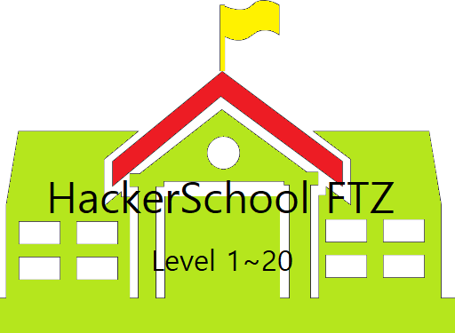

---

Level 1
=======

Level 1에서는 리눅스의 권한을 학습한 후 find 명령어를 사용하여 파일을 검색하는 법을 배우고 특수한 권한이 설정된 파일을 찾아 문제를 해결 할 것이다.

---

Linux 권한
----------

 먼저, Linux는 Window와 달리 서버용으로 만들어진 운영체제이기 때문에 혼자가 아닌 다양한 사용자가 함께 사용 할 수 있다. 이 때문에 여러가지 문제가 발생하게 되는데 먼저, test라는 서버를 user1, user2, user3이 나누어 쓴다고 가정을 해보자.

 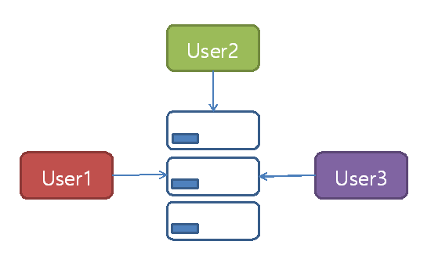

  헌데, 작업을 하던 중 user1이 만든 파일을 user2가 실수로 지워버렸다. user1은 이유 없이 지워진 자신의 파일을 보고 화가나 서버에 있던 user2, user3의 파일들을 전부 삭제해버렸다. 만약, 실제로 위와 같은 상황이 발생하고 삭제뿐만 아니라 파일 열람, 수정, 변조 또한 할 수 있다면 어떻게 될까? 이런 치명적인 문제점을 해결하기 위해 Linux는 권한(Permission)이라는 기능을 지원한다.

 권한은 읽기(r), 쓰기(w), 실행(x) 권한으로 나뉘어 각 사용자에게 부여되며 이는 각각 파일에 대한 읽기 권한, 쓰기 권한, 실행 권한에 해당한다. 읽기 권한이 없는 사용자는 파일을 열어 볼 수 없고, 쓰기 권한이 없는 사용자는 쓰기나 수정을, 실행 권한이 없는 사용자는 실행을 시킬 수 없다.

 다음은 실제 환경에서 ls –al 명령어를 사용하여 파일 목록을 본 결과이다.

 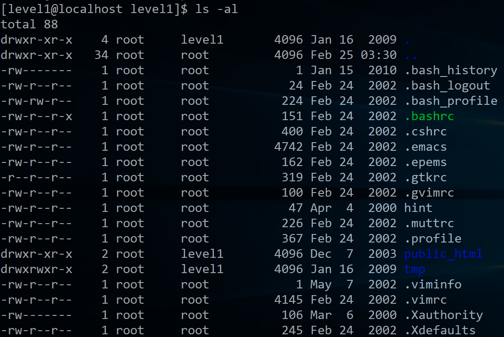

 사진을 보게 되면 제일 왼쪽에 표기된 영문 알파벳이 파일 권한정보이다. 위에서 본 r(읽기), w(쓰기), x(실행) 문자들과 처음 접하는 d 문자도 볼 수 있다. 그럼 파일 권한을 포함하여 오른쪽에 표기된 알 수 없는 글자들에 대해 알아보자.

 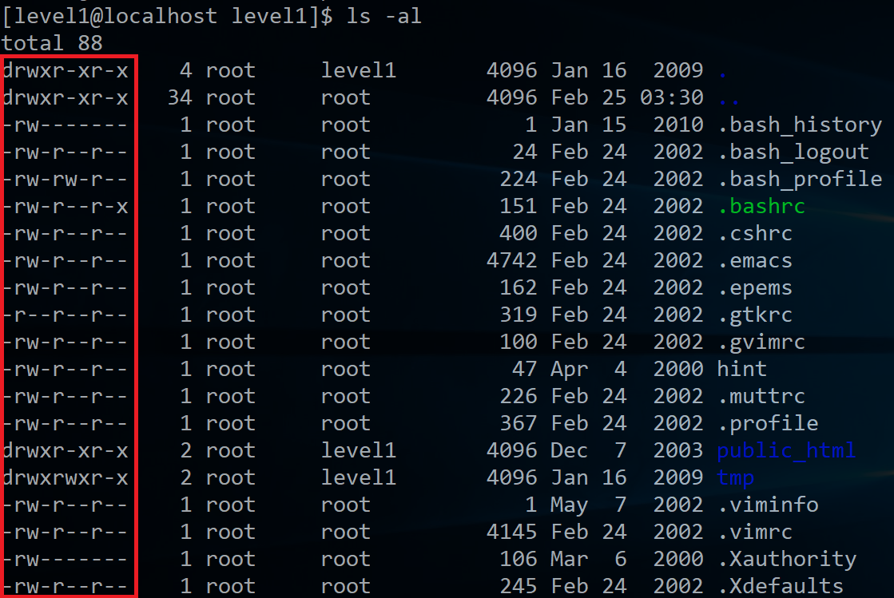

  가장 왼쪽의 권한 정보이며 총 10자리로 구성되어있다.

 

 맨 첫 번째 자리는 File Type을 표기 한 것인데 권한 정보라고 하기에는 애매한 부분이 있지만 권한 정보와 붙어 있으므로 함께 설명하겠다. 먼저 File Type은 단지 파일의 종류를 구분하기 위해 표기하는 것으로 d는 디렉토리, l은 링크 파일, -는 일반 파일을 나타낸다. 참고로 디렉토리는 Winodw에서 폴더와 같은 개념이며 /로 디렉토리를 구분한다. 이 3가지 외에도 다양한 종류가 있지만 위 3가지를 가장 흔히 볼 수 있다. (위 그림에서는 d와 –가 표기되어 있다.)

 

 다음 세 자리는 파일 소유자에 대한 권한이다. 앞에서부터 한 칸씩 차례로 r(읽기), w(쓰기), x(실행) 권한을 나타내며 해당 권한이 없으면 –로 표기한다. 이 세 자리는 해당 권한의 존재 여부만 체크하는 yes or no 형식이기 때문에 권한이 있으면 1 없으면 0으로 인식하여 2진수로 표현이 가능한데 이에 대해서는 후에 설명하도록 하겠다.

 

 이번에는 소유 그룹에 대한 권한이다. 각 자리가 의미하는 바는 파일 소유자 권한과 마찬가지로 r, w, x 권한을 의미한다. 소유 그룹이란 회사에 비유하여 부서와 같은 것인데 예를 들어 결제 서류라는 파일은 행정부에서만 열람 할 수 있다고 치자. 그럼 행정부라는 소유 그룹에만 결제 서류에 대한 r 권한이 주어진 것과 마찬가지인 셈이다.

 

 마지막 자리는 다른 사용자에 대한 권한이다. 파일 소유자, 소유 그룹을 제외한 모든 사용자(Other)에 대한 권한으로 각 자리의 의미는 마찬가지이다.

 

 위에서 언급한 2진수에 대한 설명이다. 각 자리가 나타내는 2진수는 다음과 같고 소유자, 소유 그룹, 나머지 사용자 모두 마찬가지로 r - 22(4), w – 21(2), x – 20(1)을 나타낸다. 권한이 존재하면 1 존재하지 않으면 0으로 소유자에 대한 rwx권한을 다 합친 값, 소유 그룹에 대한 권한을 다 합친 값, 나머지 사용자에 대한 권한을 다 합친 값으로 3자리로 표기한다. 예로 어떠한 파일에 권한이 다음과 같으면 권한 값이 얼마일까?

 

 소유자 : rwx = 4 + 2 +1 = 7 소유그룹 : r-- = 4 + 0 + 0 = 4 나머지 사용자 : r-- = 4 + 0 + 0 = 4 위와 같이 되어 744로 퍼미션(권한) 값을 표기한다

 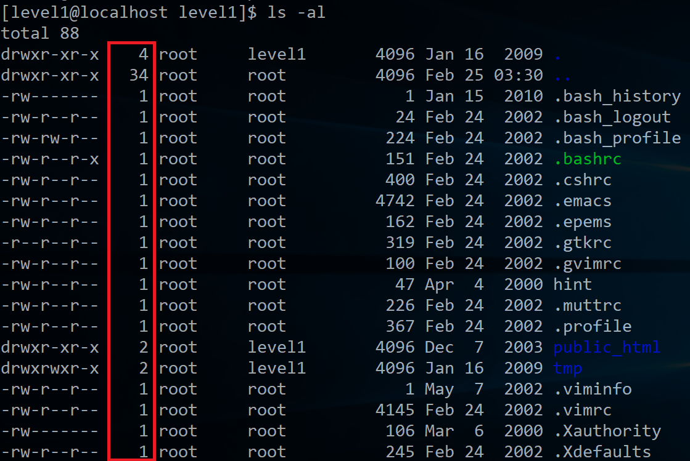

 두 번째 섹션은 링크 수를 나타낸다. 링크는 Window의 바로가기와 같은 개념으로 쉽게 말해 파일이 연결된 수를 나타낸다.

 

 세 번째 섹션은 파일의 소유자이다. 앞의 권한 정보에서 다루었듯이 말 그대로 파일을 소유한 사람을 나타낸다. 소유자를 표시하는 이유는 도대체 파일의 소유자를 명확히 하여 다른 사용자들에게 파일 소유자에 대한 정보를 제공하기 위해 사용된다.

 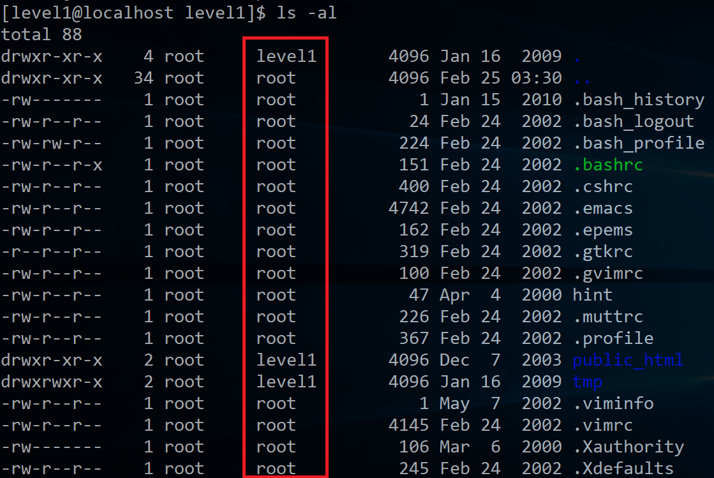

 네 번째는 소유 그룹이다. 소유 그룹에 대해서는 앞에서 설명하였으므로 생략하도록 하겠다

 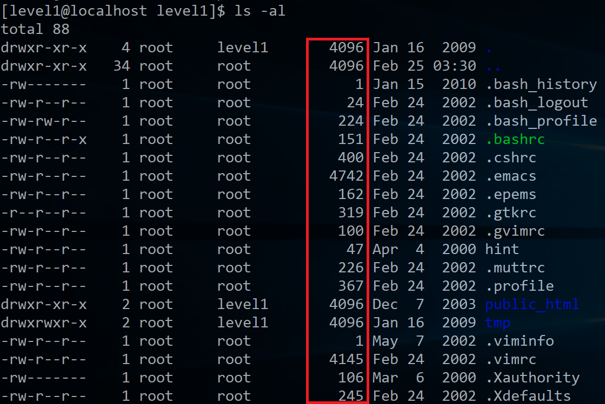

 다섯 번째는 파일 용량이다. 단위는 Byte이다.

 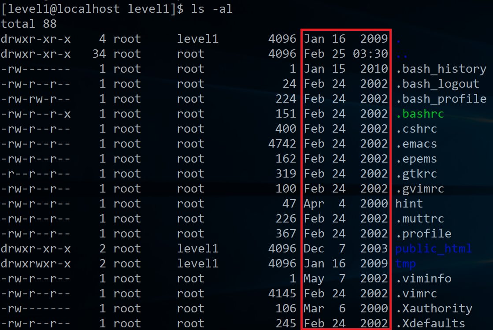

 여섯 번째로 파일이 생성된 날짜를 나타낸다.

 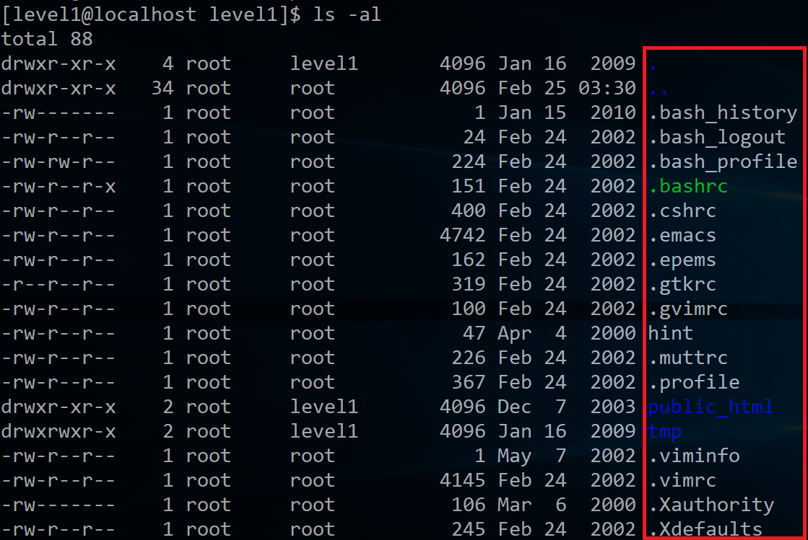

  일곱 번째로 파일 이름이다.

 이렇게 총 일곱 개의 섹션으로 파일 정보를 얻을 수 있고 파일 권한에 대해서도 알아 보았다.

---

### 파일 권한과 소유자 변경

#### 권한 변경

 기본적으로 파일의 권한은 파일 생성시에 자동으로 부여되지만 이 기본 권한을 원하는 권한으로 변경을 해야 할 때가 있을 수도 있다. 아마 분명 생길 것이다. 그 때를 대비하여 파일의 권한을 변경하는 방법을 알아보자.

 설명할 방법은 여러 방법 중 하나로 가장 기본적인 방법이다. 바로 chmod 명령어를 이용하는 것인데 이 명령어 하나로 아주 손쉽게 권한을 변경할 수 있다. chmod 명령어 사용 방법은 아래와 같다.

 **chmod [권한][파일]**

 먼저 [파일]의 자리에는 파일 이름을 적어주면 되고 [권한]부분에는 원하는 권한의 값을 넣어 주면 된다. 여기서 권한 값이란 위에서 알아 본 2진수를 이용한 세 자리 값이다.

 이해를 돕기 위해 예시를 보며 진행해보자.

 

 권한이 위와 같이 설정된 파일의 이름은 nicestudy이다. 위 권한에 소유자의 실행 권한과 그룹에 대한 쓰기와 실행 권한을 추가하고 싶다면 어떻게 하면 될까?

 

 먼저 소유자부터 천천히 살펴보자. 소유자에 실행 권한을 추가하게 되면 rwx의 권한을 갖게 된다. 각 자리가 나타내는 수는 4 + 2 +1 = 7으로 자세한 설명은 위의 권한 정보 설명을 참고하기를 바란다.

 

 다음은 그룹 권한이다. 그룹 권한에는 쓰기와 실행 권한을 추가하면 된다. 그럼 기존에 읽기와 실행 권한이 존재하지 않아 권한 값이 4 + 0 + 0이었지만 권한을 추가하게 되면 4 + 2 + 1로 마찬가지로 7이 된다.

 그럼 총 권한 값을 구해보자. 먼저 소유자 값 7, 그룹 값 7, 나머지 사용자 값은 기존에 읽기 권한만 존재 하였으므로 4가 된다. 그러므로 총 권한 값은 774이다. 파일의 이름은 nicestudy라고 하였으니 다음과 같이 명령어를 입력하면 원하는 권한으로 변경이 가능하다..

 **chmod 774 nicestudy**

 권한 값을 구하는 것 이외에 조금 더 간편한 방법이 있다. 이 방법은 소유자를 user의 u로 그룹을 group의 g로 나머지 사용자를 other의 o로 하여 rwx를 이용하여 권한을 변경하는 것이다. 방법이 간단하므로 예시만 보면 금방 할 수 있을 것이다.

 위의 nicestudy파일에 똑같이 소유자에 실행권한, 그룹에 쓰기와 싫행 권한을 부여하려고 하면 다음과 같이 입력한다.

 **chmod u+x, g+wx nicestudy**

 u+x는 소유자(user)에 x(실행 권한)를 추가, g+wx는 그룹(group)에 wx(쓰기, 실행 권한)를 추가한다는 의미이다.

 권한을 제거하고 싶으면 –(Minus 기호)를 이용하거나 권한 값에서 제거하고 싶은 권한을 빼고 계산하여 권한 변경 명령어를 실행하면 된다.

#### 파일 소유자 변경

 파일 소유자 변경은 chown 명령어로 쉽게 해결 할 수 있다. 그럼 바로 사용법을 알아보자.

 **chown [변경할 소유자] [파일 이름]**

 변경할 소유자의 이름을 적고 파일 이름을 적으면 해당 파일의 소유자가 적어진 소유자로 변경되게 된다. 만약 소유 그룹 또한 변경하고 싶다면 다음과 같이 입력하면 된다.

 **chown [.변경할 그룹] [파일 이름]**

 형식은 소유자 변경과 동일하지만 .을 이용하여 그룹의 이름임을 표시한다. 소유자와 그룹을 한 번에 변경할 경우도 생기는데 이럴 때는 변경할 소유자와 변경할 그룹 사이에 마찬가지로 .을 찍어주면 쉽게 해결이 가능하다.

---

### SetUID, SetGID

 Linux에서는 특수 권한이라고 불리는 다른 권한들과는 다르게 특별한 기능을 가진 권한이 존재하는데 그 중에 SetUID와 SetGID에 대해 알아보겠다.

 SetUID와 SetGID는 도대체 어떤 기능을 가졌길래 특수 권한이라고 불릴까? 바로 현재 사용자에게 파일이 실행 될 때 동안 파일 소유자의 권한을 빌려준다. 이 기능은 굉장히 간편하면서도 위험하다. 프로그램이 실행 될 때 동안은 권한에 관한 어떠한 방해도 받지 않는다는 장점이 있지만 그 말은 즉 프로그램이 실행 될 때 동안 어떠한 행위도 가능하다는 말과 동일하다. 그럼 그런 큰 리스크를 가지고 도대체 왜 사용하는 걸까? root 권한으로만 접근 할 수 있는 파일에 접근하거나 매번 root를 호출하여 작업을 처리하거나 일반 사용자에게 root 권한을 아예 주지 않아도 되기 때문에 작업에 효율적이다. 하지만 많은 해커들은 그 틈을 집요하게 파고들어 표적이 되기 쉽다. 그럼 이제부터 본격적으로 SetUID와 SetGID에 대해 알아보자.

 SetUID, SetGID가 어떤 일을 하는지는 알았다. 이 기능들이 가지는 특징 중 눈에 보이는 특징은 앞에서 살펴본 권한 정보에 표기가 된다는 것이다. 우리는 앞에서 파일의 종류를 표시하는 문자와 rwx권한을 알아보았다. 하지만 SetUID, GID는 s와 S라는 처음 보는 알파벳을 사용한다. 만약, 소유자에 대해 관리자의 권한이 주어지는 SetUID는 소유자 권한 부분의 x(실행 권한)가 s나 S로 표시된다. 둘의 차이는 끝에 알아보도록 하자. 그룹에 대해 관리자 권한이 주어지는 SetGID는 물론 그룹 권한 부분의 x(실행 권한)가 변경된다.

 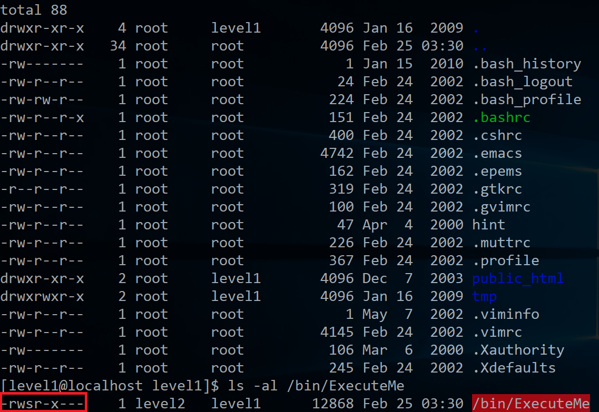

 위 그림은 일반 파일들의 목록과 SetUID가 설정된 파일을 보여준다. 가장 눈에 띄는 부분부터 보면 SetUID가 걸려있는 파일은 파일 이름이 빨간색으로 색칠되어있다. 그 다음으로는 앞에서 설명하였듯이 파일 권한 부분에 주목하여보자

 이 파일은 SetUID가 설정되어 있기 때문에 파일 소유자부분의 권한에 x가 있어야 할 자리에 s가 있는 것을 확인 할 수 있다. 파일의 소유자는 level2이고 level2의 권한으로 SetUID가 설정되어 있다고 해석할 수 있다.

 s와 S의 차이는 대문자와 소문자 차이가 아닌 기존의 실행 권한이다. 기존의 실행 권한이 있던 파일은 실행 권한 부분을 소문자 s로 표기하고 기존에 실행 권한이 없었다면 대문자 S로 표기한다.

 다음 특징은 권한 값이다. 특수 권한으로 이루어진 권한은 권한 값 세 자리 앞에 자신만의 숫자를 붙이게 되는데 우리가 살펴본 SetUID는 4, SetGID는 2이다. 이 특징과 chmod 명령어를 이용하면 특수 권한을 부여할 수도 있다.

 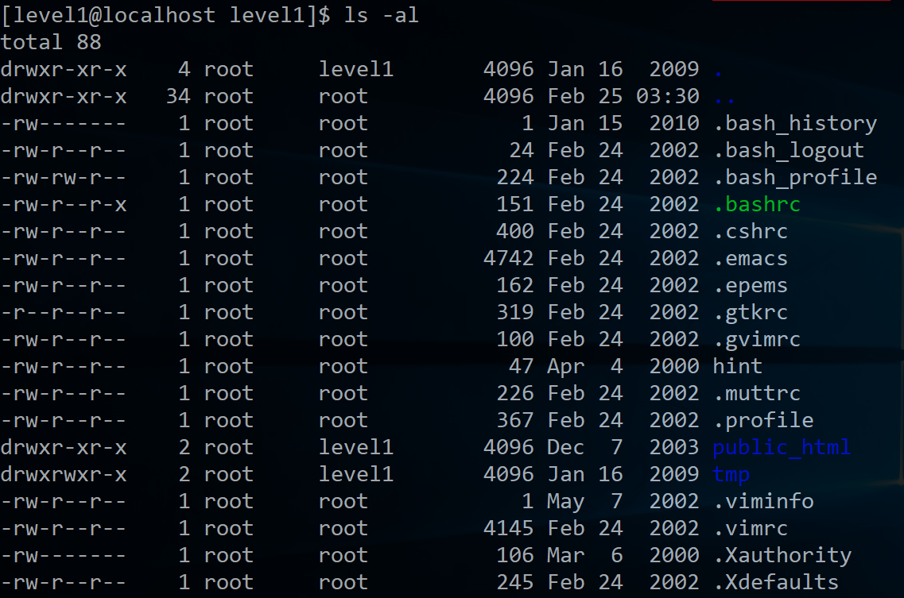

> Before

 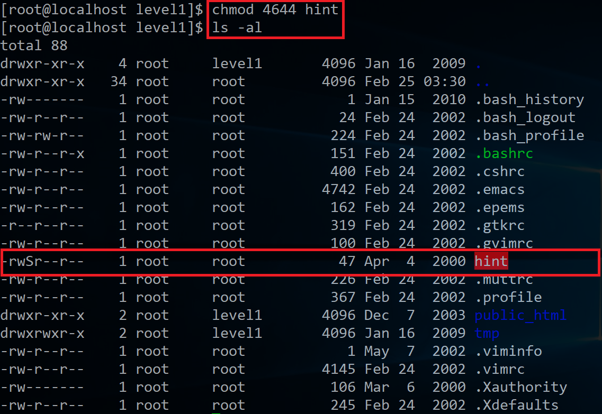

> After

  두 사진을 비교하여 보면 파일 이름의 색과 파일 권한이 변경 된 것을 확인 할 수 있다. SetUID만의 숫자 4를 붙여주고 기존 파일 권한을 입력해준 모습이다. 원래 실행 권한이 없었기 때문에 대문자 S가 되었다.

---

명령어 find
-----------

 다음은 이번 장에서 반드시 필요한 명령어인 find를 살펴보자

 명령어 find는 디스크에 저장된 각종 파일, 디렉토리를 검색할 수 있는 기능이다. 인터넷 검색 할 때 명령어의 검색어를 입력하듯이 find 명령 또한 검색어가 필요한데 검색어의 역할을 하는 옵션 기능을 이용하여 검색 기준을 설정할 수 있다.

 find 바로 뒤에 /를 붙이게 되면 root에서부터 즉 전체 하드 디스크에서부터 파일을 검색한다.

 하위 폴더에서 찾고 싶으면 ./를, 현재 폴더에서 찾고 싶으면 .을, 특정 디렉토리에서 찾기를 원한다면 /[디렉토리 이름]을 입력하면 된다.

  -name [파일명] 옵션을 이용하게 되면 파일명이 포함된 폴더를 검색한다.

  -type [file type] 옵션은 파일 타입 필터를 사용하는 것인데 예를 들어 d를 입력하게 되면 디렉토리 파일만 찾을 수 있다.

 아래는 이번 장에서 사용하게 될 옵션으로 주의 깊게 살펴보기 바란다.

  -user [소유자 이름] 옵션은 해당 소유자가 소유한 파일을 검색한다.

  -perm [권한 값] 옵션은 권한 값이 옵션으로 전달한 옵션 값과 일치하는 것을 찾는다. 그러나 – 기호를 입력하게 되면 최소라는 옵션이 추가되어 최소 권한 값 이상의 파일을 검색한다.

 find 명령어의 옵션은 이보다 훨씬 많고 다양하므로 각자 찾아 원하는 때에 원하는 옵션을 사용하길 바란다.

---

Hint
----

  그럼 이제부터 본격적으로 문제 풀이를 해보자.

 먼저 Leve1의 id와 password를 치고 로그인하여 파일 목록을 확인해보자.

 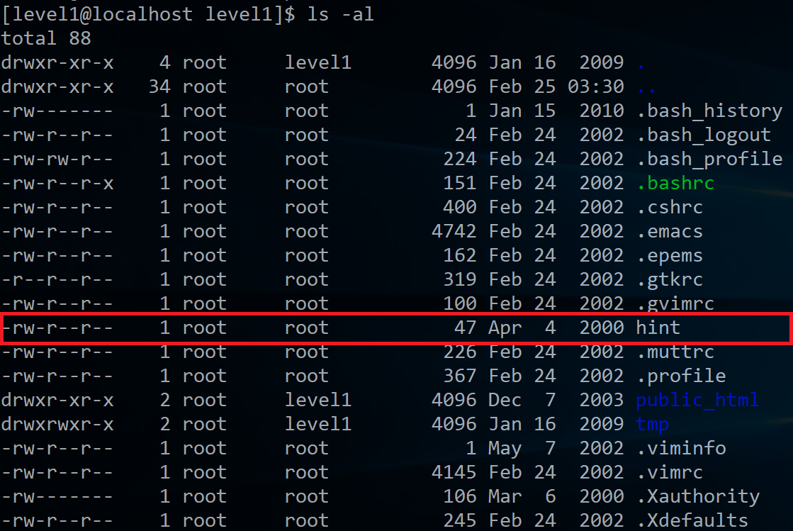

  우리가 앞에서부터 익숙히 봐왔던 파일 목록이다. 현재 파일 목록을 살펴보면 hint라는 파일이 가장 눈에 띄고 알아 볼 수 있는 파일이다.

 파일 권한 부분을 참고하면 읽기 권한은 있지만 실행 권한이 존재하지 않는다. 그러므로 일단 cat 명령어를 사용하여 hint 파일을 열어보겠다.

 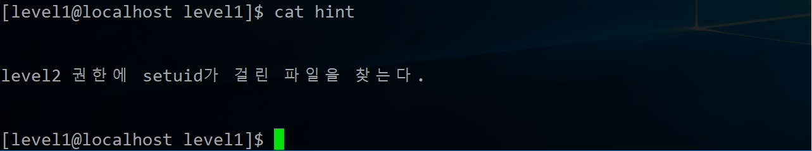

 hint는 별 다른 내용 없이 ‘level2 권한의 setuid가 걸린 파일을 찾는다.’라고 언급되어 있다.

---

풀이
----

 앞서 SetUID 파일의 특징을 살펴보았다. 파일 이름이 빨갛고, 파일 권한에 s가 포함되어 있으며 권한 값에 자신만의 특수한 숫자인 4가 들어간다고 배웠다.

 현재 ls –al 명령어로는 SetUID파일을 찾을 수 없었으므로 앞에서 살펴본 find 명령어를 활용하자. 배운 내용의 옵션들로는 파일 경로, 파일 이름, 파일 타입, 소유자 이름, 권한 값이 있다. 이 중 우리가 hint를 통해 알고 있는 정보가 있다. 바로 소유자 이름과 권한 값이다. 소유자 이름은 level2 권한의 SetUID라고 하였으니 level2이고 권한 값은 자신만의 특수한 숫자를 이용한다.

 파일을 찾기 위한 명령어를 생각해보자. 경로는 어디 있는지 현재 정보로 유추하기가 어려우므로 모든 경로를 포함 시키는 /를 입력한다.

 다음은 소유자 이름에 대한 정보를 알고 있으므로 –user 옵션을 이용하여 –user level2 옵션을 사용한다.

 마지막으로 권한 값에 대한 정보인데 SetUID는 자신만의 번호 4를 권한 값 세자리 앞에 가진다고 하였다. 그 말은 즉 맨 앞의 숫자가 4이면 뒤에 세자리 권한은 어떠한 숫자가 와도 일단은 SetUID가 설정된 파일임을 의미한다. 그렇다면 최소한의 권한을 최솟값 옵션으로 넘겨주어 검색하게 되면 SetUID가 걸린 모든 파일을 찾을 수 있다. 직접 해 보자.

 

  위에서 설명하였듯이 명령어를 다음과 같이 입력하였다.

 

  그럼 다음과 같이 검색 목록이 쭉 나올 것이다. 대부분의 파일이 ‘Permission denied’. 즉, 접근 권한이 없다라고 하지만 그 중 사진에 보이는 한 파일만 정상적으로 검색된 것을 볼 수 있다.

 위의 파일을 한 번 살펴보자.

 

 파일 이름이 빨간색이고 파일 권한에 s가 포함되어있다. 게다가 소유자마저 level2이다. 이 파일이 확실한 것 같다.

 실행 권한이 있었으니 한 번 실행시켜 보자.

 

 실행 시켰더니 다음과 같은 화면이 나왔다. Level2의 권한으로 원하는 명령어를 실행 시켜준다. 하지만, 비밀번호를 알 수 있는 my-pass와 파일 권한을 변경하는 chmod는 제외한다.

 

 시험 삼아 ls -al명령어를 입력해보았다. 그랬더니 level2 권한의 ls -al명령이 실행되고 프로그램이 종료되어 다시 level1의 쉘로 돌아왔다. 이로써 명렁어를 한 번 실행시키면 아마 프로그램이 종료되어 버린다고 유추할 수 있다.

 그렇다면 도대체 어떤 명령어를 사용해야 하는가? ‘멀수록 돌아가라’라는 말이 있다. 현재로써는 비밀번호를 한 번에 알아낼 수 있는 방법이 없는 것 같다. 그렇다면 level2의 권한을 유지한 채 현재 프로그램을 빠져나갈 수 있는 방법이 없을까? 왜 없겠는가. level2 권한의 쉘을 실행시켜 명령어를 실행한다면? 현재 프로그램과는 상관없이 level2 권한의 쉘이 실행되고 아마 프로그램은 종료 될 것이라고 예상된다.

 바로 실행에 옮겨보자.

 

 level2 권한의 쉘을 성공적으로 획득하였다. 그리고 더 이상 위 프로그램의 문구도 보이지 않는다. 바로 my-pass를 사용해 비밀번호를 알아내자.

 

  이로써 level2의 비밀번호를 알아낼 수 있게 되었다.

---

Level 2
=======

 Level2에서는 리눅스 환경에서 사용되는 텍스트 에디터에 대해 알아보고 텍스트 에디터의 특성을 활용하여 명령어를 실행시켜 문제를 해결 할 것이다.

---

텍스트 에디터
-------------

 텍스트 에디터란 대표적으로 윈도우의 메모장과 같은 텍스트 파일을 만드는 프로그램을 말하는데 간단하게는 .txt 파일부터 소스 코드 파일까지 만들 수 있다. 지금 배울 텍스트 에디터가 후에 문제를 풀어나가는데 많은 도움을 줄 것이므로 사용법에 대하여 주의 깊게 살펴보기바란다.

 먼저, 리눅스 환경에서 사용되는 텍스트 에디터 중 가장 흔하게 많이 사용되는 대표적인 에디터 emacs와 vim에 대하여 알아보자. 이 중에서도 비교적 가볍고 사용법이 간단한 vim에 대하여 자세히 알아보고 이 후에 활용 할 것이다.

---

### emacs

 emacs는 앞서 말했듯이 대표적인 리눅스 텍스트 에디터이다. 매우 다양한 기능을 제공하고 확장성이 매우 높으며, 키보드 단축키만 1,000개가 넘어가고 매크로 또한 엄청나게 많아 모두 외우는 것은 불가능에 가깝다고들 말한다. 하지만, 여러가지의 다양한 기능을 제공한다는 것은 그 만큼 프로그램이 무거워 진다는 단점을 갖는다. 1970년 중반부터 개발되어 현재까지 다양한 버전이 있는데 그 중 GNU Emacs라는 오픈 소스 프로젝트가 가장 유명하다. 이 외에도 XEmacs, Aquamacs등 다양한 버전이 있다.

 

> GNU Emacs

 사용법에 대해서는 인터넷에 다양한 정보가 있으니 emacs를 사용해보고 싶은 사람은 한 번 참고하여 사용해보면 좋을 것 같다.

### vim, vi

 위에서 설명하였듯 또 다른 대표적인 텍스트 에디터로 vim이 있는데 vi는 무엇일까? 사실 vim은 vi의 향상된 버전으로 vi 에디터를 개량한 버전을 Vi IMproved, 줄여서 vim이라고 한다. vim과 vi는 몇몇 기능이 추가된 것 이외에 큰 차이는 없지만 흔히 우리가 사용하는 한글이나 파워포인트의 버전 차이 정도라고 생각하면 이해하기 쉽다. 즉, 앞으로 설명할 내용은 vim이던 vi던 마찬가지로 적용 된다는 말이다.

 vim은 앞으로 쭉 사용하게 될 에디터이므로 사용법에 대해 함께 알아보자.

 

 

 다음과 같이 **vim** 혹은 **vim [파일이름]** 명령어를 입력하여 vim을 실행 시킬 수 있다.

 

 그럼 위와 같이 실행된 vim 프로그램을 볼 수 있다. 현재 화면에서는 콜론(:)을 활용하여 사용할 수 있는 간단한 명령어들을 보여준다.

 위에서부터 vim 정보, vim 종료, 도움말, 버전 정보를 나타낸다.

 우리는 텍스트 에디터에 대해 공부하고 있는데 키보드를 아무리 눌려보아도 파일 작성이 되지 않을 것이다. 그 이유는 vim에서는 텍스트를 입력/수정이 가능한 편집 모드와 앞에서 살펴본 콜론(:)을 이용한 명령 모드가 있는데 현재는 명령 모드이기 때문에 아무리 키 입력을 하여도 텍스트 편집이 되지 않을 것이다. 어떻게 해야 편집 모드로 들어갈 수 있을지 알아보자.

> *일단, 설명에 앞서 vim의 모든 명령어들은 대소문자를 구분한다는 점을 참고하기 바란다.*

<table>
  <tr>
    <td>o</td>
    <td>현재 커서 아래 라인으로 이동 후 편집 모드 시작</td>
  </tr>
  <tr>
    <td>O</td>
    <td>현재 커서 윗 라인으로 이동 후 편집 모드 시작</td>
  </tr>
  <tr>
    <td>i</td>
    <td>현재 커서 위치에서 편집 모드 시작</td>
  </tr>
  <tr>
    <td>I</td>
    <td>현재 커서의 라인 제일 앞으로 이동 후 편집 모드 시작</td>
  </tr>
  <tr>
    <td>a</td>
    <td>현재 커서의 다음 문자열에서 편집 모드 시작</td>
  </tr>
  <tr>
    <td>A</td>
    <td>현재 커서의 라인 제일 뒤로 이동 후 편집 모드 시작</td>
  </tr>
</table>

 위와 같은 다양한 명령어들을 사용하여 편집 모드에 들어갈 수 있다. 가장 간편하고 흔하게 쓰이는 명령어는 i이다.

 

 위 사진은 i를 활용하여 편집 모드에 들어가 'insert mode'를 입력한 모습이다. 편집 모드와 명령 모드를 구분할 수 있게 편집 모드에서는 좌측 하단에 보이는 -- INSERT -- 문구로 구분이 가능하다.

 편집 모드에서 esc 키를 누르면 다시 명령 모드로 이동이 가능하다.

 텍스트 에디터에서 명령 모드가 왜 필요한 것일까? 기존의 메모장과 같은 윈도우 프로그램은 GUI(Graphic User Interface) 기반으로 마우스로 해결이 가능한 문제들이 리눅스의 CUI(Console User Interface) 기반의 프로그램에서는 키보드를 사용하여 입력하는 명령어로 해결되기 때문이다. 예를 들면 파일의 저장, 파일 종료, 파일 불러오기와 같이 메모장의 작업 표시줄 메뉴들의 기능이라고 보면 된다.

 

 그럼, 명령어를 이용하여 사용 가능한 여러가지 기능에 대해 알아보자.

<table>
  <tr>
    <td>:w</td>
    <td>파일 저장</td>
  </tr>
  <tr>
    <td>:q</td>
    <td>vim 종료</td>
  </tr>
  <tr>
    <td>:wq</td>
    <td>파일 저장 후 vim 종료</td>
  </tr>
  <tr>
    <td>:q!</td>
    <td>저장하지 않고 종료</td>
  </tr>
  <tr>
    <td>:w!</td>
    <td>파일 덮어쓰기</td>
  </tr>
  <tr>
    <td>:edit 파일명</td>
    <td>파일 열기</td>
  </tr>
  <tr>
    <td>:tabnew 파일명</td>
    <td>새 탭에서 파일 열기</td>
  </tr>
</table>

 위에서 살펴본 내용만 잘 숙지한다면 vim을 이용한 기본적인 텍스트 입력/수정에 문제가 없을 것이다.

 위에서 생략된 내용이 있는데 이번 문제 해결에 가장 큰 키 포인트가 될 내용이다. 바로 외부 쉘 명령을 vim 실행 중에 사용할 수 있다는 점이다.

 vim의 모드에는 편집 모드, 명령 모드 이외에 ex 모드란 것이 존재한다. ex 모드란 명령 모드에서 콜론(:)이나 기타 명령을 위한 문자를 입력했을 시에 ex 모드가 되는 것이다. 즉, 우리가 :w라는 명령을 사용한다면 '명령 모드 -> ex 모드 -> 파일 저장'의 순서로 이루어지는 것이다.

 가장 핵심은 이 ex 모드에서 외부 쉘 명령을 실행할 수 있다는 점이다. 방법은 바로 !를 이용한 방법으로 간단하게 ex 모드에서 !를 입력하고 ls 명령어를 사용하여 테스트 해보자.

 

 

 !ls 문구를 사용하여 명령을 내렸더니 외부 쉘에서 ls 명령이 실행되어 hint, public_html, tmp 파일을 확인할 수 있었다. Enter 키를 누르게 되면 다시 vim으로 복귀가 가능하다.

 즉, vim 텍스트 에디터 사용 중 ex 모드와 !를 통하여 외부 쉘 명령을 실행 할 수 있다는 것을 확인 하였다. 이 점은 후에 우리가 이번 문제를 해결하는데에 큰 역할을 하게 될 것이다.

---

### emacs? vim?

 그렇다면 emacs와 vim 중 어떤 것을 사용하는 것이 더 좋을까? 정답은 없다. 각각이 지닌 장단점이 서로 달라 어떤 것을 사용하던 사용자의 마음이고 가장 중요한 것은 이 두가지 에디터가 리눇의 가장 강력한 에디터 중 하나라는 것은 틀림없다. 그러므로 자신에게 맞는 에디터를 잘 선택하여 사용하면 되겠다. 아래 그림은 emacs와 vim을 그림으로 재미있게 비교한 것인데 해석해보면 vim은 간단하게 어디에서나 쉽게 사용할 수 있다는 말이고 emacs는 여러가지 기능을 제공하지만 굉장히 복잡하다는 점을 보여준다.

 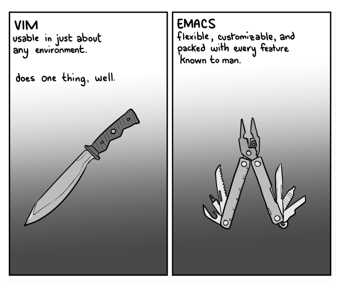

---

Hint
----

 본격적으로 문제 풀이를 위해 힌트를 살펴보자.

 

 앞 문제와 마찬가지로 파일 목록을 확인해 본 결과 hint 파일 말고는 크게 눈에 띄는 파일은 없다. hint를 열어보자.

 

---

풀이
----

 그렇다. 이때까지 텍스트 에디터에 대하여 살펴본 이유다. 텍스트 에디터 실행 중에 외부 쉘 명령을 사용할 수 있다는 것은 이미 배운 내용이고 강조까지 하였으니 기억하고 있을 것이다. 그럼 남은 문제는 서버 어딘가에 존재하는 텍스트 에디터를 찾아 level3의 비밀번호를 획득하는 것이다.

 Level3의 비밀번호가 필요하다. 그렇다면 1차적으로 Level3의 쉘으로 my-pass를 입력한다면 문제가 해결 될 것이다. 그러므로 Level3의 쉘을 획득할 수 있는 SetUID가 Level3인 파일을 찾아보자.

 

 위에서 공부하였듯 find 명령어를 이용하여 명령어는 'find / -user level3 -perm -4000'으로 Level3 권한의 파일 소유자와 최소한 권한 값이 4000인 즉, SetUID 파일을 찾는다.

 

 그럼 다음과 같은 검색 결과가 나온다. 많은 파일 중 검색 조건에 적합하게 검색된 /usr/bin/editor 파일을 볼 수 있다. 파일 이름부터 editor인게 우리가 찾는 파일이 맞는 것 같다. 한 번 열어보자.

 

 그렇다. 앞에서 공부한 vim 에디터이다. 제대로 찾아 온 것 같다.

 여기서 한 가지 주목해야 할 점은 현재 에디터는 Level3의 권한으로 실행 되었다는 점이다. 바꿔 말하면 현재 에디터에서 외부 쉘 명령을 실행시키면 어떤 명령어던지 Level3 권한으로 명령어가 실행 된다는 것이다.

 우리는 앞에서 에디터 사용 도중 외부 쉘 명령어를 실행시키는 방법을 배웠다. 그럼 남은 문제는 간단하다. my-pass 명령어를 외부 쉘에서 실행시켜 Level3의 비밀번호만 알아내는 일만 남은 것이다. 방법은 앞에서 살펴보았듯 콜론(:)을 사용하여 ex 모드로 들어간 후 ! 뒤에 명령어를 입력하는 것이다. 곧바로 실행에 옮겨보자.

 

 

 비밀번호 획득에 성공하였다. 앞의 내용을 잘 살펴보았다면 당연하게 Level3의 비밀번호를 알아낼 수 있었을 것이다.

---

Level 3
=======

 Level3는 함수 실행 시에 전달되는 인자와 한 번에 여러가지 명령어를 사용하는 방법에 대해 알아보고 이를 활용하여 문제를 해결 할 것이다.

---

함수 인자
---------

 함수는 프로그램 상으로 어떠한 동작을 하는 하나의 행위라고 볼 수 있다. 예를 들어 더하기 함수가 있다면 더하기 기능을 빼기 함수는 빼기 기능을 하는 것과 같은 행위를 말한다. 덧셈과 뺄셈을 예로 생각 해보자.

 덧셈을 예로 덧셈이 이루어지기 위해서는 더해지는 수던 더하는 수던 숫자가 최소한 2개가 필요하다는 점에 이의가 있는 사람은 없을 것이다. 아무리 +(더하기 기호)가 수천 개, 수만 개가 있다고 하더라도 +기호 갯수 만큼의 숫자가 있지 않다면 덧셈은 무의미하다. 함수도 마찬가지이다. 덧셈 함수는 단지 +기호와 같은 역할을 한다. 즉, 어떤 수가 될 지는 모르지만 어떤 수던 두 수를 더해주는 기능은 변하지 않는다는 것이다. 물론 덧셈과 마찬가지로 수가 없다면 의미가 없다. 함수 인자란 여기서 어떠한 수를 말한다. 함수는 앞서 말했듯 +기호가 되는 셈이다. 만약, 뺄셈 함수가 있다면 함수의 기능은 -기호가 될 것이고 곱셈, 나눗셈 모두 마찬가지이다.

 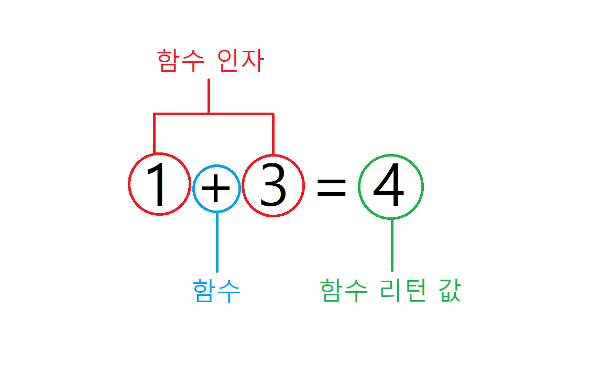

 덧셈의 결과는 함수의 리턴 값이라고 불리는 것과 같다. 보통의 경우 함수는 리턴 값을 포함하고 있는데 이 값은 함수의 결과 값으로 연산의 결과를 넘겨주는 것을 말한다.

 리턴 값은 함수의 자료형으로 알 수 있는데 쉽게 말해 그릇을 정하는 것이다. 대게 자료형을 설명할 때 그릇을 예로 설명하는데 밥 그릇에는 밥을 국 그릇에는 국을 반찬 그릇에는 반찬을 담는 것과 마찬가지이다.

 

 예를 들어 요리를 하는 함수가 있다고 가정하자. 우리의 목표는 알맞은 그릇에 알맞은 요리를 담는 것이다. 그런데 함수가 어떻게 알맞은 그릇에 알맞은 음식을 넣을 수 있을까? 여기서 사용되는게 함수의 자료형이다. 미리 함수의 리턴 값을 정하여 그 형태의 값을 넘겨준다는 얘기이다. 밥 그릇 자료형의 함수를 만들면 밥 형태의 음식이 리턴되는 것이고, 국 그릇 자료형의 함수는 국을 리턴하는 것이다. 위와 같이 자료형으로 함수의 결과 값을 구분하여 알맞은 공간에 알맞은 값을 넣어 사용 할 수 있다.

 그런데 만약, 국 그릇 자료형의 밥이 리턴되면 어떻게 될까? 현실으로 돌아와 생각해보자. 보통 국 그릇이 밥 그릇보다 크다. 그러므로 국 그릇에 밥이 들어가도 넘처지는 않을 것이다. 하지만, 그 반대의 경우라면? 밥 그릇에 들어간 국이 넘쳐버릴 것이다. 프로그램도 같다. 단, 프로그램은 크기에 상관없이 자료형이 다를 경우 모두 오류를 이르킬 가능성이 거의 100%이므로 주의해서 사용하자.

 그렇다면 프로그램의 그릇 종류를 알아보자.

<table>
  <tr>
    <th>자료형</th>
    <th>자료형 종류</th>
    <th>크기</th>
  </tr>
  <tr>
    <td>문자형</td>
    <td>char</td>
    <td>1 byte</td>
  </tr>
  <tr>
    <td>정수형</td>
    <td>int</td>
    <td>2 or 4 byte</td>
  </tr>
  <tr>
    <td>부호 없는 정수형</td>
    <td>unsigned int</td>
    <td>2 or 4 byte</td>
  </tr>
  <tr>
    <td rowspan=2>실수형</td>
    <td>float</td>
    <td>4 byte</td>
  </tr>
  <tr>
    <td>double</td>
    <td>8 byte</td>
  </tr>
</table>

 위 표에서 재미있는 부분은 float과 double형 모두 같은 실수형인데 크기가 서로 다르다는 점이다. 두 자료형의 차이는 '얼마나 더 정교하고 정확하게 실수, 소숫점을 표현 할 수 있는가'이다. 아무래도 크기가 더 큰 double이 좀 더 정밀하다.

 한 가지 더 우리가 짚고 넘어가야 할 부분이있다. 바로 문자형과 다른 자료형들의 구분이다. 컴퓨터에서는 문자를 표기할 때 ASCII Code나 UNI-Code와 같이 문자를 숫자로 변환하여 표현한다.

 만약, 문자형에 1234라는 숫자를 넣고 싶다고 하자. 이 1234를 그대로 문자형 변수에 입력하게 되면 1234라는 숫자를 문자형에 맞추기 위해 ASCII Code로 변환되어 문자로 저장된다. 그렇게 되면 1234가 아닌 ASCII Code에 의해 잘못 변환된 1234의 ASCII Code 값이 들어가 있을 것이다.

 또한, 더 심각한 문제는 char은 1 byte형의 자료형인데 글자 하나 당 1 byte를 차지한다. 그렇기 때문에 문자열을 저장하기 위해서는 가장 첫 글자의 위치를 저장하고 글자의 끝을 표시하는 NULL BYTE를 만날 때까지 문자열을 인식하는데 이를 위해 포인터가 사용된다. 보통 크기가 정해져있지 않은 경우 **char*** 혹은 **char 이름[]** 과 같은 형태로 자료형을 지정하는데 1234를 입력하게 되면 이를 문자열이 아닌 주소 값으로 받아드려 메모리 상의 0x00001234의 위치로 이동해버린다. 그렇게 되면 잘못된 메모리 참조로 오류가 발생한다.

 이 같은 문제를 해결하기 위해 문자열은 따로 구분을 지어주기로 하였는데 바로 쌍따옴표("")로 문자를 묶어주는 것이다. 위와 같이 1234를 전달하려면 "1234"와 같은 형태로 전달하면 된다. 그러면 컴퓨터는 쌍따옴표 안의 내용은 문자열로 인식을 하고 해당 문자의 올바른 ASCII Code 값을 가지고 있게 된다.

---

동시에 여러 명령어 실행
-----------------------

 이 문제는 굉장히 간단하다. 단지, 명령어 사이에 세미콜론(;)을 넣어주면 해결 가능하다.

 

 ;를 활용하여 ls 명령어를 한 번에 두 번 사용하였다.

---

Hint
----

 이제 문제 해결에 필요한 내용을 모두 학습하였으니 본격적으로 문제를 풀어보자.

 마찬가지로 파일 목록을 확인 후 힌트 파일을 열어보았다.

 

 

 이번에는 힌트의 내용이 긴데, 천천히 함께 살펴보자.

---

풀이
----

 먼저, 우리가 알아볼 수 있는 부분부터 보자. autodig의 코드라고 한다. autodig 프로그램을 실행시키면 될 것 같다. more hints 부분을 보면 앞에서 우리가 모두 숙지한 내용이다. 코드 해석만 한다면 이번 문제는 간단히 해결 할 수 있을 것 같다.

 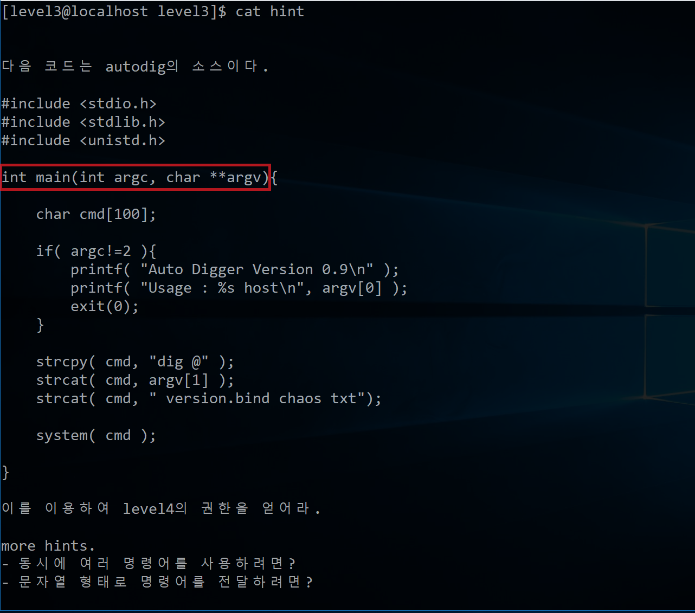

 맨 위의 #include 부분은 사용에 필요한 헤더 파일을 불러오는 것이므로 크게 신경 쓸 필요 없다.

 표시된 부분이 우리가 볼 수 있는 main 함수이다. 이름에서 알 수 있듯 main 기능, 프로그램의 모든 동작이 이루어지는 곳이다.

 함수 선언 형식은 다음과 같다.

> *함수_자료형 함수_이름(인자1_자료형 인자1_이름, 인자2_자료형 인자2_이름 ...)*

 위 형식에 맞추어 보면 int는 함수의 자료형, main은 함수의 이름, int argc, char \*\*argv가 함수의 인자이다. 크게 어려운 부분은 없는데 argc, argv 인자에 대해 설명하자면 main 함수의 기본 형태로 프로그램 실행 시에 전달 받는 인자이다.

 argc는 int형으로 argv로 넘어오는 문자열의 길이를 나타낸다.

 argv는 char형으로 실행 시 문자열을 전달 받는다.

 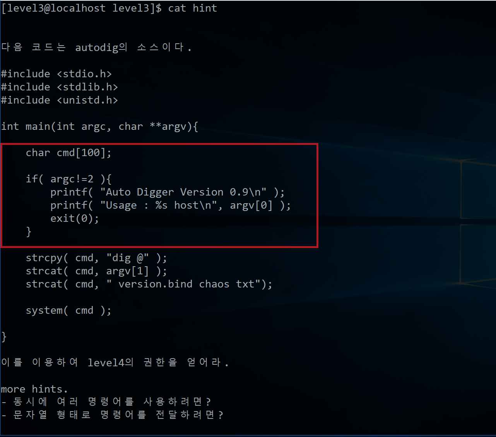

 그 다음으로 문자형 변수 cmd를 선언하고 실행 시에 전달 받은 argv인자의 길이가 2와 같지 않으면 사용법을 출력하고 프로그램을 종료한다. (2와 같지 않다는 뜻은 문자열을 입력하지 않았다는 뜻이다.)

 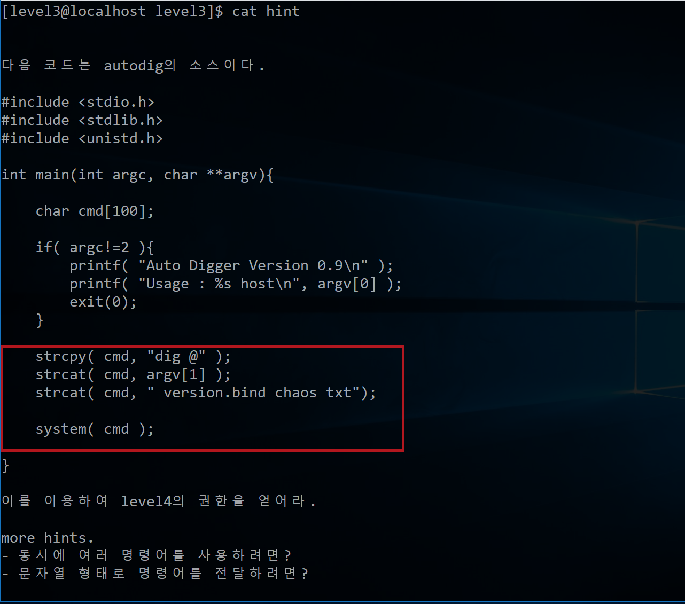

 이 부분이 굉장히 중요하다. 먼저, cmd 변수에 "dig @"를 저장한다. 그 뒤에 strcat을 이용하여 인자 argv를 이어 붙이고, 또 다시 그 뒷 부분에는 " version.bind.chaos.txt"를 이어붙인다. 그리고 마지막으로 cmd에 저장된 문자열을 쉘 명령어로 실행시킨다.

 정리해보자면 프로그램 실행 시 문자열을 전달받고 문자열을 올바르게 입력하였으면 그 문자열을 문구 사이에 이어붙이고 이후에는 명령어로 실행시킨다는 것이다.

 아직은 해결 방법이 딱 떠오르지 않지만 직접 한 번 실행시켜보자.

 

 아무 문자열이나 치고 프로그램을 실행시켜 보았다. 그랬더니 ''abcdef'의 서버를 찾을 수 없다. 서비스가 존재하지 않는다.' 라는 문구가 나온다.

 dig가 무엇일까? dig는 DNS 네임서버에 쿼리를 날리는 툴이라고 한다. 사용법은 'dig @주소 도메인' 이다.

 우리가 입력한 인자가 주소가 되는 것이고 뒤에 이어 붙는 문구가 도메인으로 적용되어 dig명령어가 실행되는 것으로 예상된다.

 뒤에 이어 붙는 문구를 자세히 보면 맨 앞의 글자가 공백인 것을 확인 할 수 있다. 이 점을 이용하여 dig 명령어를 정상적으로 실행시키고 뒤에 우리가 원하는 명령어를 함께 실행시킨다면? 뒤에 문구는 첫 글자가 공백이기 때문에 무시 될 것이고 두 가지 명령어 모두 정상적으로 동작 할 것이다. 직접 해보자.

 

 비밀번호 획득에 성공하였다. 'abcdef'서버를 찾을 수 없다는 것을 보아 dig 명령어가 제대로 동작하였고 이후에 my-pass 명령어가 성공적으로 실행 성공하였다.

---

Level4
======

 백도어가 무엇인지 알아보고, 리눅스의 데몬과 finger service의 동작 원리를 살펴보아 문제를 해결 할 것이다.

---

backdoor
--------

 backdoor(백도어), 한국어로 직역하면 '뒷문'이라는 뜻이다. 보통 뒷문이라는 개념이 어떤 때에 사용이 되는가?

 만약, 여러분의 집에 금고가 있고 이 금고로 통하는 뒷문이 있다고 치자. 그렇다면 뒷문을 만든 이유는 무엇일까? 사람마다 갖가지의 이유가 있겠지만 분명 몇 가지의 공통된 이유가 있을 것이다.

 먼저, 보안 유지를 위해서가 가장 큰 이유이다. 나만 알고 있는 뒷문이 있어 다른 사람에게 노출 되지 않는다면 내가 아닌 사람이 금고로 접근하는 것을 막을 수 있다. 뿐만 아니라 아예 금고의 존재 자체도 알기 힘들 정도로 높은 수준의 보안이 유지된다.

 그 다음은 편리함이다. 금고를 나만 알고 있는 공간이 아닌 노출된 공간에 보관하면 여러가지의 복잡하고 다양한 방법으로 금고를 지켜야한다. 그리고 금고를 사용 할 때마다 그 여러가지의 복잡하고 다양한 방법의 인증 절차를 거쳐야 한다. 하지만, 나말 알고 있는 뒷문으로 금고를 사용한다면 매번 복잡한 인증 절차를 거칠 필요가 없다.

 이와 같이 뒷문을 통한 금고 보관 방식은 간편하고 높은 수준의 보안을 유지시켜준다.

 이제부터 우리가 금고를 훔치는 도둑이 되어보자.

 먼저, 노출된 공간에 있는 금고를 훔치는 도둑이 되었다고 생각해보자. 어떤 보안 시스템인지에 따라 다르겠지만 간단하게 여러 가지 인증 절차를 모두 뚫었다고 하자. 다음은 그냥 눈앞에 놓여 있는 금고를 들고 가면 그만이다. 뚫지 못했다고 하여도 그냥 보안 시스템을 부숴버리면 그만 일 것이다.

 이번에는 뒷문을 통해 보관되는 금고를 훔쳐보자. 간단하다. 뒷문의 존재 여부를 알고 있으면 아주 손쉽게 금고를 훔치는 것이고 그렇지 않다면 금고가 있는지 조차 모를 것이다.

 시스템에서 말하는 백도어도 똑같다. 앞에서 예를 든 금고가 시스템이라고 생각하면 된다. 금고의 주인이 뒷문을 통해 금고를 사용한다면 보다 편하게 사용이 가능하다. 즉, 시스템의 주인이 백도어를 통해 시스템의 정보를 열람 또는 수정 등과 같이 사용한다면 별다른 인증 절차 없이 손쉽고 빠르게 사용 가능하다. 이러한 이유 때문에 프로그래머들은 고의로 보안적 결점을 남겨 백도어를 설치하고 손쉽게 프로그램을 유지보수 할 수 있게 만드는 경우도 있다.

 반대로 도둑이 되어 뒷문을 통해 쉽게 금고에 접근이 가능하듯이 다양한 기법의 백도어를 시스템의 보안 결점을 이용하여 설치하면 시스템의 정보를 금고를 열어보듯 손쉽게 얻을 수 있다.

 백도어가 무서운 것이 시스템 상의 보안 결점을 이용하여 자신도 모르게 백도어를 설치 할 수도 있다는 점이다. 우리 집에 나도 모르게 뒷문이 생겨 누군지도 모르는 자가 집을 들락 날락 한다는 얘기이다.

 이렇게 악의적으로 생성된 백도어는 로그를 남기지 않고 보다 빠르게 다른 사용자의 시스템을 마치 내 것인 것처럼 들여다보고 사용 할 수 있다. 어느 해킹 기법이나 마찬가지로 매우 위험한 기법이다. 만약, 개인이 아닌 기업을 상대로 백도어가 설치되어 있다면 피해는 더더욱 커질 것이다.

---

데몬
----

 데몬이라하면 가장 먼저 떠오르는 것이 악마(demon)일 것이다. 하지만 리눅스의 데몬(daemon)은 수호신이라는 뜻으로 시스템의 기능을 제공하거나 백그라운드에서 실행하는 프로그램을 뜻하며 우리에게 익숙한 윈도우 환경에서의 시스템 프로세스이다.

 조금 더 자세히 알아보면 데몬은 리눅스 서버에서 네트워크 서비스를 처리하는 프로그램을 뜻하며 시스템이 처음 가동될 때 실행되는 백그라운드 프로세스이다. 아직까지는 무슨 말인지 감이 안 올 것이다.

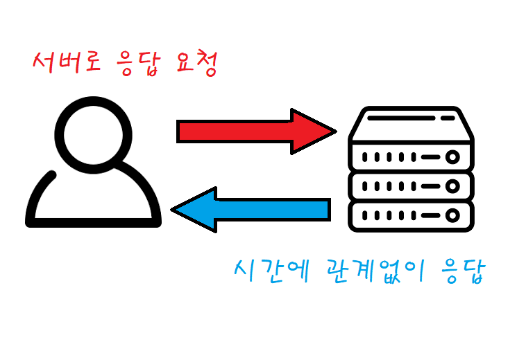

 예를 들어 온라인 게임 서버 데몬 프로그램을 실행한다고 가정하자. 우리는 게임 계정을 입력하고 접속할 것이다. 그럼 게임 서버에서는 사용자 계정을 언제든지 구별하여 시간에 관계없이 게임을 즐길 수 있게 올바른 응답을 하여 동작 해줘야 한다. 우리는 게임 접속을 위해 네트워크 통신을 이용하였고 게임 서버는 네트워크 통신에 응답한다. 즉, 네트워크 서비스를 처리하는 데몬 프로그램이 실행 된 것이다. 그렇다면 우리는 언제든지 게임에 접속하여 이용을 할 수 있으니 게임 서버는 게임 서버 데몬 프로그램을 항상 실행하고 있다는 말이 된다. 게임 서버 데몬 프로그램이 꺼진다면 네트워크 서비스 처리 기능이 꺼져 게임에 접속도 되지 않을 것이다.

 그럼 데몬이 어떻게 동작하는지 알아보자.

 데몬은 두가지 방식으로 동작한다. <li>standalone<li>슈퍼 데몬

 주로 standalone 방식은 서버를 자주 사용하는 데몬에 사용되고 슈퍼 데몬 방식은 사용 빈도가 비교적 작은 서버에 사용된다.

 standalone은 독자적으로 프로세스가 구동되어 실행되며 서비스 요청에 응답하기 위해 항상 메모리에 상주한다. 서버를 자주 사용하기 때문에 항상 서비스 요청에 응답이 가능해야 하기 때문이다. 단, 그만큼 많은 비용이 부담된다. standalone은 주로 웹 서버와 같이 서버를 자주 사용해야하는 곳에 사용된다.

 standalone 데몬의 실행 스크립트는 /etc/init.d 디렉토리에 주로 존재한다. (단, /etc/init.d 디렉토리에 있다고 모두 데몬은 아니다.) /etc/init.d 디렉토리에서 시스템 부팅 시에 자동 실행 여부를 지정 할 수 있다.

 슈퍼 데몬은 standalone 방식의 큰 비용 문제를 해결한 것으로 자신이 독립적으로 서비스를 실행 하지 않고 클라이언트의 요청을 받아 데몬을 실행해 주는 역할을 한다. 이 같은 특징 때문에 자주 사용되는 데몬을 슈퍼 데몬으로 사용하면 데몬을 구동, 종료하는 과정을 계속 반복해야하므로 시스템에 부담을 준다. 한 단계를 더 거쳐서 데몬이 실행되기 때문에 standalone방식보다 속도가 느리다는 단점이 있다. 대표적으로 telnet 서비스가 이에 해당한다.

 이 데몬이 슈퍼 데몬이라고 또는 xinetd 데몬이라고 불리는데 그 이유는 xinetd 데몬이 다른 하위의 데몬들을 지배하는 상위 데몬이기 때문이다. 즉, xinetd 데몬이 클라이언트의 요청을 받아 하위 데몬을 실행 시켜주는 연결고리 역할을 하는 것이다.

 슈퍼 데몬은 /etc/xinetd.conf 파일을 수정하여 슈퍼 데몬 설정이 가능하다. 슈퍼 데몬의 위치는 /etc/xinetd.d 디렉토리이다.

---

finger service
--------------

 finger는 로컬 사용자와 원격 서버 사용자의 계정 정보를 확인하는 명령어이다. 특이한 점은 who 명령어가 현재 사용중인 사용자들에 대한 정보를 제공하는 반면 finger 명령어는 시스템에 등록된 사용자 뿐만 아니라 네트워크를 통하여 연결된 다른 시스템에 등록된 사용자들에 대한 정보까지 제공한다는 점이다.

 리눅스에서는 사용자 계정에 대한 정보를 /etc/password 파일에 담고 있는데 finger 명령어를 사용하면 이 /etc/password 파일에서 계정 정보를 읽어서 보여준다. 때문에 정보 노출을 우려하여 finger service를 비활성화하는 것을 권장하고 있다.

 명령어 사용 방법은 다음과 같다.

> *finger [-옵션] [계정...] [계정@호스트...]*

 간단하게 예를 들어 user1 계정을 시스템에서 찾아보자. 명령어는 **finger user1** 이 될 것이다.

 이번에는 localhost라는 원격서버에 연결된 모든 계정을 찾아보자. 입력 방식은 'finger [계정@호스트]' 일 것이다. 현재 특정한 계정이 아닌 모든 계정을 찾는 것이므로 계정은 비워두고 호스트 명만 입력해주면 된다. 그렇다면 명령어는 **finger @localhost** 가 된다.

---

Hint
----

 역시나 파일 목록을 확인하고 힌트 파일을 열어보자.

 

 

 /etc/xinetd.d/와 백도어 모두 우리가 해석 가능한 내용이다.

---

풀이
----

 먼저, /etc/xinetd.d는 앞서 슈퍼 데몬 디렉토리라고 배웠다. 그렇단 말은 /etc/xinetd.d 디렉토리 어딘가에 백도어의 역할을 하는 파일이 있다는 말이고, 그 백도어가 슈퍼 데몬 방식으로 동작한다는 뜻이 된다.

 조금 더 뜻을 풀어보자. 슈퍼 데몬은 외부 클라이언트의 요청을 받고 /etc/xinetd.d 디렉토리에 의해 데몬이 실행 된다고 하였다. 현재는 바로 그 실행되는 데몬이 백도어라는 것이다. 디렉토리를 살펴보자.

 

 다양한 데몬, 즉, 서비스들이 있다. 그 중 당연하게도 눈에 띄이는 파일이 보인다. 이름부터 backdoor 파일인데 딱 봐도 수상해 보이고, 누가 봐도 백도어 파일인게 거의 확실한 것 같다. 한 번 열어보자.

 

 finger라는 서비스인데 앞에서 어떤 서비스인지는 설명하였다. 아래의 내용은 데몬 파일의 형식인데 한 줄씩 살펴보자.

<table>
  <tr>
    <td>service 이름</td>
    <td>서비스의 이름</td>
  </tr>
  <tr>
    <td>disable</td>
    <td>no : 데몬 활성화 yes : 데몬 비활성화</td>
  </tr>
  <tr>
    <td>flags</td>
    <td>서비스 포트가 사용 중일 경우 해당 포트의 재사용 여부</td>
  </tr>
  <tr>
    <td>socket_type</td>
    <td>소켓 타입 지정</td>
  </tr>
  <tr>
    <td>wait</td>
    <td>서비스가 연결된 상태에서 다른 요청이 들어오면 바로 응답을 할 지 여부</td>
  </tr>
  <tr>
    <td>user</td>
    <td>해당 유저의 권한으로 데몬 실행</td>
  </tr>
  <tr>
    <td>server</td>
    <td>슈퍼 데몬에 의해 실행될 파일</td>
  </tr>
  <tr>
    <td>log_on_failure</td>
    <td>정상적인 가동에 실패한 경우 기록될 내용</td>
  </tr>
</table>

 위의 표를 토대로 backdoor 파일을 해석하면 우리가 주의 깊게 봐야할 내용은 finger 명령어를 통해 네트워크 서비스를 실행하여 슈퍼 데몬에 요청을 하고 levle5의 권한으로 /home/level4/tmp/backdoor가 실행된다는 것이다.

 일단 데몬을 finger 명령어를 사용하여 데몬을 실행시켜보자.

 

 앞서 설명하였듯 슈퍼 데몬은 클라이언트의 요청을 받고 /etc/xinetd.d 디렉토리에 의해 데몬이 실행 된다고 하였다. finger 명령어에 의해 외부 클라이언트 요청을 해보자. 외부의 localhost 서버의 모든 사용자 계정에 대한 정보를 요청하는 finger 명령어를 사용하여 데몬을 실행시켰다. 그러나 현재 우리 눈으로는 아무런 변화를 볼 수 없다. 직접 실행 파일로 이동하여 살펴보자.

 

 /home/level4/tmp 경로까지 이동하여 파일 목록을 확인 하였으나 backdoor 파일이 존재하지 않는다는 것을 확인하였다. 슈퍼 데몬에 의해 실행 되어야 할 /home/level4/tmp/backdoor 파일이 존재하지 않으므로 backdoor 데몬이 동작하지 않은 것이다. 혹시나 파일이 숨겨져 있거나 finger 명령어 동작에 이상이 있는지 확인하기 위해 임시로 backdoor 파일을 만들어주자.

 

 

 위와 같이 간단히 alright! 문구를 출력하는 실행 파일을 backdoor라는 이름으로 gcc를 이용하여 컴파일 하여 생성하였다. 파일 목록을 확인하면 이제는 backdoor 파일이 존재하는 것을 볼 수 있다.

 그럼 정상적인 동작을 하는지 finger 명령어를 사용해 backdoor 데몬을 실행시켜 보자.

 

 우리가 만든 backdoor 파일 그대로 동작이 된다. 여기서 중요한 점이 현재 /home/level4/tmp/backdoor는 finger 서비스가 실행되면서 슈퍼 데몬에 의해 /etc/xinetd.d/backdoor 데몬이 실행되고 그 안의 /home/levle4/tmp/backdoor가 level5의 권한으로 실행된다는 점이다. 쉽게 말해 finger 명령어에 의해 실행된 /home/level4/tmp/backdoor는 level5의 권한이라는 말이다. 그럼 남은 문제는 간단하다. level5의 권한으로 원하는 코드를 동작 시킬 수 있다는 말은 다음 단계의 비밀번호를 알아내는건 시간 문제라는 말이다.

 

 앞의 샘플 코드를 위와 같이 my-pass 명령어를 실행시키는 코드로 수정하였다.

 

 그 다음, gcc 컴파일러를 활용하여 backdoor 파일을 다시 컴파일 하고 finger 명령어를 실행시켜 클라이언트 요청을 하여 /etc/xinetd.d/backdoor 데몬을 실행 시키고, 그 데몬에 의해 level5 권한의 /home/level4/tmp/backdoor가 실행되어 my-pass 명령어를 실행시켰다.

 결과는 비밀번호를 성공적으로 얻을 수 있었다.

---

Level5
======

 이번 문제는 Symbolic Link(심볼릭 링크)와 Hard Link(하드 링크)에 대해 공부하고 문제를 해결할 것이다.

---

Symbolic Link & Hard Link
-------------------------

 리눅스의 링크는 크게 Symbolic Link와 Hard Link가 있다. Symbolic Link는 윈도우의 바로 가기와 비슷하고 Hard Link는 원본 파일 데이터에 접근하는 또 다른 경로이다.

 이해를 돕기 위해 그림을 보며 살펴보자.

 

 Symbolic Link는 그림과 같이 원본 파일 데이터가 원본 파일에 저장되고 원본 파일의 데이터를 Symbolic Link 파일이 링크하는 형식이다. 윈도우의 바로가기 기능을 생각하면 된다. 바로가기로 생성된 파일을 실행 시키면 원본 파일이 실행되고 원본 파일은 원래 파일의 데이터를 가지고 있는 것이다.

 

 Hard Link는 앞서 설명한 내용 그대로 또 다른 경로이다. Hard Link 된 파일을 실행하면 원본 파일을 거치지 않고 바로 원래 파일의 데이터를 실행하게 된다. 또 다른 원본 파일이 하나 더 생긴 셈이다. 복사의 개념과 비슷하지만 다르다. 어떤 점이 다를까?

 만약, 원본 파일이 수정되었다고 가정하면 과연 Symbolic Link와 Hard Link 파일 중 어느 것이 수정될까? 정답은 둘 다이다. 결국은 둘 다 같은 데이터를 가리키고 있기 때문에 원본 파일이 수정되면 원래의 데이터가 수정되어 둘 다 내용이 수정된다. 하지만 원본 파일이 삭제 되었다면? 얘기가 달라진다. HardLink는 가리키는 데이터가 삭제되지 않았기 때문에 그대로 남아있지만 Symbolic Link는 데이터가 아닌 원본 파일을 가리키고 있었기 때문에 가리키는 파일이 없어져 원본 파일의 역할을 대신 하는 셈이 된다.

 Symbolic Link와 Hard Link를 설정하는 법을 알아보자.

 <li>Symbolic Link

> *ln -s [원본 파일 or 폴더 경로] [Symbolic Link 파일이 저장될 경로]*

 <li>Hard Link

> *ln [원본 파일 or 폴더 경로] [Hard Link 파일이 저장될 경로]*

 ln 명령어를 사용하여 링크를 걸어준다. 단순히 -s 옵션을 주어 Symbolic Link임을 명시하는 것을 제외하고는 형식이 같다.

---

Hint
----

 힌트를 열어보자.

 

 

 따로 특별한 내용은 현재로는 보기 힘들다. /usr/bin/level5 프로그램을 실행시켜 /tmp/level5.tmp 파일을 확인해보자.

---

풀이
----

 프로그램을 실행시켜 /tmp 디렉토리 목록을 확인하여 보았다.

 

 헌데, 어찌된 일인지 level5.tmp 파일이 온데간데 없이 보이지 않는다. 이유가 무엇일까? hint의 내용이 잘못되지 않은 이상 이 디렉토리에 level5.tmp 파일이 생성되는게 확실하다면 두 가지의 경우가 존재한다.

 우리가 level5.tmp 파일을 볼 수 없게 했거나 level5.tmp 파일이 삭제됐거나 두 가지이다. 우리는 파일 이름을 알고 있으니 파일 링크를 걸어 원본 데이터의 내용을 볼 수 있게 시도 해보자.

 원리는 이렇다. 빈 파일을 하나 생성하고 level5.tmp 파일을 링크시킨다. 그럼 level5.tmp 파일에 수정이 일어나면 level5.tmp가 우리가 생성한 빈 파일의 원본 데이터를 링크하고 있으니 원본 데이터가 수정 될 것이다. Symbolic Link이던 Hard Link이던 링크된 level5.tmp 파일이 수정되면 원본 데이터가 함께 수정이 되므로 최종적으로 우리가 생성한 빈 파일에 level5.tmp의 내용이 저장된다.

 

 touch 명령어를 이용해 빈 hardlink 파일을 생성하고 level5.tmp를 Hard Link 시켰다. 그리고 프로그램을 실행하고 파일 목록을 확인하였을 때 Hard Link에 의해 같은 데이터가 쓰이면서 파일의 크기까지 똑같은 걸 확인 할 수 있다. 그리고 파일을 열어 비밀번호를 획득 할 수 있었다. 특이하게 level5.tmp가 삭제되지 않았는데 Hard Link 시키면서 생성된 빈 level5.tmp에 덮어 쓰여진 것 같다.

 

 이번에도 마찬가지로 빈 symboliclink 파일을 생성하고 level5.tmp를 Symbolic Link 시켰다. 파일 목록에서 ->를 통하여 관계를 확인 할 수 있다. 프로그램을 실행하고 파일 목록을 확인하면 symboliclink 파일의 크기는 31이고 Symbolic Link된 level5.tmp의 크기는 12인 것을 확인 할 수 있다. 이 것은 단지 symboliclink를 가리키는 역할만 하기 때문이다. 링크에 의해 symboliclink의 원본 데이터에 저장된 level5.tmp 파일의 데이터를 마찬가지로 볼 수 있다.

 

---

Level 6
=======

 리눅스의 프로그램 도중 사용 할 수 있는 signal에 대해 간단하게 알아보자.

---

signal
------

 프로그램을 사용하다 보면 프로그램을 종료 시켜야 할 때가 있다. 그럴 때 signal이라는 기능을 사용하는데 리눅스에서는 상당히 많은 signal이 존재하고 각 signal마다 고유 번호가 있어 시스템은 고유 번호로 signal을 구분한다.

 많은 종류의 시그널 중 자주 사용되는 몇 가지만 살펴보자.

<table>
  <tr>
    <td>SIGKILL</td>
    <td>프로세스를 죽임</td>
  </tr>
  <tr>
    <td>SIGALARM</td>
    <td>알람 발생</td>
  </tr>
  <tr>
    <td>SIGSTP</td>
    <td>프로세스 정지</td>
  </tr>
  <tr>
    <td>SIGCONT</td>
    <td>멈춘 프로세스 가동</td>
  </tr>
  <tr>
    <td>SIGINT</td>
    <td>프로세스 차단</td>
  </tr>
  <tr>
    <td>SIGSEGV</td>
    <td>프로세스 메모리 오류</td>
  </tr>
</table>

 다음으로는 우리가 단축키를 활용하여 다양한 종료 시그널를 보내는 방법을 알아보자.

<table>
  <tr>
    <td>ctrl + z</td>
    <td>백그라운드로 작업 전환</td>
  </tr>
  <tr>
    <td>ctrl + d</td>
    <td>정상 종료</td>
  </tr>
  <tr>
    <td>ctrl + c</td>
    <td>강제 종료</td>
  </tr>
</table>

 위 세 가지의 단축키를 사용하여 실행중인 프로그램을 종료 시킬 수 있다.

---

Hint
----

 

 level6에 접속하면 자동으로 쉘이 아닌 위와 같은 프로그램이 실행 된다. Enter를 눌려 계속 진행해보자.

 

 그럼 다음과 같은 문구가 나오고 1,2,3번 중 어느 번호를 선택해도 텔넷 접속을 실행하고 아예 창이 닫혀버린다. 명령어 또한 어느 것도 먹히지 않는다.

---

풀이
----

 우리가 원하는 것은 일단 level6의 쉘이다. 그런데 알수없는 이 프로그램이 자꾸 실행되어 멋대로 종료되어 버린다. 해결 방안이 무엇일까?

 위에서 배운대로 그냥 프로그램을 종료 시켜버리자. ctrl + z 키는 눌려도 소용이 없고, ctrl + d는 프로그램이 정상 종료되어 또 다시 창이 꺼져버린다.

 

 위 창에서 ctrl + c를 사용하여 강제 종료 시켜버리면 다음과 같이 쉘을 획득 할 수 있다.

 

 

 어느 때와 같이 파일 목록을 확인해보자. 이때까지 한 번도 못보던 파일들 중 password라는 파일이 굉장히 눈에 띈다.

 일단 한 번 열어보자.

 

 그럼, 위와 같이 비밀번호를 획득 할 수 있다.

---

Level7
======

 이번에는 비밀번호를 유추하는 문제라 설명은 생략하겠다.

---

Hint
----

 

 

 파일 목록을 확인하고 힌트를 열어보자.

---

풀이
----

 힌트를 해석하여 조금 더 힌트를 주자면 힌트는 정말 가까운 곳에 있고, 공학용 계산기에는 2진수를 10진수로 바꿔주는 기능만 있으면 된다. 그리고 앞에서 배운 문자 변환을 생각하면 문제가 금방 해결 될 것이다.

 

 프로그램을 실행하고 비밀번호에 아무 문자나 입력하면 올바른 패스워드가 아니고 가까운 곳에 비밀번호가 있다고 얘기한다.

 힌트를 활용해 비밀번호를 알아내면 다음 단계 비밀번호가 나온다.

 

 비밀번호 해석은 직접 한 번씩 해보길 바란다.

---

Level8
======

 리눅스의 shadow 파일에 대해 알아보고 툴을 사용하여 패스워드를 복호화 하여 문제를 해결 할 것이다.

---

Shadow 파일
-----------

 리눅스 시스템은 사용자 계정 정보를 포함한 암호화 된 패스워드를 /etc/passwd 파일에 보관한다. 이 파일의 수정 권한은 없지만 파일을 읽는 권한은 누구에게나 주어져 있다. 그 이율호 해커들이 툴을 사용하여 사용자들의 패스워드를 알아내었다. 계정 정보는 물론 패스워드까지 노출 되어 버리는 매우 취약한 문제점이 있는 것이다.

 이 문제를 해결하기 위해 shadow 파일을 사용하게 되었다. shadow 파일이란 /etc/passwd의 패스워드 부분을 /etc/shadow에 두고 root만이 읽을 수 있는 권한으로 설정해두는 것이다.

 기존의 /etc/passwd는 누구나 읽을 수 있어 비록 암호화 되어 있는 패스워드라도 손 쉽게 해독을 할 수 있던 반면 패스워드를 /etc/shadow에 두고 관리 하면서 일반 사용자는 보지 못하게 함으로써 보안을 한 층 강화 하였다.

 root 권한으로 cat /etc/shadow 명령어를 실행시킨 결과이다.

 총 9개의 항목으로 이루어져 있으며, 각 항목은 콜론(:)으로 구분된다.

<table>
  <tr>
    <td>1. Login Name</td>
    <td>사용자 이름</td>
  </tr>
  <tr>
    <td>2. Encrypted</td>
    <td>패스워드를 암호화한 값</td>
  </tr>
  <tr>
    <td>3. Last Changed</td>
    <td>1970년 1월 1일로부터 패스워드가 수정된 날짜의 일수 계산</td>
  </tr>
  <tr>
    <td>4. Minimum</td>
    <td>패스워드 변경 전 최소 사용 기간</td>
  </tr>
  <tr>
    <td>5. Maximum</td>
    <td>패스워드 변경 전 최대 사용 기간</td>
  </tr>
  <tr>
    <td>6. Wran</td>
    <td>패스워드가 파기되기 전에 경고 메시지를 제공하는 함수</td>
  </tr>
  <tr>
    <td>7. Inactive</td>
    <td>패스워드가 파기되는 일 수</td>
  </tr>
  <tr>
    <td>8. Expire</td>
    <td>계정이 만료되는 일 수</td>
  </tr>
  <tr>
    <td>9. Reserved</td>
    <td>사용되지 않는 값</td>
  </tr>
</table>

 각 항목이 뜻하는 것은 위와 같고 두 번째 항목인 Encrypted 항목을 복호화한다면 패스워드를 알 수 있다.

 위의 Encrypted 부분을 자세히 보면 $로 또 다시 세 부분으로 나뉘어져 있다.

> \$HashID \$Salt \$Hash Value

 각 부분은 위와 같다.

<table>
  <tr>
    <td>Identifier</td>
    <td>Scheme</td>
    <td>Hash Function</td>
    <td>Salt lenght (char)</td>
    <td>Salt lenght (bits)</td>
  </tr>
  <tr>
    <td>1</td>
    <td>MD5-crypt</td>
    <td>MD5</td>
    <td>8</td>
    <td>64</td>
  </tr>
  <tr>
    <td>2a</td>
    <td>B-crypt</td>
    <td>Blowfish</td>
    <td>8</td>
    <td>64</td>
  </tr>
  <tr>
    <td>md5</td>
    <td>Sun MD5</td>
    <td>MD5</td>
    <td>8</td>
    <td>64</td>
  </tr>
  <tr>
    <td>5</td>
    <td>SHA-crypt</td>
    <td>SHA-256</td>
    <td>16</td>
    <td>128</td>
  </tr>
  <tr>
    <td>6</td>
    <td>SHA-crypt</td>
    <td>SHA-512</td>
    <td>+16</td>
    <td>128</td>
  </tr>
</table>

 맨 처음 HashID는 위 표의 Identifier 부분이고 이에 따라 Hash Function과 Salt Length 등이 변경된다.

 두 번째의 Salt는 단순 복호화 방지를 위한 값으로 HashID에 따라서 Byte 크기로 변환된 Salt Length의 값이다.

 Hash Value는 앞의 두 가지를 이용하여 Hash Function을 수행한 결과이다.

---

패스워드 복호화 툴
------------------

 패스워드 복호화 툴에는 다양한 온라인/오프라인 도구가 존재한다. (Hydra, Medusa, Findmyhash 등) 이번에는 오프라인 도구 중 하나인 John the Ripper(존 더 리퍼)에 대하여 알아보자.

 John the Ripper는 패스워드 복호화 툴 중 하나로 초당 백만개 이상의 패스워드를 비교할 수 있다. 사용법이 간단하고 편리하여 처음 복호화에 대한 기본 지식을 쌓는데에 적합한 도구이다.

 사용법은 위에서 살펴본 shadow 파일의 두 번째 항목 Encrypted를 알고 있으면 된다. 그리고 Encrypted 항목 전체를 복사하여 John the Ripper에 전달하면 복호화가 된다.

 John the Ripper는 인터넷 상에서 다운 받아 압축을 해제하여 사용한다. 그 후 압축 해제 폴더에서 run 폴더를 찾아 run 폴더 안에 복호화를 원하는 Encrypted 항목을 복사한 txt 파일을 넣어주면 된다.

 그리고 John the Ripper의 run을 실행시키고 명령어와 옵션을 이용하면 복호화된 결과를 볼 수 있다.

 운영체제의 환경마다 사용법이 다르므로 더 자세한 내용은 인터넷을 활용하면 좋을 것 같다.

---

Hint
----

 

 

 힌트를 열어보면 앞에서 배운 level9 계정에 관한 shadow 파일이 존재하고 용량이 2700이라고 알려준다.

---

풀이
----

 파일을 찾는 명령어는 앞서 find라고 배웠다. 그 중 -size 옵션을 이용하면 크기를 기준으로 검색이 가능하다. 우리가 알고 있는 정보는 파일 용량 뿐이다.

 -size 옵션 뒤에 추가로 크기의 단위를 지정해 줄 수 있다. b는 블록 단위, c는 byte 단위, k는 kbyte 단위, w는 word 단위로 검색이 가능하다.

 보통 파일 크기의 기준은 Byte이므로 2700 bytes 용량을 기준으로 검색을 해보자.

 

 위와 같이 옵션을 주어 검색하였다.

 

 그랬더니 너무 많은 검색 결과가 나오고 제대로 검색이 된 파일이 하나가 아니라 한 눈에 보기가 어렵다. 이럴 때에 find 명령 끝에 2>/dev/null이라는 문자를 추가로 적어주면 permission denied 대상의 파일은 제외하고 한 눈에 보기 쉽게 결과를 보여준다.

 

 이제 한 눈에 보기가 편해졌다. 검색 결과를 보면 총 4개의 파일이 검색 되었는데 하나는 gif 그림 파일, 또 다른 하나는 txt의 문서 파일, 나머지 두 개는 gz 형식의 압축 파일이다.

 이 중 우리가 shadow 파일처럼 글을 볼 수 있는 형식은 txt 파일 밖에 없다. txt 파일을 한 번 열어보자.

 

 제대로 찾아 온 것 같다. 앞에서 우리가 본 shadow 파일 형식과 동일하게 9개의 항목으로 이루어져 있으며 사용자도 level9로 힌트의 내용과 동일하다. 남은 것은 두 번째 항목인 Encrypted를 복사하여 John the Ripper를 사용해 복호화 하는 것이다.

 

 위 부분을 모두 복사하여 새로운 txt 파일을 만들고 John the Ripper에 전달하면 복호화가 완료된다. 앞의 내용과 인터넷의 도움을 받아 자신에게 알맞는 환경에서 직접 복호화 해보길 바란다.

 복호화 결과로는 'apple'이라는 문구가 나올 것이다.

---

Level9
======

 이번 장에는 시스템 해킹의 핵심인 buffer overflow에 대해 알아 볼 것이다. buffer overflow는 앞으로 문제에 계속 나오게 될 내용임은 물론 실제로도 사용하게 될 경우가 굉장히 많으므로 가장 주의깊게 봐야 할 부분이다.

---

Buffer Overflow
---------------

 Buffer Overflow는 메모리 상의 Buffer라는 저장 공간을 Overflow(넘치다) 시키는 것이다. 당장 Buffer도 모르는데 Overflow 시킬 수 있을 리가 없기 때문에 메모리 구조부터 차근 차근 하나씩 알아가보자.

---

### Memory 구조

 프로그램은 먼저 메모리에 로드되고 메모리를 읽어 프로그램을 실행 시킨다. 그러기 위해서는 프로그램의 여러 가지 변수들과 같은 데이터를 저장할 공간이 필요하다.

 원할하고 효율적인 프로그램 실행을 위해 운영체제는 다양한 메모리 공간을 제공하고 있다. 대표적으로 메모리는 다음과 같이 나뉘어 진다.

<li>코드(code) 영역<li>데이터(data) 영역<li>스택(stack) 영역<li>힙(heap) 영역

 조금 더 쉽게 그림을 보고 이해해보자.

 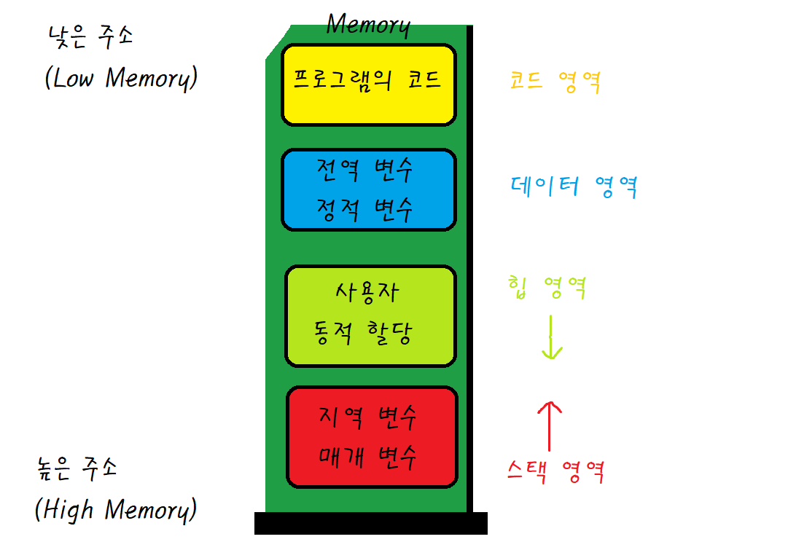

 코드 영역은 프로그램의 실행 코드가 저장되는 영역으로 텍스트 영역이라고도 한다. CPU는 코드 영역에 저장된 명령어를 순서대로 하니씩 처리한다.

 데이터 영역은 프로그램의 전역 변수와 정적(static) 변수가 저장되는 영역이다. 이 변수들은 함수 호출에 따라 소멸되거나 생성되지 않는 변수들이다. 프로그램의 시작과 함께 할당되어 프로그램이 종료되면 소멸된다.

 힙 영역은 사용자가 직접 할당하는 메모리 영역이다. 사용자가 직접 메모리 공간을 동적으로 할당하여 사용하고 해제한다. 힙 영역은 그림에서 보다싶이 낮은 주소에서 높은 주소 방향으로 할당된다.

 스택 영역은 함수 호출과 관계되는 지역 변수와 매개 변수가 할당되는 곳이다. 데이터 영역과 다르게 함수 호출에 따라 할당되고 소멸된다. 그렇기 때문에 실행 중인 함수의 정보를 잃지 않기 위해 함수마다 각각 다른 위치의 스택을 사용하게 되는데 이를 스택 프레임이라고 한다. 즉, 하나의 함수는 각각 하나의 스택 프레임을 가진다. 스택은 후입선출(LIFO, Last-In First_out) 구조로 가장 늦게 저장된 데이터가 가장 먼저 인출된다. 접시를 차곡차곡 쌓는다고 생각하면 된다. 높은 주소에서 낮은 주소로 순서대로 할당되며 이러한 특징때문에 스택은 거꾸로 자란다고 말한다.

---

 우리는 이 중 스택에 대한 Overflow를 공부할 것이다. 스택을 조금 더 자세히 알아보자.

---

### 스택

 앞서 스택은 스택 프레임이라는게 존재하여 함수마다 다른 위치의 스택을 사용한다고 하였다. 스택 프레임은 함수가 시작될 때 할당되어 종료되면 다시 스택을 제자리로 되돌려 놓는다. 이 때 어떻게 스택이 제자리를 찾을 수 있을까? 바로 RET와 SFP라는 데이터가 함께 스택에 저장되기 때문이다.

 RET는 복귀 주소로 eip라는 레지스터의 위치를 복귀 주소의 위치로 이동시킨다. eip 레지스터는 사용자가 마음대로 조작할 수 없으며 현재 eip가 가리키는 명령어가 실행된다.

 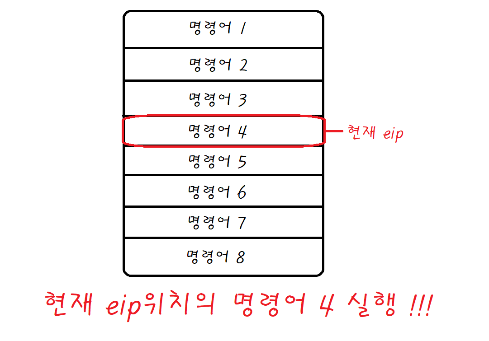

 복귀 주소는 함수를 실행시키는 명령어가 실행 될 때 그 다음 명령어의 위치로 자동으로 저장된다.

 SFP는 이전 ebp를 저장한 데이터를 말하며 ebp란 스택의 가장 윗 부분을 가리킨다. 스택은 위에서 아래로 자란다고 했다. 즉, 이 ebp의 위치를 기준으로부터 낮은 주소를 향해 스택에 데이터가 쌓이게 된다는 말이다. 이전 ebp 데이터를 저장해놓음으로써 각각의 함수마다 스택 프레임을 사용할 수 있는 것이다. 만약 SFP가 없다면 스택 프레임은 새로운 함수가 실행될 때마다 같은 지점의 ebp를 기준으로 데이터를 쌓아 올리게 될 것이다. 그렇게 된다면 자신이 원하는 지점의 데이터를 찾아서 사용하기가 매우 까다로울 것이다.

 언제나 할당되는 스택은 항상 RET와 SFP를 가진다. RET와 SFP의 크기는 4 Bytes이고 위치는 스택의 가장 끝이다. 가장 끝 4 Byte에 RET가 저장되고 그 앞의 4 Byte에는 SFP 데이터가 저장되어 있다.

 현재까지 우리가 배운 내용으로 스택을 그려보면 다음과 같을 것이다.

 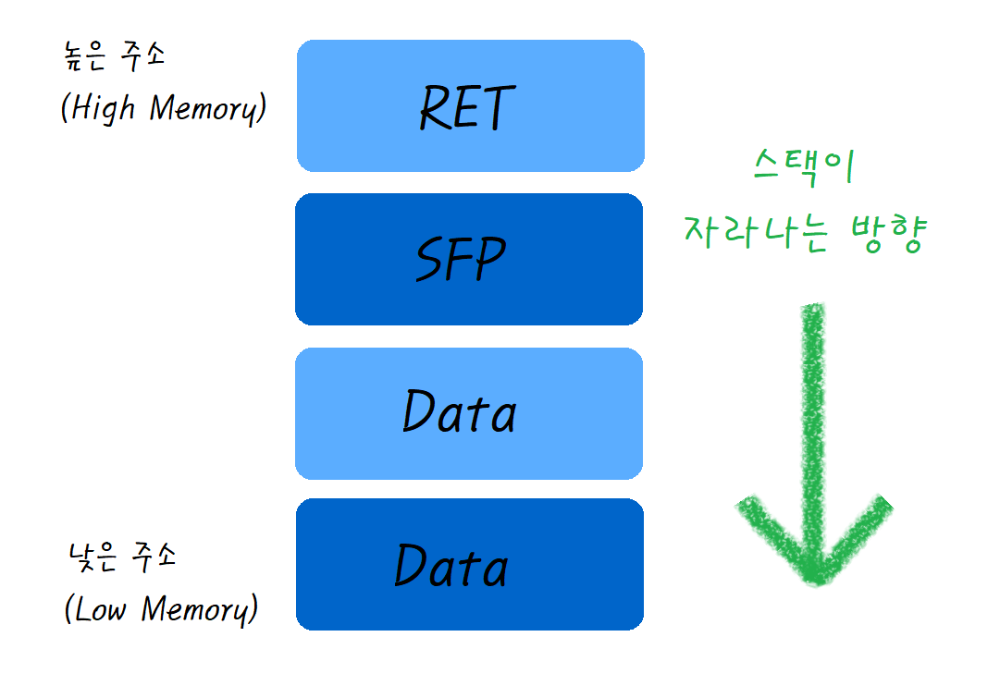

 data는 지역 변수와 같은 데이터를 뜻한다. 만약 이 함수에 지역 변수가 선언되어 있다면 SFP-4의 위치 부터 낮은 주소 방향을 항하여 차곡차곡 쌓이게 된다. 데이터를 사용하기 위하여 꺼낸다면 반대로 가장 늦게 저장된 가장 낮은 주소의 데이터부터 꺼내어 사용할 수 있다.

 예를 들어 int index 변수를 선언했다고 하자. 현재 스택은 어떤 모양일까?

 

 스택은 그림과 같을 것이다.

 그럼 이번에는 char buf[10] 크기의 변수를 선언해보자.

 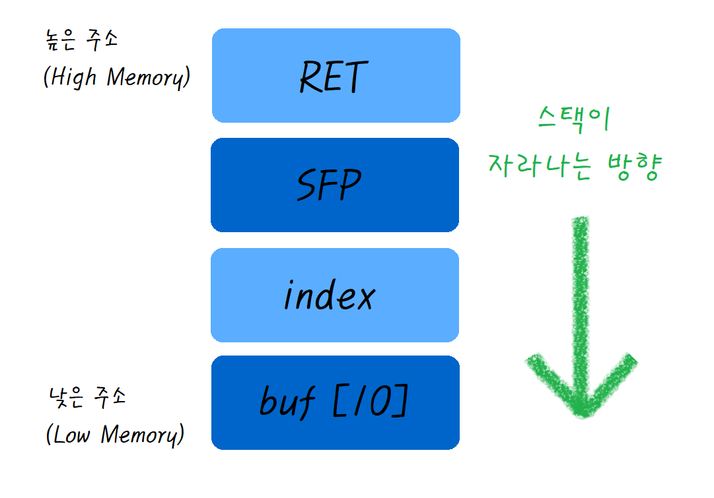

 int 자료형의 크기는 4 bytes이므로 index-4의 주소에 buf[10] 변수가 저장될 것이다.

 여기까지가 스택의 기본 구조이다. 스택은 높은 주소에서 낮은 주소로 자란다는 점을 반드시 기억하고 스택에 데이터가 쌓이는 과정과 RET와 SFP의 위치를 이해가 될 때까지 반복해서 보길 바란다.

---

### stack overflow

 이제 본격적으로 buffer overflow를 시켜보자. 우리는 buffer 중 stack이라는 공간을 overflow 시킬 것이고 이미 stack의 구조를 살펴보았다. overflow란 할당된 크기의 용량보다 더 많은 데이터를 집어 넣어 넘치게 하는 것이다.

 위의 그림을 예로 살펴보자. 현재 스택의 가장 낮은 주소는 buf 변수의 주소이다. buf은 char 자료형으로 배열 10개가 선언되었으므로 크기가 10 bytes이다. 근데 만약 22 bytes 크기의 데이터를 buf에 집어넣게된다면 어떻게 될까?

 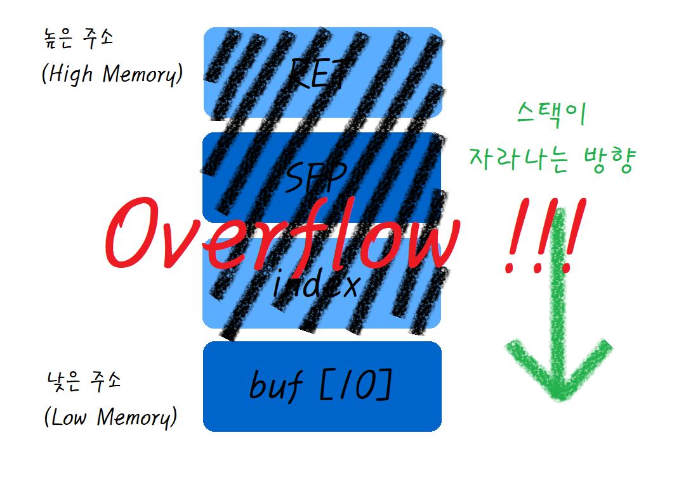

 이것이 바로 overflow이다. 자신에게 할당된 크기보다 더 큰 크기의 데이터를 할당 받게 되면 처음에 스택에 할당된 자신의 구역이 아닌 다른 변수의 영역까지 넘어가서 침범해버리게 되는 것이다. 그럼 침범당한 다른 변수는 앞의 byte에 의해 값이 변할 것이다.

 위의 내용이 기본적인 buffer overflow의 개념이다. 근데 이것이 왜 위험한 공격이고 이토록 많은 이들이 공부하고 주목하는 것일까?

 우리는 앞서 RET에 대해 공부하였다. 복귀주소, 함수가 종료되면 다음 명령어가 실행될 곳이다. 그런데 생각해보자. 지금 우리만 해도 RET의 위치를 포함한 현재 스택의 구조를 세세하게 모두 알고있다. 그 말은 buf를 RET까지 overflow시켜 복귀주소르 우리가 원하는 곳으로 바꿔버릴 수 있다는 말이 아닌가? 바로 이 점 때문에 buffer overflow는 매우 치명적인 공격인 것이다.

 공격자가 스택의 구조를 파악하여 자기가 원하는 코드를 삽입하고 그 코드의 위치로 RET를 덮어써버리면 공격자는 자유자재로 시스템을 다룰 수 있게 된다. 하지만 가장 중요한 스택의 구조를 파악하지 못하면 RET가 어느 위치에 있는지 변수가 어디에 위치했는지 알 지 못한다면 무용지물이 된다.

---

 여기까지가 메모리 구조와 stack, buffer overflow에 대한 설명이다. 그럼 직접 buffer overflow를 시켜보자.

---

Hint
----

 

 

 힌트를 열어보면 /usr/bin/bof 프로그램의 소스가 나온다. 함께 분석해보자.

---

풀이
----

 

 가장 먼저 char형 10 bytes 크기의 buf2와 buf 변수를 선언한다.

 

 다음은 "It can be overflow : "라는 문구를 출력하고 fgets() 함수를 이용하여 buf 변수에 40 bytes 크기의 키보드 입력을 받는다.

 잠깐 주목하자. 40 bytes라고 하였다. 분명 위에 선언된 변수의 크기는 10 bytes 인데 40 bytes라니 이게 웬 말인가? 10 bytes보다 큰 크기의 데이터를 입력하면 반드시 overflow가 일어날 것이다.

 

 strncmp 함수는 문자열 비교 함수이다. 해석하면 buf2의 첫 2 bytes가 go인지 검사하는 것이다. if 조건 구문을 통하여 go가 맞다면 "Good Skill!"을 출력하며 쉘을 준다. 그렇지 않다면 프로그램이 종료되는 것으로 보인다.

 코드 해석은 마쳤으니 스택 구조를 파악하여 overflow를 시도해보자.

 위에서부터 천천히 아래로 쌓아보자.

 

 가장 먼저 RET와 SFP가 스택에 들어 있을 것이다. 그리고 이후의 변수는 SFP의 밑으로 쌓이게 될 것이다. 그럼 그 다음 변수인 bu2와 buf를 차례대로 쌓아보자.

 

 그럼 다음과 같은 형태가 될 것이다. 위 그림을 보면 buf에 40 bytes 입력을 받아 buf2의 데이터를 조작할 수 있다는 것을 확신할 수 있다.

 그럼 이제 buf의 10 bytes를 아무렇게 채우고 뒤에 go만 붙여주면 성공적으로 overflow가 될까? 정답은 아니다. 리눅스에서는 buffer overflow를 막기 위해 스택의 구조를 추리하기 어렵게 하였다.

 바로 dummy byte를 추가하는 것이다. 변수와 변수의 저장 공간사이에는 dummy라는 명칭의 쓰레기 값이 존재한다. 그런데 문제는 이 쓰레기 값의 크기가 랜덤이기 때문에 쓰레기 값의 크기를 계산하여 스택을 계산하기 매우 어렵다는 것이다.

 

 현재 스택은 위와 비슷한 형태일 것이다. 문제는 dummy의 크기를 알아내는 것인데 현재로써는 알아내는 것이 매우 힘들다. 이럴 때에는 될 때까지 값을 반복하여 넣어서 알아내는 방법이 있다.

 하지만 우리는 조금만 더 머리를 써보자. 어차피 우리는 buf2의 첫 2 byte만 go로 바꾸어주면 된다. 즉, 40 bytes를 go로 가득 채워 overflow 시키면 dummy를 포함한 모든 byte가 go로 뒤덮여있을 것이다. buf2의 위치를 정확히 알지 못해도 buf2는 모두 go로 뒤덮이기 때문에 어디가 첫 바이트이던 go를 만나게 된다.

 실행에 옮겨보자.

 

 go를 마구 입력하였다. 꼭 40 bytes를 맞춰줄 필요도 없다. 우리가 몇 byte를 입력하던 fgets 함수에 의해 40 bytes만 인식 될 것이기 때문이다. 어쨋든 go를 무작정 집어 넣어준 덕분에 Level10의 쉘을 획득했다.

 my-pass를 입력하여 비밀번호를 획득하자.

 

---

Level 10
========

 리눅스의 공유 메모리에 대해 알아보고 코드를 작성하여 직접 공유 메모리를 다루어 문제를 해결할 것이다.

---

공유 메모리
-----------

 보통 프로세스 하나에 할당되는 메모리 영역은 해당 프로세스만이 사용 가능하다. 그런데 공유 메모리는 여러 개의 프로세스가 하나의 메모리 영역을 같이 사용할 수 있게 해준다.

 

 

 코딩을 통해 공유 메모리를 사용하는 방법을 알아보자.

<table>
  <tr>
    <td>shmget(key_t key, int size, int shmflg)</td>
    <td>공유 메모리 생성</td>
  </tr>
  <tr>
    <td>shmat(int shmid, const void ＊shmaddr, int shmflg)</td>
    <td>공유 메모리 접근</td>
  </tr>
  <tr>
    <td>shmdt(const void ＊shmaddr)</td>
    <td>공유 메모리 접속 종료</td>
  </tr>
  <tr>
    <td>shctl(int shmid, int cmd, struct shmid_ds ＊bf)</td>
    <td>공유 메모리 제어</td>
  </tr>
</table>

 위는 공유 메모리를 다루기 위하여 필요한 함수들이다.

 공유 메모리의 사용을 위해 고유의 key가 필요한데 공유 메모리를 생성할 때 특정한 key 값을 주어 생성하고 접근할 때에도 key 값을 이용하여 접근이 가능하다. 또 key 값은 공유 메모리를 구분하기 위해서도 반드시 필요하다.

 함수 인자들을 살펴보면 key 인자는 공유 메모리 고유의 key 값을 말한다. size는 말 그대로 크기, shmflg는 공유 메모리 플래그로 옵션 설정을 하고, shmid는 공유 메모리의 id이다. shmaddr은 공유 메모리의 주소를 말한다. 나머지는 크게 중요한 부분이 아니므로 넘어가도록 하자.

---

Hint
----

 

 

 힌트를 통해 얻을 수 있는 정보는 공유 메모리를 사용한다는 점과 공유 메모리 고유의 키 값이 7530이라는 점이다.

---

풀이
----

 힌트에서 얻은 key 값을 활용해 공유 메모리에 직접 접근하여 보자.

 앞서 배운 함수들을 활용해 7530 key 값의 공유 메모리에 접근하는 프로그램을 짰다.

 

 한 줄씩 함께 봐보자.

 위는 함수의 인자를 위한 변수들이다. shmid는 공유 메모리의 id를 얻기 위한 변수, keyval은 공유 메모리 key 값을 이용하여 공유 메모리에 접근하기 위한 key 변수, \*shared_memory는 공유 메모리의 주소를 얻기 위한 변수이다.

  shmget 함수를 이용하여 key 7530 값의 공유 메모리를 생성한다. 즉, 공유 메모리를 얻는 것이다. 함수는 int 형으로 리턴 되고 shmid에 공유 메모리 id가 저장된다.

 얻은 id로 공유 메모리에 shmat 함수를 사용하여 접근한다. 그리고 shared_memory는 공유 메모리를 가리키고 있다.

 printf로 shared_memory가 가리키는 내용, 공유 메모리의 내용을 출력한다.

 코드를 저장 후에 컴파일하고 실행시켰다.

 

 그랬더니 위와 같이 공유 메모리의 내용을 정확히 확인하는데에 성공하였다.

---

Level11
=======

 buffer overflow를 기반으로 어셈블리어로 리버싱을 하고 쉘 코드를 작성해 볼 것이다. 그리고 ASLR 보호 기법과 간단한 우회 방법에 대해 살펴보자.

---

어셈블리어
----------

 어셈블리어는 기계어와 1대1 대응을 하는 언어로 코드가 어떤 일을 하는지 직접적으로 보여준다. 컴퓨터 시스템과 구조를 좀 더 깊게 이해하는데에 큰 도움을 주고 프로그램 최적화 및 리버스 엔지니어링을 위해서도 필요한 언어이다.

---

### 80x86 프로세서

 cpu 레지스터에는 범용 레지스터, 상태 레지스터, 플래그 레지스터가 있다. 레지스터란 cpu 내부의 기억장소로 pc가 정보를 처리하기위해 확보한 특정한 셀을 말한다. cpu상의 작은 기억장치라고 봐도 무방하다.

 앞으로 어셈블리어를 사용하려면 cpu 레지스터에 대하여 잘 알고있어야 한다. cpu 레지스터에는 어떤 종류가 있는지 조금 더 자세히 들여다보자.

 

 <li>데이터 레지스터 데이터 레지스터는 각종 데이터 처리를 대상으로 하는 32 bit or 16 bit 레지스터를 프로그래머가 명령 중에 자유롭게 지정할 수 있는 범용 레지스터이다.

> EAX, EBX, ECX, EDX

 <li>포인터 레지스터

> ESP, EBP

 <li>인덱스 레지스터

> ESI, EDI

 <li>세그먼트 레지스터

> CS, DS, SS, ES

 각 레지스터가 담당하는 일을 표를 통해 살펴보자.

<table>
  <tr>
    <td>32 bit</td>
    <td>16 bit</td>
    <td>상위 8 bit</td>
    <td>하위 8 bit</td>
    <td>기능</td>
  </tr>
  <tr>
    <td>EAX</td>
    <td>AX</td>
    <td>AH</td>
    <td>AL</td>
    <td>누산기라고 불리며, 곱셈이나 나눗셈 연산에 중요하게 사용</td>
  </tr>
  <tr>
    <td>EBX</td>
    <td>BX</td>
    <td>BH</td>
    <td>BL</td>
    <td>베이스 레지스터라고 불리며 메모리 주소 지정시에 사용</td>
  </tr>
  <tr>
    <td>ECX</td>
    <td>CX</td>
    <td>CH</td>
    <td>CL</td>
    <td>계수기 레지스터라고 불리며 Loop등의 반복 명령에 사용</td>
  </tr>
  <tr>
    <td>EDX</td>
    <td>DX</td>
    <td>DH</td>
    <td>DL</td>
    <td>데이터 레지스터라고 불리며 곱셉, 나눗셈어세 EAX와 함께 쓰이며 부호 확장 명령 등에 사용</td>
  </tr>
  <tr>
    <td>ESI</td>
    <td>SI</td>
    <td></td>
    <td></td>
    <td>다량의 메모리를 옮기거나 비교할 때 값의 주소를 가짐</td>
  </tr>
  <tr>
    <td>EDI</td>
    <td>DI</td>
    <td></td>
    <td></td>
    <td>다량의 메모리를 옮기거나 비교할 때 목적지의 주소를 가짐</td>
  </tr>
  <tr>
    <td>ESP</td>
    <td>SP</td>
    <td></td>
    <td></td>
    <td>스택 포인터로 스택의 최종점을 저장</td>
  </tr>
  <tr>
    <td>EBP</td>
    <td>BP</td>
    <td></td>
    <td></td>
    <td>ESP를 대신해 스택에 저장된 함수의 파라미터 지역 변수의 주솔르 가리키는 용도로 사용</td>
  </tr>
</table>

 세그먼트 레지스터

<table>
  <tr>
    <td>16 bit</td>
    <td>기능</td>
  </tr>
  <tr>
    <td>ES</td>
    <td>보조 세그먼트 레지스터, 두 곳 이상의 데이터 저장영역을 가리켜야 할 때 DS와 함께 사용</td>
  </tr>
  <tr>
    <td>CS</td>
    <td>코드 세그먼트를 가리키는 레지스터, 프로그래머 코드의 시작주소를 가짐</td>
  </tr>
  <tr>
    <td>SS</td>
    <td>스택 세그먼트를 가리키는 레지스터, 스택의 시작 주소를 가짐</td>
  </tr>
  <tr>
    <td>DS</td>
    <td>데이터 세그먼트를 가리키는 레지스터, 프로그래머가 정해놓은 데이터의 시작 주소를 가짐</td>
  </tr>
  <tr>
    <td>FS</td>
    <td rowspan=2>보조 세그먼트 레지스터, FS, GS는 286 이후에 추가된 것으로 운영체제를 작성하는 게 아니라면 중요하게 여기지 않아도 무관</td>
  </tr>
  <tr>
    <td>GS</td>
  </tr>
</table>

 상태 레지스터

<table>
  <tr>
    <td>32 bit</td>
    <td>16 bit</td>
    <td>기능</td>
  </tr>
  <tr>
    <td>EIP</td>
    <td>IP</td>
    <td>EIP는 현재 실행되고 있는 프로그램의 실행코드가 저장된 메모리의 주솔를 가리키는 레지스터로 프로그램의 실행이 진행됨에 따라 자동으로 증가하고 프로그램의 실행 순서가 변경되는 제어문이 실행될 때 자동으로 변경. 그래서 직접 접근해서 값을 저장하거나 읽거나 하는 일이 없기 때문에 응용 프로그램에서 직접 사용할 일이 없음</td>
  </tr>
  <tr>
    <td>EFLAGS</td>
    <td>FLAGS</td>
    <td>비트 단위의 플래그 들을 저장하는 레지스터로 아주 특별한 용도로 사용</td>
  </tr>
</table>

---

### 명령어

 위의 다양한 레지스터에 값을 저장하고 변경하고를 반복하며 프로그램이 실행되고 종료되는 것이다. 어떻게 레지스터의 값을 변경할까? 바로 어셈블리어 명령어를 사용하여 값을 변경한다. 그렇기에 어셈블리어 코드는 명령어와 operand라고 불리는 값들의 연산으로 이루어져있다. 그리고 이것은 기계어와 1대1 대응을 이루고 있다.

 몇 가지 많이 쓰이는 명령어를 알아보자.

 어셈블리어 명령어

<table>
  <tr>
    <td>명령어</td>
    <td>예제</td>
    <td>설명</td>
    <td>분류</td>
  </tr>
  <tr>
    <td>push</td>
    <td>push %eax</td>
    <td>eax의 값을 스택에 저장</td>
    <td>스택 조작</td>
  </tr>
  <tr>
    <td>pop</td>
    <td>pop %eax</td>
    <td>스택 가장 상위에 있는 값을 꺼내어 eax에 저장</td>
    <td>스택 조작</td>
  </tr>
  <tr>
    <td>mov</td>
    <td>mov %eax, %ebx</td>
    <td>메모리나 레지스터의 값을 옮길 때 사용</td>
    <td>데이터 이동</td>
  </tr>
  <tr>
    <td>lea</td>
    <td>lea (%esi), %ecx</td>
    <td>%esi의 주소 값을 ecx에 옮김</td>
    <td>주소 이동</td>
  </tr>
  <tr>
    <td>inc</td>
    <td>inc %eax</td>
    <td>%eax의 값을 1 증가</td>
    <td>데이터 조작</td>
  </tr>
  <tr>
    <td>dec</td>
    <td>dec %eax</td>
    <td>%eax의 값을 1 감소</td>
    <td>데이터 조작</td>
  </tr>
  <tr>
    <td>add</td>
    <td>add %eax, %ebx</td>
    <td>레지스터나 메모리의 값을 덧셈</td>
    <td>논리, 연산</td>
  </tr>
  <tr>
    <td>sub</td>
    <td>sub %eax, %ebx</td>
    <td>레지스터나 메모리의 값을 뺄셈</td>
    <td>논리, 연산</td>
  </tr>
  <tr>
    <td>call</td>
    <td>call proc</td>
    <td>프로시져를 호출</td>
    <td>프로시져</td>
  </tr>
  <tr>
    <td>ret</td>
    <td>ret</td>
    <td>호출했던 바로 다음 지점으로 이동</td>
    <td>프로시져</td>
  </tr>
  <tr>
    <td>cmp</td>
    <td>cmp %eax, %ebx</td>
    <td>레지스터와 레지스터 값을 비교</td>
    <td>비교</td>
  </tr>
  <tr>
    <td>jmp</td>
    <td>jmp proc</td>
    <td>특정한 곳으로 분기</td>
    <td>분기</td>
  </tr>
  <tr>
    <td>int</td>
    <td>int $0x80</td>
    <td>OS에 할당된 인터럽트 영역을 System call</td>
    <td>인터럽트</td>
  </tr>
  <tr>
    <td>nop</td>
    <td>nop</td>
    <td>아무런 동작도 하지 않음 (No Operation)</td>
    <td></td>
  </tr>
</table>

 위의 명령어들이 가장 흔하게 많이 쓰이는 것들이다. 이 뿐만이 아니라 어셈블리 명령어는 아주 많으므로 인터넷을 참고하면 더 많은 명령어에 대한 자료를 얻을 수 있을 것이다.

---

Shell Code
----------

 쉘 코드란 보통 공격을 통해 시스템의 관리자 권한의 쉘을 얻어내는 것을 말한다. 즉, 쉘을 실행시키는 프로그램을 코드로 짜는 것이다. 어셈블리어를 활용해 컴파일러가 필요없는 기계어와 1대1 대응되는 16진수 Byte값의 코드를 얻고 말 그대로 코드만을 추출하는 것이다. 실행되는 프로그램이 아니라 쉘을 실행을 시키는 코드 말이다.

 

 그렇게 만들어진 코드를 프로그램에 삽입하여 프로그램의 RET를 쉘 코드의 시작 주소로 변조 시킨다. 그렇게 되면 함수가 종료되고 다음 위치의 명령어가 아닌 쉘 코드가 시작되는 것이다.

 어셈블리어를 사용하여 함께 만들어보자.

 우선 c언어를 사용해 쉘을 띄우는 프로그램을 작성한다.

 

 코드는 exeve 함수를 이용하여 /bin/sh을 실행시키는 간단한 코드이다.

 execve 함수가 표준 라이브러리를 사용하지 않고 정적으로 바이너리 파일 내에 포함되어 컴파일 될 수 있도록 -static 옵션을 사용하여 컴파일한다.

 

 gdb라는 디버거를 사용하여 디버깅 해보자. 사용법이 간단하므로 따라하기만 해도 사용하는데 문제가 없을 것이다.

 

 sh 파일을 gdb로 열어 디버깅을 할 수 있게 하였고 set disas intel 명령어를 사용하여 gdb의 표기 방식을 intel 방식으로 변경하였다.

 

 sh 파일 main 함수의 어셈블리 코드이다. 맨 앞의 두 줄의 코드 push ebp와 mov ebp, esp가 함수 프롤로그라는 것이다. 두 명령어가 하는 역할은 이전 ebp를 스택에 저장하고 현재 ebp를 esp와 같게 만들어 준다. 스택 프레임을 갱신하는 것이다.

 이후 sub 명령을 활용하여 현재 esp의 위치로 부터 일정 공간만큼 스택을 확장한다. mov 명령어를 사용하여 ebp의 위치로 부터 원하는 만큼의 위치에 값을 저장한다. 그리고 push 명령어로 한 번더 값을 저장하는데 이 값들은 execve 함수의 인자이다. 이후 execve 함수를 호출한다.

 스택을 정리하면 다음과 같다.

 

 main의 코드와 위 그림의 스택을 비교하면서 여기에 왜 이 값이 들어가는지 이해가 될 때까지 잘 살펴보기를 바란다. 그리고 ebp를 이용하여 값을 저장하는 방법도 주의깊게 살펴보아라.

 

 위의 코드가 쉘을 띄우는 코드인데 이 중에는 반드시 필요한 내용도 있고, 그렇지 않은 내용도 있다. 우리는 이 중 반드시 필요한 내용을 뽑아내어 쉘 코드에 사용할 것이다.

 그러기 위해서는 execve 코드의 필요한 부분을 알아야 한다. 어셈블리에서는 함수를 호출하면 모든 값을 세팅한 후 최종적으로 int 0x80 명령어를 통해 인터럽트 콜을 발생시킨다. 시스템에서는 이 인터럽트의 번호에 따라서 함수를 구분하고 알맞은 콜을 호출한다. 그렇다는 말은 우리가 필요한 내용은 execve 함수에 알맞은 값을 세팅하는 것과 올바른 인터럽트 콜을 호출하는 것이다. 여기서 값이란 함수의 인자를 뜻한다.

 일단, 어셈블리 코드를 인터럽트 호출하는데까지 짤라보자.

 

 이제 범위가 좁혀졌다. 이 코드 중에서 값을 세팅하는 내용만 찾으면 된다. 천천히 코드를 함께 살펴보자.

 이번에는 함수 프롤로그와 함께 eax를 0으로 초기화 해준다. 그리고 edi와 ebx 값을 스택에 push한다. 그 후 ebp + 8, ebp + 12, ebp + 16의 위치에 값들을 각 edi, ecx, edx에 복사하는데 이 값들은 현재 ebp의 위치로 보았을 때 이전 main 함수에서 넘어온 execve 함수의 인자들이다. 즉, 순서대로 0x808ef90, eax, 0x0과 같다는 얘기이다. 그리고 ebx를 push하여 ebx에 edi 값을 저장한다. 그 후 eax에 저장된 0xb번 인터럽트 콜을 발생시킨다.

 정리해보자. edi = 0x808ef90, ecx = eax, edx = 0x0, ebx = edi 이다.

 각 값이 뜻하는 내용은 c 코드의 함수 인자와 비추어 보면 된다. 0x808ef90은 "/bin/sh", eax는 str의 주소, 0x0은 null과 같다. 그럼 대충 감이 오지 않는가? 이것들이 바로 올바른 값을 세팅하고 인터럽트 콜을 호출하는 내용이다.

 우리가 필요한 코드를 정리하여 어셈블리로 작성하면 된다. 그런데 저 코드들을 그대로 사용하면 되는 것인가? 아니다. 위 코드를 보면 값을 push 할 때 NULL Byte(0x0)이 포함되어 있는데 이는 문자열의 끝에 붙는 null과 뜻이 겹치게 된다. 그래서 쉘 코드에 NULL Byte를 넣게 되면 값이 아닌 문자열의 끝을 뜻하는 NULL로 인식하게 되어 코드가 꼬여버린다.

 이를 같은 값을 xor 연산시키면 0이나오는 결과를 이용하여 해결하고 어셈블리 코드를 작성하면 된다.

 

 코드는 위와 같이 작성하면 된다.

 한 단계씩 코드를 자세히 알아보자.

 

 NULL Byte가 생기지 않게 xorl을 이용하여 eax를 0으로 만들어준다.

 

 0x6e69622f는 ASCII의 /bin을 0x68732f2f는 /sh, eax는 /bin/sh 문자열의 끝을 나타낸다.

 

 현재 esp의 값(/bin/sh의 시작점)을 ebx에 넣는다.

 

 그리고 /bin/sh + null, 즉, ebx + eax를 push한다. 이것이 첫 번째 인자이다.

 

 /bin/sh의 시작 주소를 ecx애 전달한다.(두 번째 인자)

 NULL을 edx에 전달한다.(세 번째 인자)

 

 시스템 콜 번호를 0xb로 설정하고 인터럽트 콜을 일으킨다.

 

 차례대로 어셈블리 파일을 해석 가능한 obj파일로 obj 파일을 실행 가능한 파일로 컴파일한다.

 

 objdump 유틸리티에 -d 옵션을 사용하여 표시된 부분을 보면 16 진수의 쉘 코드를 얻은 것을 확인할 수 있다. 이제 저 코드를 그대로 프로그램에 집어넣기만 하면 쉘이 실행될 것이다.

---

ASLR
----

 ASLR 보호 기법은 공격자가 스택의 정확한 주소를 쉽게 유추할 수 없도록 한 것이다. 앞서 말했듯 dummy byte를 넣었음에도 공격자들이 스택을 정확하게 유추하자 아예 스택의 주소를 랜덤하게 바꿔버린 것이다.

 즉, 프로그램 실행 시 메모리에 올라갈 때 항상 같은 위치가 아닌 다른 위치에 올라간다는 말이다. 그렇게 된다면 정확한 주소를 유추하기 어려울 것이고 스택에 값을 삽입하여 ret를 조작하는 것 또한 쉽지 않게 될 것이다.

---

환경변수를 이용한 우회 기법
---------------------------

 앞의 ASLR 기법을 간단하게 우회 하는 방법이 있다. 바로 환경변수를 이용하는 것인데 환경변수는 메모리 상의 항상 같은 위치에 올라가 있다는 점을 이용한 것이다.

 굳이 프로그램의 스택에 쉘 코드를 집어넣어 ret를 유추하기 어려운 스택 주소로 조작하기 보다 항상 같은 곳에 있는 환경변수의 주소로 ret를 변경시켜 버리는 기법이다.

 간단하게 쉘 코드를 환경변수에 등록하는 것만으로도 가능하다. 그렇게 되면 ret가 쉘 코드가 저장된 환경변수의 주소로 덮어지면 환경변수가 실행될 것이고 자연스럽게 쉘 코드가 실행되는 것이다.

---

Hint
----

 

 파일 목록을 확인하였더니 우리가 늘 보던 hint와 함께 level12 권한의 SetUID가 걸린 attackme 파일을 함께 볼 수 있었다. 일단 힌트를 열어보자.

 

---

풀이
----

 힌트를 살펴보니 어떤 프로그램의 소스가 나와있다. 아무래도 앞의 attackme의 소스인 것 같다.

 코드는 간단하다. 프로그램 실행시 인자를 전달받아 256 byte의 str 변수에 복사를 하고 str 문자열을 출력하는 것이 끝이다. 딱 봐도 길이제한이 없는게 인자를 통한 buffer overflow가 일어나기 좋은 것 같다.

 관건은 dummy byte의 크기를 알아내어 ret까지 도달하는 것이 될 것이다.

 gdb로 직접 살펴보자.

 

 attackme의 어셈블리 코드이다.

 

 위 부분을 보면 함수 프롤로그 이후 스택을 0x108(264 Byte)만큼 할당하는 모습이다. 아래의 내용들은 함수 호출을 하고 함수 인자를 위해 스택을 할당하고 해제하는 과정을 반복하는 것이므로 신경쓰지 않아도 된다.

 그런데 우리가 본 str 변수는 256 Byte인데 264 Byte라니 뭔가 이상하지 않나? 나머지 8 Byte는 어디서 온 것일까? 이것이 바로 Dummy Byte이다.

 현재 스택 상황을 생각해보자.

 

 스택은 위와 같을 것이다. 그럼 어떻게 쉘 코드를 실행시켜야 할까? 앞에서 buffer overflow를 설명하며 ret를 덮는다고 하였다. 현재 내가 원하는 값을 넣을 수 있는 곳은 str 변수이고 다행히도 현재 스택 구조 상 ret까지 도달할 수 있다. 그렇다면 str에 쉘 코드를 넣고 쉘 코드의 시작 주소로 ret를 덮어버리자.

 그 전에 한 가지 더 문제가 발생하는데 앞서 설명한 ASLR이라는 것이다. 현재 시스템에 ASLR기법이 적용되어 있어 gdb로 보았을 때 프로그램 실행 시마다 스택의 주소가 달라지는 것을 확인할 수 있다.

 그럼 우리도 앞에서 배운 환경변수를 이용한 우회기법을 사용해보자.

 먼저, 쉘 코드를 환경변수로 등록하자.

 

 그림을 보면 export를 이용해 SHELLCODE라는 환경변수를 등록하고 python을 이용하여 문자열을 이어 붙이고 \`를 사용하여 쉘 명령어로 실행되도록 하였다. \\x90은 앞서 보았듯 nop이라는 뜻으로 아무 동작도 하지않고 넘어가게 된다. nop을 넣어주는 이유는 공간에 부족하지 않도록 충분히 overflow 시켜주기 위함이다.

 이제 환경변수의 주소만 알아내면 된다.

 

 getenv 함수의 인자로 환경변수의 이름을 넣어주면 환경변수의 주소를 얻을 수 있다. 이를 이용해 짧은 코드를 만들었다. 컴파일 시키고 SHELLCODE 환경변수를 인자로 전달하여 실행시켜보자.

 

 보다 싶이 환경 변수의 주소를 얻어내는데 성공하였다. 이제 이 주소로 ret를 덮어 써주기만 하면 된다.

 앞에서 본 스택을 떠올려 보았을 때 str이 256 Bytes이고 dummy가 8 Bytes, SFT는 4 Bytes이다. 그 이후가 ret가 있는 지점이다. 그렇다면 총 overflow 시켜야 할 크기는 256 + 8 + 4 = 268 Bytes가 되는 것이다.

 아무 동작도 하지 않는 nop(\\x90)으로 268 Bytes를 가득 채우고 환경변수 SHELLCODE의 주소를 ret로 덮어써보자.

 

 이번에도 역시 python을 활용하여 인자를 전달하였다. 268 Bytes를 성공적으로 채우고 환경변수의 주소까지 전달해준 결과 쉘을 얻을 수 있었다.

 이제 my-pass 명령어를 사용해 비밀번호를 얻어면 끝이다.

 

---

Level12
=======

이전과 동일한 유형의 문제로 부가 설명은 없고 단지 인자의 전달이냐 프로그램 내의 입력이냐의 차이이다.

---

Hint
----

 

 

 이번에도 역시 attackme와 hint를 볼 수 있다.

---

풀이
----

 전체적인 흐름은 level11과 비슷하지만 인자로 값을 전달 받냐 gets 함수를 통해 값을 입력 받냐가 다르다.

 스택은 어떨지 gdb로 살펴보자.

 

 이번에도 역시 0x108(264 Bytes)를 할당하는 것을 볼 수 있다. 즉, 이전 단계와 스택이 동일하다.

 그럼 바로 공격해보자.

 이번에도 마찬가지로 SHELLCODE를 환경변수로 등록하고 getenv를 이용하여 주소 값을 알아냈다.

 이제부터가 중요한데 cat 명령어를 이용하여 프로그램 실행 이후 문자열을 전달해주는 것이다. 형식은 '(문자열;cat)|./프로그램이름'이다.

 그럼, 직접 264 Bytes를 채우고 환경변수 SHELLCODE의 주소로 ret를 덮어쓰는 코드를 전달해보자.

 

 이전과 동일하게 코드를 구성하고 실행하였다. 그랬더니 cat 명령어를 통하여 자동으로 값이 입력되었고 그 결과로 ??가 출력된 것을 볼 수 있다. 현재로서는 쉘이 실행된건지 정확히 알 수 없으므로 whoami 명령어를 사용해 쉘이 실행되었는지 보자.

 

 level13의 권한의로 SetUID가 설정되었기때문에 사용자가 Level13으로 나오는 것을 확인하였다. 쉘도 정상적으로 작동한다. 남은 것은 비밀번호를 알아내는 것 뿐이다.

 

---

Level13
=======

 앞으로의 내용은 거의 비슷하기 때문에 새로운 내용이 나오지 않으면 생략하고 바로 문제 풀이로 넘어가겠다.

---

Hint
----

 

 

 힌트를 열어보았더니 이번에는 다른 코드가 나왔다. 함께 살펴보자.

---

풀이
----

 먼저 strcpy함수를 통해 실행 인자로 전달 받은 값을 buf에 넣는다. 이번에도 입력에 제한이 없기 때문에 buffer overflow가 충분히 가능하다. 그런데 바로 아래를 보면 변수 i의 값을 0x1234567과 비교한다. 그리고 값이 틀리면 프로그램을 종료시킨다.

 i는 처음에 0x1234567로 초기화 되어있는데 이 값이 변경되지만 않으면 안전하게 쉘을 얻을 수 있을 것이다. 그런데 문제는 i는 buf보다 높은 위치의 주소에 존재한다는 것이다. 즉, buf가 overflow 되면 i에 영향을 미쳐 값이 변경된다.

 우리는 앞에서 원하는 문자열로 데이터를 변경한 적이 있다. 그 때는 대충 짐작하여 데이터를 변경하였지만 이번에는 정확하게 i의 위치를 알아야한다. 그렇게 된다면 우리는 i가 overflow 되도 우리가 원하는 값을 넣을 수 있다.

 해답은 간단하다. buf와 i 간의 거리를 알아내면 된다. 그리고 알아낸 i의 위치에는 0x1234567이라는 값을 넣어주면 된다.

 gdb로 자세히 들여다보자.

 

 여기서 우리한테 필요한 부분은 스택이 할당된 크기와 i의 위치이다.

 스택이 할당되는 크기는 sub esp, 0x418 명령어를 통해 알 수 있다.

 그렇다면 총 할당된 스택의 크기는 0x418(1048 Bytes)이다. buf는 코드에서 1024 Bytes로 선언되었으니 1048 - 24 = 24 Bytes가 남는다. 그 중 4 Bytes는 변수 i의 몫이므로 총 dummy byte는 20 Bytes가 된다.

 i의 위치는 어떻게 알 수 있을까? 바로 0x1234567이라는 값에 힌트가 있다.

 

 표시된 부분을 보면 0x1234567이라는 값을 ebp-12의 위치에 저장하고 또 ebp-12의 값과 0x1234567을 비교하는 것을 볼 수 있다. 우리가 hint에서 보았을 때 0x1234567이라는 값이 들어가고 또 비교되는 변수가 있었을까? 바로 i이다. 즉, i의 위치는 ebp-12이다.

 스택을 정리해보자.

 

 SFP의 바로 아래 할당되는 변수의 위치는 ebp-4이다. 그리고 i의 위치는 ebp-12이다. 이 두 가지 정보를 조합하면 ebp와 i 사이에 8 Bytes의 dummy가 있다는 것을 알 수 있다.

 ebp와 i 사이의 dummy가 8 Bytes라면 앞에서 구한 총 20 Bytes의 dummy 중 12 Bytes만이 남은 것이다. 그럼 자연스럽게 i와 buf의 사이에는 12 Bytes의 dummy가 있다는 것을 알게된다.

 

 그럼 우리가 총 overflow 해야 할 byte는 buf(1024) + dummy(12) + i(4) + dummy(8) + SFP(4) = 1052 Byte이다. 그 중 i의 4 Bytes는 0x1234567로 덮어야한다.

 정리해보면 buf(1024) + dummy(12) = 1036 Bytes까지 nop으로 덮고, 그 다음의 4 byte인 i는 0x1234567로 덮고 다시 남은 12 Bytes를 nop으로 덮어주면 된다.

 

 이번에도 역시 환경변수로 쉘 코드를 등록하고 주소를 알아냈다.

 

 공격 코드는 위와 같을 것이다.

 

 그리고 프로그램을 실행 시켰더니 공격에 성공하였다.

---

Level 14
========

Hint
----

 

 

 힌트를 살펴보면 바로 이전 단계와 굉장히 유사한 형식이다.

---

풀이
----

 앞에서 언급한대로 이전 단계와 비슷하게 check를 0xdeadbeef로 변경하면서 overflow를 시켜주면 된다. 그럼 자연스럽게 쉘까지 실행시켜주니 쉘 코드도 필요가 없이 check만 0xdeadbeef로 변경하면 된다.

 그럼 바로 gdb로 분석해보자.

 

 어렵게 생각 할 것 없이 간단하게 buf의 위치와 check의 위치를 찾아보겠다. 먼저 check의 위치는 앞에서 배웠듯 0xdeadbeef 비교 구문을 통하여 ebp-16이라는 걸 눈치 챘을 것이다.

 그렇다면 buf의 위치는 어디일까? 바로 함수 호출로 전달되는 인자를 통해 간단하게 알 수 있다. 힌트의 코드를 보면 fgets 함수의 인자로 buf와 45, stdin이 전달된다. 그리고 어셈블리코드의 call fgets 부분을 보자. 똑같이 ds:0x8049664, 0x2d, eax가 push된다. 그렇다면 buf는 ebp-56일 것이다.

 

 벌써 두 변수 간의 거리 계산이 끝났다. 56 - 16 = 40 Byte이다. 바로 dump시켜 공격해보자.

 

 인자 전달 방식이 아닌 프로그램 싫행 후 입력을 받는 방식이므로 위와 같이 입력하자.

 

 그랬더니 위와 같이 비밀번호 획득에 성공하였다.

---

Level15
=======

Hint
----

 

 

 바로 이전 단계와 소스까지 거의 동일하다.

---

풀이
----

 hint의 소스 코드 중 한 가지 다른 점이 있다면 check 변수의 자료형이다. 이전 단계는 정수형이였다면 지금은 정수형 포인터로 선언이 되어있다. 즉, 변수 check가 가리키는 주소의 값이 0xdeadbeef여야 한다는 것이다.

 그렇다면 0xdeadbeef의 주소를 찾아 그 주소로 check를 덮어써주면 된다.

 

 gdb로 살펴 본 결과 두 주소의 거리까지 동일하다. 남은 것은 0xdeadbeef의 위치를 찾는 것이다.

 

 gdb로 main에서부터 0xdeadbeef를 찾았는데 표시된 부분에서 0xdeadbeef가 발견되었다.

 

 2 Byte가 떨어져 있어 2 Byte를 더해 정확한 주소를 얻었다.

 이제 이 주소를 check에 덮어쓰기만 하면 된다.

 

 얻은 0xdeadbeef의 주소를 넣어주었다.

 

 당연하게도 비밀번호를 성공적으로 얻었다.

---

Level16
=======

Hint
----

 

 

 이번에는 다른 코드가 나타났다. 한 번 살펴보자.

---

풀이
----

 코드의 흐름은 이렇다. 함수 포인터 call이 printit를 가리키게 한다. 그리고 20 Bytes의 buf에 48 Bytes만큼을 입력받는다. 여기서 당연히 buffer overflow가 생길 수 있다. 그리고 call이 가리키는 함수를 실행한다. 현재는 printit이다.

 우리가 해야 할 것은 무엇일까? 간단하다. printit의 주소를 shell의 주소로 바꿔주면 된다.

 그럼 필요한 것은 무엇일까? buf와 call 사이의 간격 shell 함수의 주소가 있어야 올바른 overflow를 할 수 있을 것이다.

 필요한 것을 얻어야 하니 gdb로 열어보자.

 

 함수 프롤로그부터 시작한다. 그리고 0x38만큼의 스택을 할당하는데 별로 중요하지 않다. 우리가 알아야 할 것은 buf와 call 사이의 간격, shell 함수의 주소이다.

 

 먼저 buf의 위치는 앞에서 말했다싶이 fgets의 함수 인자로 ebp-56인 것을 충분히 쉽게 알 수 있다.

 

 call의 위치 또한 마찬가지이다. hint를 보면 call에는 초기 할당 값인 printit의 주소가 대입된다. 어셈블리에도 마찬가지로 이 점이 나타나 있다. 어셈블리 코드를 보면 위 부분에서 값이 대입되는 것을 알 수 있다. 그리고 0x8048500의 주소를 따라가면 printit 함수가 나타난다.

 

 즉, ebp-16은 call의 위치이고 그 말은 buf(ebp-56)와 call(ebp-16)의 거리는 40 Bytes인 것이다.

 우리는 call이 가리켜야할 함수의 이름을 알고 있으니 이를 이용해 shell 함수의 시작 주소를 찾아보자. 방법은 'disas 함수 이름'을 입력하면 해당 함수의 시작 주솔르 찾을 수 있다.

 

 그 결과 제대로 된 shell 함수의 시작 주소 0x080484d0을 얻을 수 있었다.

 이제 필요한 것도 모두 얻었으니 공격을 시도해보자.

 

 이제 이 정도의 공격 코드는 혼자서 만들 수 있을 것이다. 그럼 실행시켜보자.

 

 비멀번호 획득에 성공하였다.

---

Level17
=======

Hint
----

 

 

 이번에도 이전 단계와 코드가 많이 비슷하다. 하지만 shell 함수가 존재하지 않는다.

---

풀이
----

 쉘을 실행시켜주는 shell 함수가 사라졌다. 어떻게 해야 할까? 무엇을 걱정하는가. 우리는 이미 앞에서 쉥을 실행시켜주는 코드를 만들었다. 단지 call의 주소를 shell 함수가 아닌 우리의 쉘 코드 주소로 바꿔주기만 하면 된다.

 역시 gdb로 분석해보자.

 

 역시나 이전과 call과 buf사이의 간격이 일치한다.

 남은 문제는 아주 간단하다. 쉘 코드를 환경변수로 등록해주고 환경변수의 주소만 call이 가리키게 해주면 되는 것 아닌가?

 

 쉘 코드를 환경변수로 등록하고 환경변수 SHELLCODE의 주소를 얻었다. 그리고 40 Bytes 만큼 dump시키고 call이 가리키는 주소를 환경변수의 주소로 변경하여 프로그램을 실행시켰다.

 

 역시나 성공하였다.

---

Level18
=======

 

 

 

 

 이번에는 힌트으 내용이 조금 긴데 어려운 내용은 아니니 잘 따라오기 바란다.

---

풀이
----

 위는 변수 선언의 내용이다. count가 100보다 작고 check가 0xdeadbeef와 같으면 쉘을 실행시킨다. 핵심 내용은 그 아래으 switch 문이다.

 read함수를 통해 x에 입력을 받는다. 그리고 x의 값에 따라 조건문을 처리한다. 0x08일 때 count값은 감소되고 default 값이면 현재 count값 만큼의 string에 x를 넣는다. 즉, 이 부분을 통해 원하는 값을 대입시킬 수 있다.

 우리가 원하는 것은 check 값의 위치이다. check의 위치를 알아야 덮어쓸 시도라도 할 수 있기 때문이다.

 gdb로 보자.

 

 

 

 

 

 

 코드의 양 만큼이나 어셈블리 코드도 길다.

 우리는 이 중 입력을 하는 x와 값을 조작해야 하는 check의 거리를 알아내면 되는 것이다. 변수에 들어가는 값들과 비교문, 함수 호출 등을 모두 종합하여 대충 스택의 모습을 알 수 있다.

 스택의 모습이다.

 

 위 모습에서 보아야 할 것은 check의 위치이다. string의 바로 아래에 자리 잡고 있다. 즉, string-4의 위치이다. 우리는 string[count]를 통해 string에 접근이 가능하다. 그런데 혹시 기억이 나는가? x값이 0x08이면 count는 감소된다. string[-4]가 안될 이유가 있겠는가?

 그렇다. x에 0x08을 4번 넣어 위치를 check로 맞춘 후 다시 0xdeadbeef 값을 입력하면 count 값도 100이하가 되고 check의 값도 딱 맞아 떨어진다.

 직접 해보자.

 

 0x08을 4번 넣고 그 후 0xdeadbeef 값을 전달하는 모습이다.

 

 다음 비밀번호 획득에 성공했다.

---

Level19
=======

Hint
----

 

 

 힌트를 보면 앞의 코드들과 비슷한 한 눈에 보이는 간단한 buffer overflow 취약점이 있는 소스 코드이다.

---

풀이
----

 그런데, 앞의 문제들과는 다른 점이 있다. 바로 Setreuid 함수가 없다는 것이다. 즉, 쉘을 실행 시킬 수는 있지만 권한이 다른 쉘을 실행하려면 직접Setreuid 기능을 쉘 코드에 덧붙여야한다.

 이미 우리는 앞에서 쉘 코드를 16진수 코드로 변환시켜 지금까지 잘 사용하고 있다. 천천히 한 번 방법을 알아보자.

 먼저, overflow 시킬 byte부터 살펴보자.

 

 이번에는 다행히도 어셈블리 코드가 작다. 이번에는 다른 변수가 없기 때문에 buf와 ret사이의 거리를 바로 구하면 된다. 총 0x28(40 Bytes)만큼을 할당한 모습이다. 하지만, buf의 크기는 20 Bytes이다.

 그렇다면 현재 스택의 모습은 다음과 같다고 할 수 있다.

 

 우리는 총 44 Bytes를 dump 시키면 된다.

 

 그런 다음 프로그램이 실행 될 때 함수 setreuid의 주소를 알고 있어야 한다. 이 주소로 우리는 setreuid를 실행 시킬 것이다. 현재 setreuid 함수의 주소는 0x420d7920이다. 이 함수의 주소를 쉘 코드와 함께 원하는 권한을 붙여 전달하면 주소를 타고 들어가 실행이 된다. 하지만, 함수를 실행시키는 것이므로 반드시 인자에 해당하는 값들을 함께 주어야한다.

 현재까지 알아낸 정보들로 공격코드를 짠다면 '44 Bytes dump 코드 + setreuid 함수의 주소 + 쉘 코드 + setreuid 인자1 + setreuid 인자2'가 된다. 이제 이 값들에 알맞은 값을 넣어주자.

 

 위와 같이 입력한다면 맞을 것이다. (0x00000c1c는 level20의 권한 값) 그럼 한 번 실행시켜 보자.

 

 성공이다. 드디어 마지막 단계의 비밀번호를 알아내었다.

---

Level20
=======

 이번 단계는 드디어 새로운 내용인 Format String Bug에 대하여 배우고 문제를 해결할 것이다.

---

Format String Bug
-----------------

### Format string

 format string이 무엇일까? 보통 우리는 printf 함수를 사용할 때 다음과 같이 사용한다.

> printf("Hi, I am %d years old\n", age);

 여기서 "Hi, I am %d years old\n"가 바로 포맷 스트링이다. 즉, 포맷 스트링이란 포맷 스트링을 사용하는 함수에 대해 어떤 형식 혹은 형태를 지정해 주는 문자열을 의미한다.

 printf 함수문을 보면 두 가지 유형을 보았을 것이다. 하나는 포맷 스트링을 사용한 것이고 다른 하나는 그렇지 않은 것이다.

 <li>printf("%s", str)

> 포맷 스트링 사용

 <li>printf(str)

> 포맷 스트링 미사용

 어느 것이 잘못된 것일까? 잘못된 코드는 없다. 모두 프로그래머가 원하는 대로 정상적으로 동작한다. 단지 포맷 스트링을 미사용 하였을 경우에는 해커들의 공격 대상이 된다. 이 점을 이용해 어떻게 공격을 하는지 알아보자.

---

### 포맷 인자

 prinf 함수와 같이 포맷 스트링을 사용하는 함수는 포맷 인자를 함수에 인자로 넘겨 사용한다. 만약, 포맷 인자가 세 개 있다면 함수에도 세 개의 인자가 있어야 한다. 포맷 인자의 종류에 대해 살펴보자.

<table>
  <tr>
    <td>인자</td>
    <td>입력 타입</td>
    <td>출력 타입</td>
  </tr>
  <tr>
    <td>%d</td>
    <td>값</td>
    <td>10진수</td>
  </tr>
  <tr>
    <td>%u</td>
    <td>값</td>
    <td>부호 없는 10진수</td>
  </tr>
  <tr>
    <td>%x</td>
    <td>값</td>
    <td>16진수</td>
  </tr>
  <tr>
    <td>%s</td>
    <td>포인터</td>
    <td>문자열</td>
  </tr>
  <tr>
    <td>%n</td>
    <td>포인터</td>
    <td>지금까지 출력한 바이트 수</td>
  </tr>
</table>

 포맷 인자는 스택의 다음 4 Bytes에 있는 주소를 함수 인자로 인식하고 값을 연산한다.

---

### %n

 %n은 출력 될 문자들의 개수를 세는 기능을 제공한다. %n을 사용하면 %n 이전의 출력되는 문자들의 개수가 다음 변수에 저장된다.

 

 위와 같은 코드를 작성하고 실행시켜 보았다.

 

 우리는 pos의 값을 입력하지 않았는데 4라는 값이 들어가있다. 이것이 바로 %n의 기능이다. %n이 출력되기 직전에 235 + 공백, 총 4글자가 출력되었기 때문에 %n의 인자 pos에 4가 들어갔다.

---

### Format String attack

 앞서 포맷 인자는 스택의 다음 4 Bytes의 값을 함수 인자로 인식하고 읽는다고 하였다. 그런데 이 함수인자가 있어야 할 값에 함수인자가 아니라 다른 값이 있다면 어떻게 될까? 프로그램은 정상적으로 스택의 다음 4 Bytes를 읽으려 할 것이고 그럼 자연스럽게 스택의 다음 4 Bytes가 노출되게 된다.

 그런데 스택의 다음 4 Bytes의 값을 읽어 오는 포맷 인자가 아니라 %n을 이용해 스택의 다음 4 Bytes에 쓰기를 시도 한다면? 물론 스택의 다음 4 Bytes는 깔끔하게 써질 것이다. 그럼 또 다시 공격자는 이와 같은 특성을 이용하여 자신이 원하는 값을 스택에 넣을 수 있게 되는 것이다.

 만약, 포맷 인자를 이용하여 스택의 다음 4 Bytes를 건너 건너 ret까지 도달하였으면 어떻게 될까? %n을 사용하면 ret에 값이 쓰이게 된다. 이것이 Format String Bug이다.

 %n 이전의 길이를 자신의 마음대로 조절하면 자신이 원하는 값을 스택에 삽입시킬 수 있을 것이다. 이에 대해서는 문제를 풀면서 함께 배워보자.

---

Hint
----

 

 

---

풀이
----

 힌트를 보면 bleh 변수를 포맷 인자 없이 출력하고 있는 것이 보인다. 포맷 스트링 버그이다. 이제 저 bleh에 포맷 인자를 마구 전달하고 길이를 내 마음대로 조작하면 결국에 원하는 값이 들어 갈 것이다.

 그럼, 우리가 dump 시키기를 원하는 ret의 위치를 찾자. gdb로 디버깅을 하면 편하겠지만 현재 gdb로 디버깅이 불가능한 상태이다. 이럴 때에는 프로그램이 종료될 때 자동으로 호출되는 소멸자 .dtors를 이용하면 쉽게 알 수 있다. .dtors로 부터 4 Bytes 떨어진 곳이 바로 ret의 주소 이다.

 

 objdump를 이용하여 .dtors의 위치를 찾은 결과 0x08049594에 위치한 것을 확인하였다. 즉, ret는 0x08049598에 위치하고 있다.

 지금까지의 내용을 정리하면 우리는 0x08049598에 위치한 ret를 쉘 코드의 주소로 덮어야한다. 그럼 함수 인자 bleh의 주소가 위치한 곳에 ret 주소로 덮어쓰고 원래의 ret 주소에 위치한 값은 쉘 코드의 주소로 덮으면 된다.

 

 간단하게 정리하자면 함수 인자 %08x를 이용하여 4 Bytes씩 3번 총 12 Bytes의 dummy를 건너뛴다. 그리고 bleh에 있는 ret의 주소를 2 Bytes씩 나누어 총 2번 덮어쓴다.

 정리하면 AAAA \x98\x95\x04\x08 BBBB \x9a\x95\x04\x08 %08x%08x%08x %n %n과 같은 형태이다.

 AAAA와 BBBB가 있는 이유는 위에는 나와 있지 않지만 이제 설명하게될 길이 조절을 위한 포맷 인자 2개가 사용되기 때문이다.

 이제 남은 것은 앞의 문자열 길이를 쉘 코드의 주소 값과 일치하도록 만들어주는 것이다. 여기서 우리는 %c 포맷 인자를 사용한다.

 그럼 코드는 AAAA \x98\x95\x04\x08 BBBB \x9a\x95\x04\x08 %08x%08x%08x %c %n %c %n가 된다.

 %c 포맷 인자의 사용법은 %정수c 형으로 사용하면 정수만큼의 공백이 더 생기게 된다. 그렇게 되면 %정수c를 포맷 인자로 전달하며 마음대로 문자열 길이를 조절할 수 있다.

 우선 쉘 코드의 주소를 구해보자.

 

 쉘 코드 환경변수의 주소이다. 그럼 우리는 bleh에 0xbfffd50e(3221214478) 만큼 입력해야 하는 것인데 저 정도의 숫자를 입력 했다간 코드 전체가 덮혀 버릴지도 모른다. 그렇기에 우리는 2 Bytes씩 나눠서 두 번에 걸쳐 쉘 코드의 주소를 전달할 것이다. 이것이 %c와 %n 인자가 두 개씩 있는 이유이다.

 bfff(49151)과 d50e(54542)의 길이 만큼 2번씩 전달하면 된다. Little Endian 표기법에 의해 역순으로 d50e부터 입력하면 된다. 그렇게 만들어진 코드는 다음과 같다.

> AAAA \x98\x95\x04\x08 BBBB \x9a\x95\x04\x08 %08x%08x%08x %54502c %n %49151c %n

 54542가 아니라 54502인 이유는 앞의 byte를 고려한 것이다. 앞에서는 이미 16 byte가 출력 되었고, %08x 또한 8 Bytes씩 3개를 출력할 것이다. 그럼 총 16 + 24 = 40 Bytes가 이미 출력된 것이기 때문에 54542에서 40을 빼주었다.

 그런데 뭔가 이상하지 않나? 54502가 49151보다 더 큰 수이다. 길이를 늘리는 건 들어봤어도 다시 줄인다는 건 금시초문이다. 그렇기에 bfff의 자릿수를 늘려주어 음수로 계산을 하게 한다. 1bfff의 값에서 d50e의 값을 빼주면 된다. 이후 연산에서는 자연스럽게 자릿 수가 밀려나며 원래의 값을 찾을 것이다.

 114687(bfff) - 54542(d50e) = 60145이다. 앞의 54502보다 더 커졌으니 이제 제대로 입력이 될 것이다. 현재 코드는 이렇다.

> AAAA \x98\x95\x04\x08 BBBB \x9a\x95\x04\x08 %08x%08x%08x %54502c %n %60145c %n

 그럼 이제 공격을 해보자.

 

 위의 코드대로 입력을 하고 실행 시켰다.

 

 그랬더니 앞의 내용들이 출력되고 최종 클리어 문구가 나왔다. 이제 모든 과정을 끝마쳤다.
