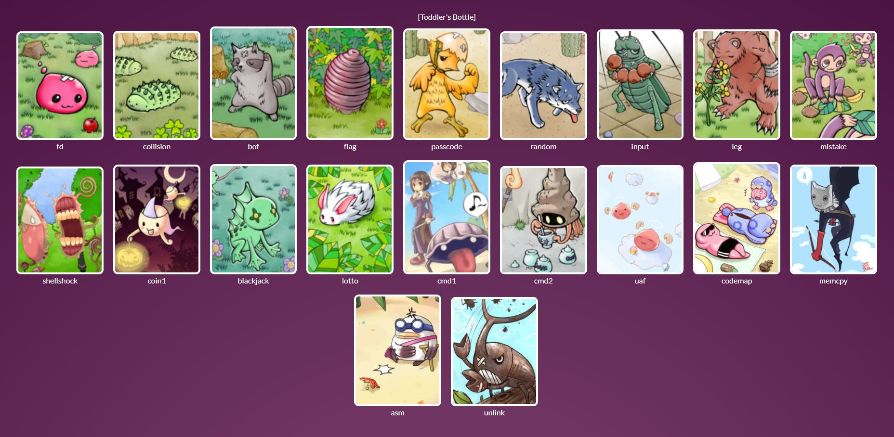

pwnable.kr
==========

 pwnable.kr의 낮은 점수대의 기초 문제를 함께 풀어보자!

---

fd
==

 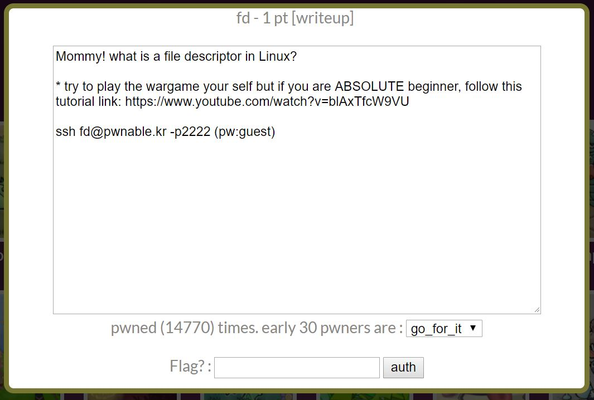

 pwnable.kr에 접속하여 fd 문제를 클릭하면 위와 같은 문제를 볼 수 있다. 문제의 내용은 'Mommy! what is a file descriptor in Linux?', '리눅스에서 file descriptor가 무엇인가요?'라고 물어보고 있다.

 putty로 pwnable.kr에 접속하여서 ID : fd, Password : guest를 입력하여 파일 목록을 확인해보았다.

 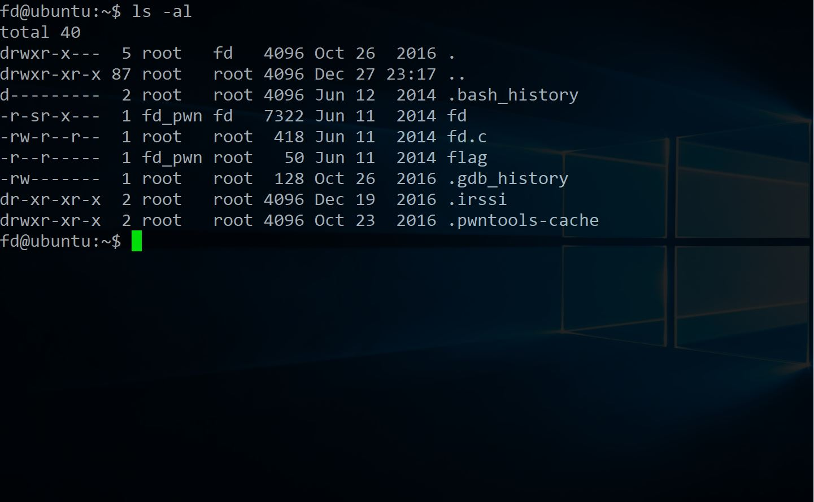

 fd라는 이름의 실행 파일과 소스 코드가 보인다. 열어보자!

 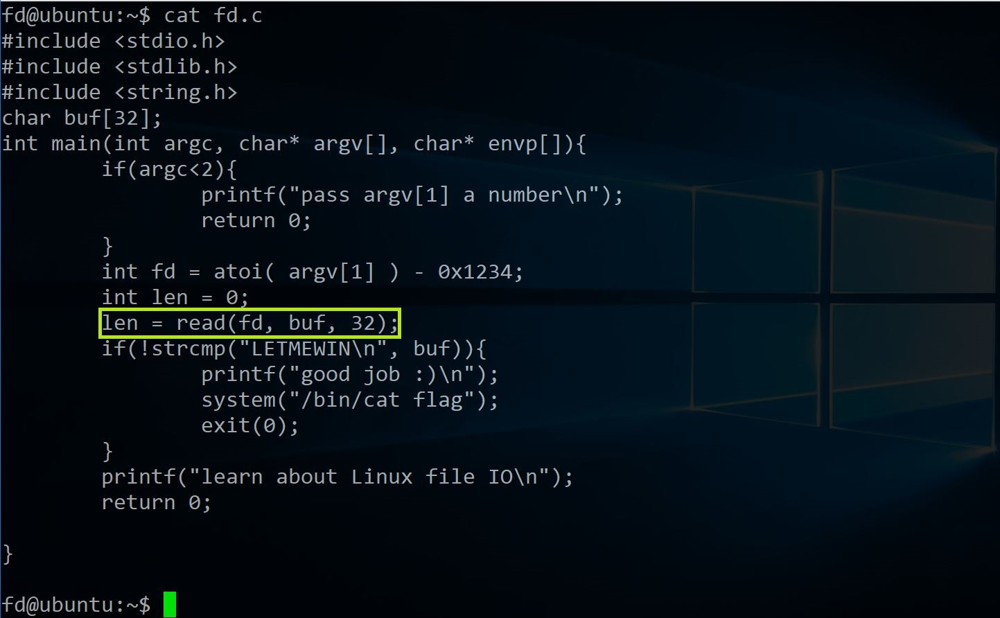

 딱히 이해하기 어려운 코드가 없어서 따로 주석은 달지 않았다. 대신 이번 문제에서 핵심이 되는 부분에 표시를 해두었다.

 코드를 살펴보면 buf를 할당하고 argv[1]에 인자를 받아 argv[1] - 0x1234 해준다. 이 때 사용된 atoi() 함수는 ASCII to Integer라는 뜻으로 문자열을 정수형으로 변환 해준다. 그리고 len 변수에 read() 함수를 사용하여 값을 저장한다.

 read() 함수 다음을 보면 "LETMEWIN\\n"과 buf의 내용을 비교한다. 그리고 buf의 내용이 "LETMEWIN\\n"과 같다면 문제가 성공적으로 풀리는 것 같다.

 그렇다면 buf에 "LETMEWIN\\n"을 어떻게 넣을지 생각 해봐야한다. 그냥 막 때려 넣지 말고 천천히 조심스럽게 정성을 다해 함께 넣어보자.

 코드를 보면 buf를 유일하게 사용하는 곳이 read() 함수이다. 그렇다면 read() 함수에 대해 알아보자.

 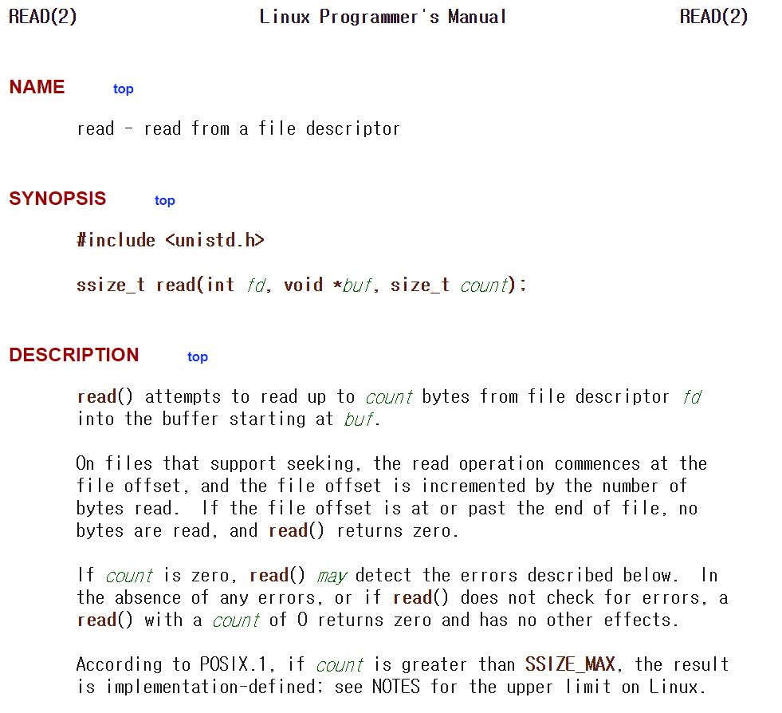

 read() 함수에 대한 가이드이다. 그렇다... 영어영어영어다.

 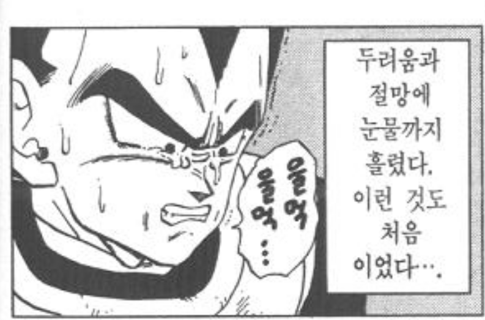

 두려움과 절망에 눈물을 흘릴 님들을 위해 직접 정리 해주겠다!

 우선, 맨 윗 줄을 보면 read - read from a file descriptor라고 적혀있다. file descriptor 정도는 알아 볼 수 있을 것이라고 믿어 의심치않는다. 즉, 우리가 찾는 file descriptor로부터 읽는다고 한다. 도대체 file descriptor가 무엇일까?

 file descriptor는 운영체제가 원활한 파일 관리를 위해 운영체제에서 파일에 부여한 가지고 있는 정수 번호이다. 이 번호가 0일 경우에는 표준 입력(STDIN)이 되고, 1일 경우 표준 출력(STDOUT), 2일 경우 표준 에러(STDERR)로 처리 된다.

 read() 함수에서는 인자 fd가 file descriptor의 역할을 한다. 이제 다시 read() 내용을 정리하면 fd로부터 count만큼을 읽어 buf에 써준다고 요약 할 수 있다.

 자! 지금부터 집중하자. fd 값은 atoi(argv[1]) - 0x1234이다. 즉, 0x1234와 같은 수를 인자로 넣으면 fd가 0이 되고, 1큰 수를 넣으면 1, 2큰 수는 2가 된다.

 buf에 담긴 값이 없으므로 우리가 직접 "LETMEWIN\n"을 넣어주어야 한다. 이 때 file descriptor, fd는 어떤 값이 되어야할까? buf에 아무 값도 없는데 1을 주어서 출력(STDOUT)을 할까? 아니면 멀쩡한 프로그램을 에러(STDERR) 처리를 해줄까?

 

 둘 다 재밌어보이지만 그냥 0(STDIN)을 넣어서 우리가 원하는 값을 buf에 입력 할 수 있도록 하자. ㅎㅎ

 fd가 0이 되려면 atoi(argv[1]) - 0x1234 결과 값이 0이어야 한다. 즉, 0x1234를 다시 10진수로 바꿔서 인자로 전달하면 된다. 0x1234는 10진수 4660이다.

 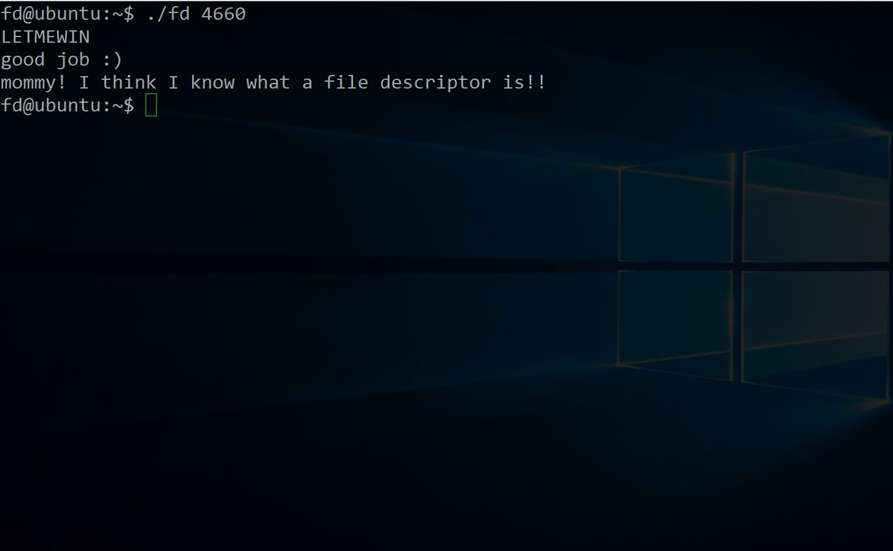

 4660을 인자로 실행 시킨 결과 성공적으로 동작 하였다. good job :)

 아래의 문구를 fd의 flag에 제출하면 pwnable.kr님이 축하해 줄 것이다. 그럼, 가볍게 웃으며 you're welcome이라고 큰 소리로 외치면 1pt를 받을 수 있다.

---

collision
=========

 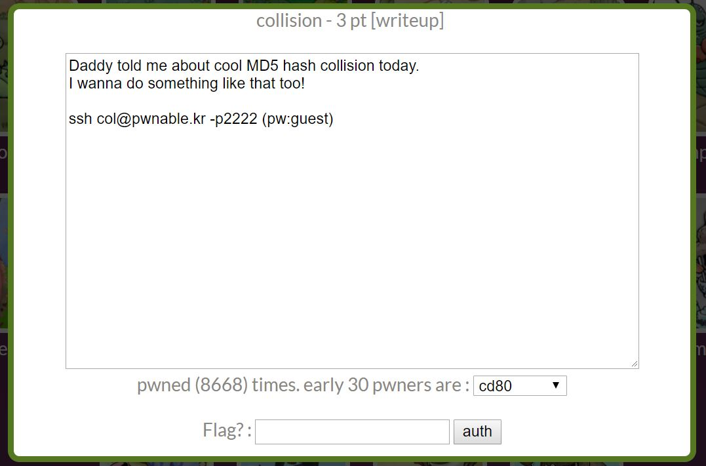

 Daddy told me about cool MD5 hash collision today. I wanna do something like that too!

 아빠가 cool한 MD5 hash collision에 대해 말해주었어. 나도 비슷한 걸 해보고 싶어!

 이번 문제는 MD5 hash collision에 관한 내용인 것 같다. 여기서 문제. 아빠와 아들 중 누가 더 잘못했을까?

 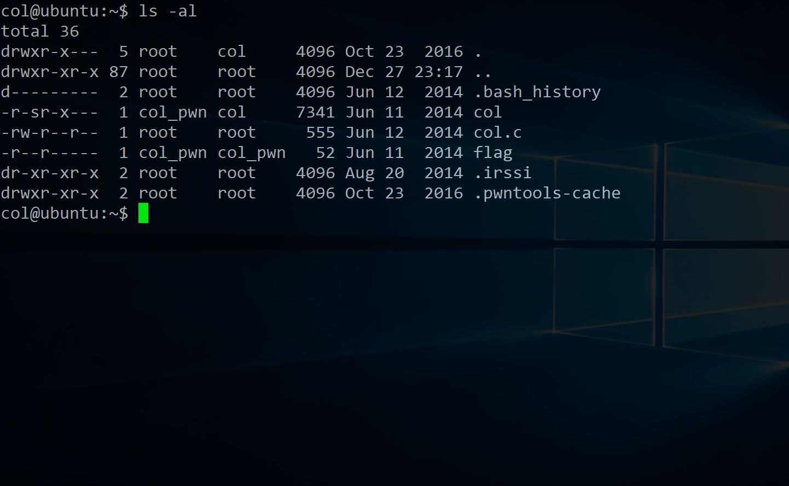

 ID : col, Password : guest로 접속해주면 된다. 파일 목록을 보니 col 실행 파일과 소스 파일이 보인다. 역시나 열어보자!

 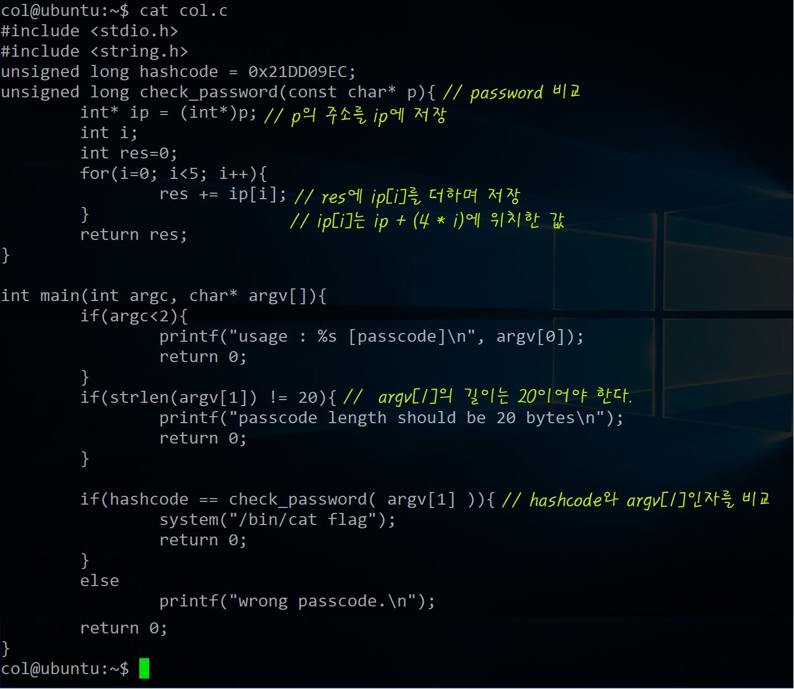

 친절하게 주석을 달아 놓았다! 코드 내용을 정리하면 인자로 전달한 값을 4 byte씩 잘라서 더한 값이 hashcode의 값과 같으면 된다.

 i는 1씩 증가하는데 왜 4 byte씩 자르냐고 물어보면...

 

 그냥 같이 알아보자. int는 4 byte 자료형이기 때문이라고 말할 수 있다. ip[i]로 표현해서 알아보기가 조금 어려울 수도 있지만 ip + i라고 보면 조금 더 이해하기 쉬울 수도 있다.

 ip는 저장된 data가 아니라 주소를 가리키므로 ip + i를 하면 ip에서 int(4 byte)만큼 떨어진 다음 주소를 가리키게 되어 4 byte를 더해주는 것과 같은 셈이다.

 결과적으로 4 byte씩 5개의 값을 더한 값이 hashcode와 같은 0x21DD09EC여야 한다. 5개인 이유는 길이 20 byte를 만족하기 위해서이다!

 그럼, 가장 간단하게 00000000 + 00000000 + 00000000 + 00000000 + 21DD09EC를 생각 할 수 있다.

 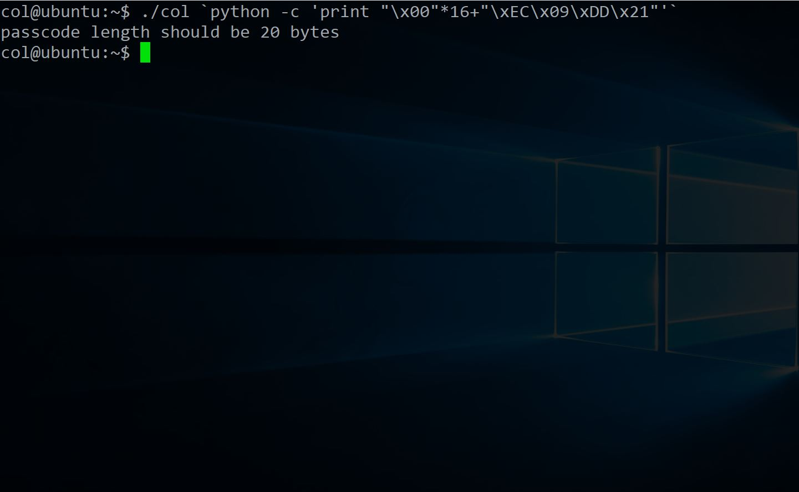

 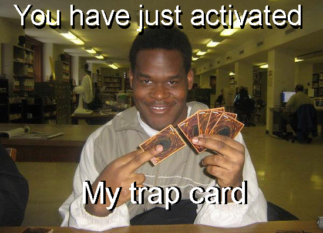

 우왕! 함정에 빠져버렸다.

 "\\x00"은 NULL byte를 의미한다. NULL byte는 문자열의 끝을 의미하는 것과 같다. 그러므로 우리는 "끝끝끝끝끝끝끝끝끝끝끝끝끝끝끝끝"을 전달해버렸다. 그러니 컴파일러는 이미 문자열이 끝났다고 받아드려 뒤에 값이 전달되지 못하는 것이다.

 이를 해결하기 위해 "\\x01"을 16개 전달해주자. 다행히도 20 byte를 더한 값이 0x21DD09EC와 같으면 되기 때문에 0x21DD09EC에서 0x01010101을 4번 빼주면 된다.

> 0x21DD09EC - (0x01010101 * 4) = 0x1DD905e8

 최종적으로 전달 해 줄 값은 01010101 + 01010101 + 01010101 + 01010101 + 1DD905e8이다.

 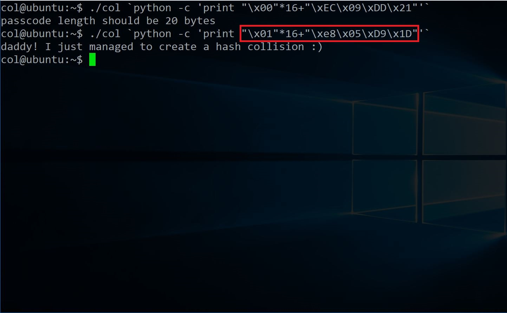

 문제를 성공적으로 해결하였다! 마찬가지로 pwnable.kr로 이동해서 위 문구를 제출해주자.

---

bof
===

 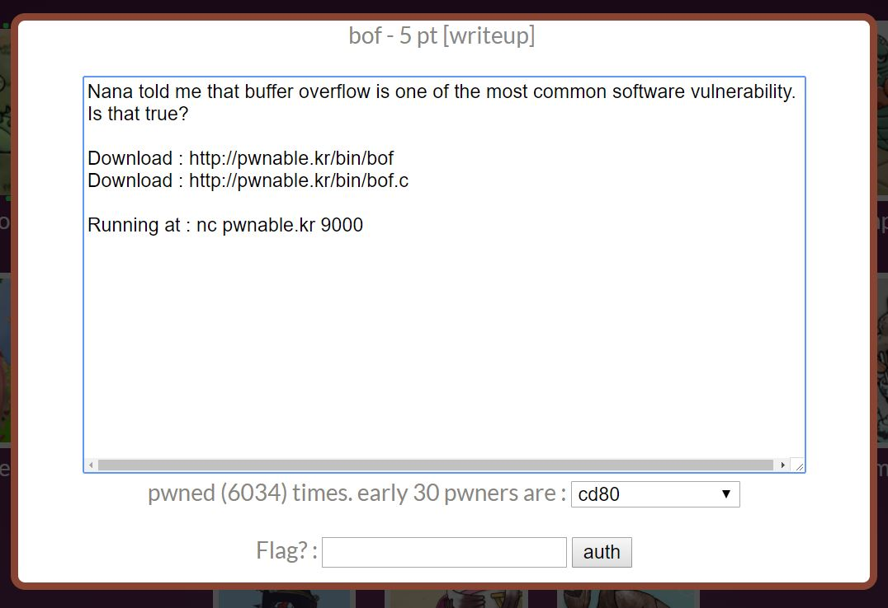

 NaNa told me that buffer overflow is one of the most common software vulnearability. Is that true?

 할머니께서 내게 buffer overflow는 가장 보통의 소프트웨어 취약점이라고 말해 주셨다. Is that true?

 

 Yes! Okey dokey yo! 그렇다. 언제나 할머니의 말씀은 옳다. 이번 문제는 buffer overflow에 관한 문제이다. 그리고 pwnable.kr에 9000번 포트로 접속하여 최종 실행을 하라고 말해주고 있다.

 위 다운로드 링크로 이동해 소스 코드를 보자.

 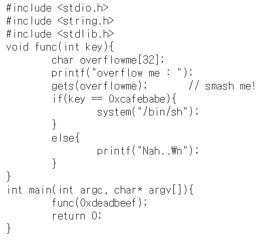

 코드는 간단하다. 친절하게도 overflowme라고 이름부터 자신을 overflow 시켜달라고 말하고 있다. smash me!라는 부분에서 m 성향이 매우 강한 이 아이를 마음껏 후려쳐주면 overflow가 될 것 같다!

 func() 함수에서 overflow를 일으켜야 하니 func()의 스택 프레임을 생각해보자.

 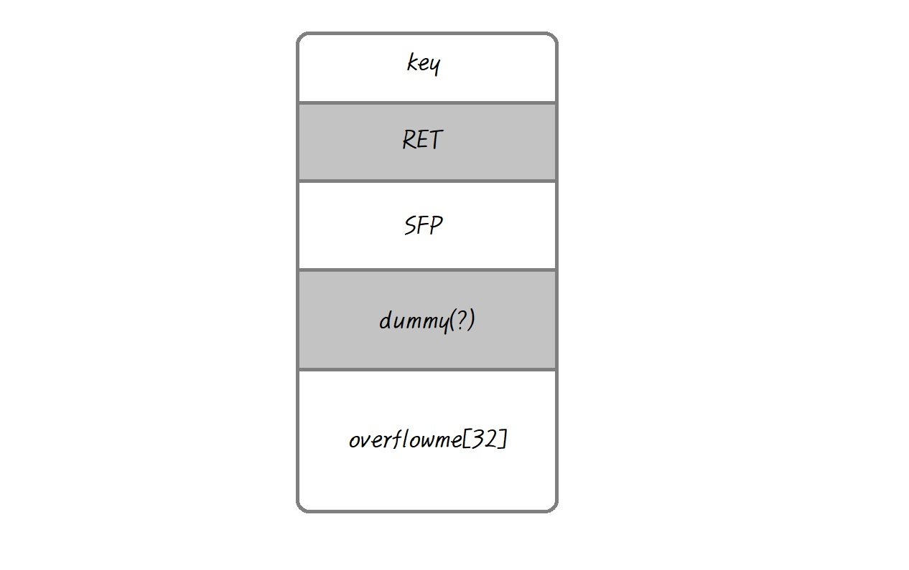

 스택은 위와 같이 구성 될 것이다. 우리의 목표는 overflowme를 overflow 시켜서 key에 저장된 값을 바꾸는 것이다. 페이로드를 구성해야 하는데 dummy byte로 자신을 숨기고 있다.

 gdb로 홀딱 벗겨주자(?).

 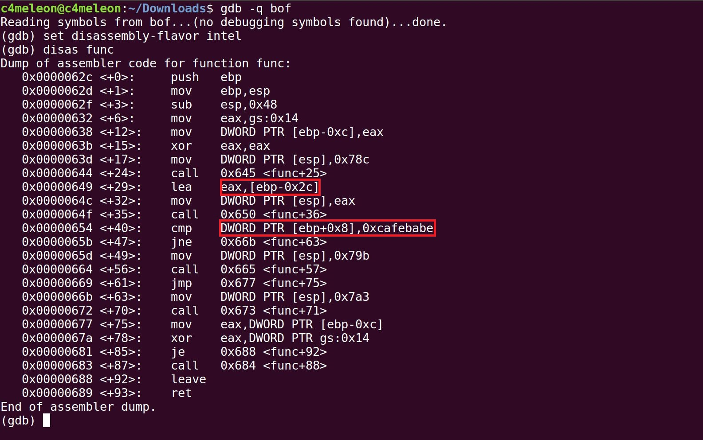

 

 드디어 녀석이 사악하고 악랄한 속내를 드러내었다.

 c코드를 보면 두 번째 함수 호출 지점에서 gets() 함수를 호출하고 인자로 overflowme를 전달한다. 그럼 당연히 gdb에서도 똑같이 두 번째 함수 호출 지점은 gets() 일 것이고, 인자는 역시나 overflowme이다.

 위 assembly코드를 보면 두 번째 함수가 호출 되면서 ebp-0x2c 지점을 인자로 사용한다. 즉, 이 곳이 overflowme 변수가 위치한 지점이다. 그리고 func() 함수의 인자인 key는 당연히 ebp+8 지점에 위치하고 있다. cmp 비교문을 통해서도 key의 위치를 알 수 있다.

 0x2c는 10진수로 44이다. 즉, overflowme + dummy = 44 byte이다. 그러므로 overflowme에서 key까지의 총 거리는 overflowme(32 byte) + dummy(12 byte) + SFP(4 byte) + RET(4 byte) = 52 byte이다.

 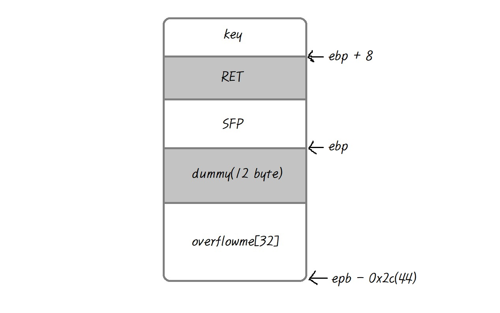

 우리가 모은 정보를 종합해보면 위와 같다. 이제 52 byte를 dump 시키고 key 값을 0xcafebabe로 바꿔주기만 하면 프로그램은 system("/bin/sh")을 실행 시켜 줄 것이다.

 

 렛츠기릿~!

 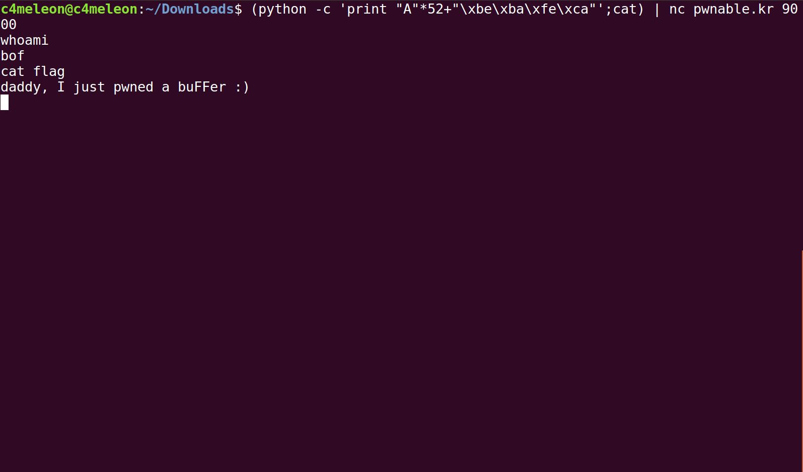

 앞서 언급한대로 nc pwnable.kr 9000 환경에서 bof를 실행시켰고, 52 byte를 dump 시켜 key 값을 0xcafebabe로 바꿔주었다. 성공적으로 쉘을 따서 flag를 얻었다. flag를 입력해주고 다음 단계로 가즈아~!

---

flag
====

 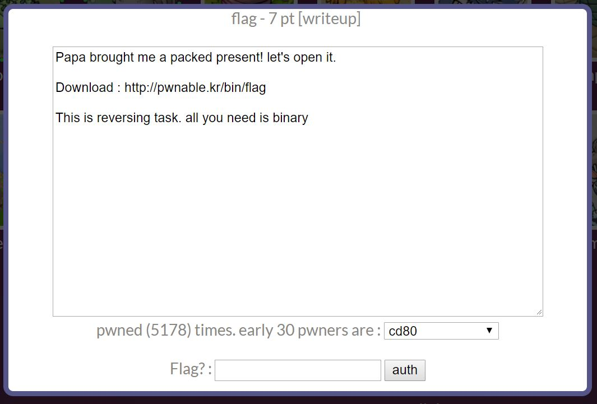

 '아빠가 나에게 packed된 선물을 줬다. 열어보자!'라는 문구와 함께 아래에 '이것은 reversing task이다. 너는 바이너리가 필요하다'라고 한다.

 

 아..ㅇ..ㅏ..버지... 조...조흔..선물이..였어..ㅇ...ㅛ..

 마찬가지로 download 링크에서 파일을 다운 받으면 된다.

 

---

passcode
========

 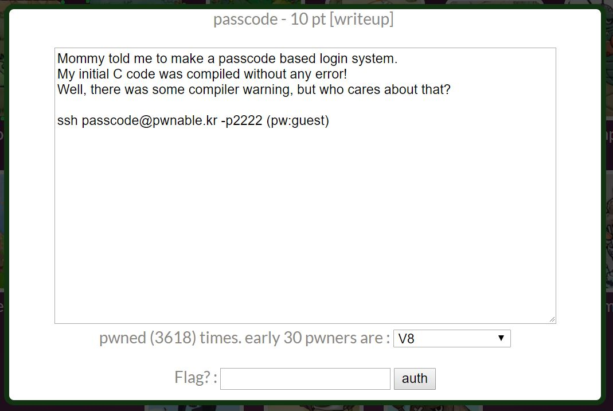

 엄마가 passcode 기반의 login system을 만들라고 했어. 내 C code는 에러 없이 컴파일 되었어! 음, compiler warning이 있긴 했는데, 누가 거기에 신경 써?

 

 신경 써... 가끔은 신경도 써주고 그래..

 후.. 우리가 compiler warning에게 따뜻한 관심을 가져주자.

 ID : passcode, Password : guest로 접속하면 된다. 파일 목록을 확인하고 passcode 실행 파일과 소스 파일이 있는 것을 확인하였다.

 passcode.c 소스 파일을 열어보자.

 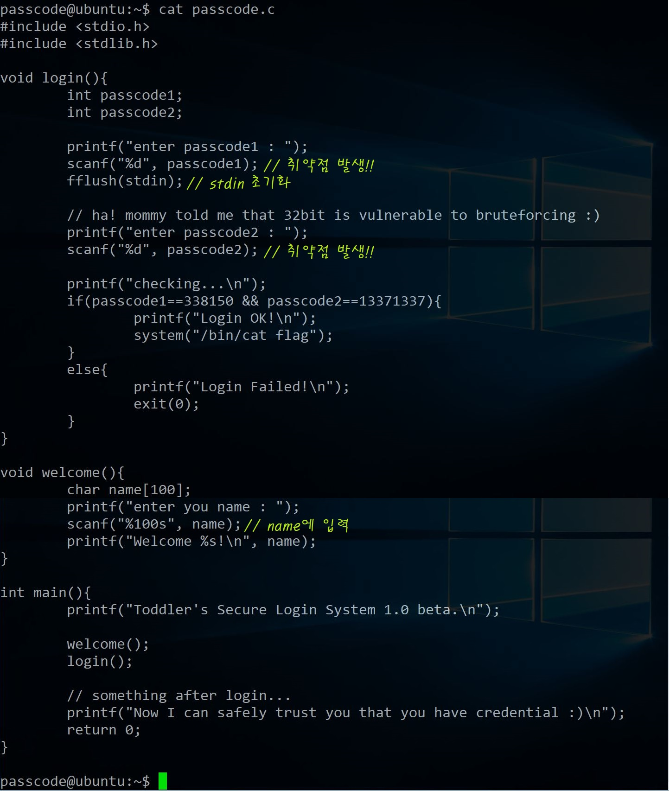

 코드는 간단하다. welcome() 함수와 login() 함수를 호출하고 문자열을 출력한다. welcome() 함수에서는 name을 입력받고, login() 함수에서는 passcode1과 passcode2에 입력을 받아 값을 비교하여 값이 조건문과 같으면 system() 함수를 실행 시킨다.

 우리가 주의 깊게 봐야할 곳은 login() 함수의 scanf() 부분이다. 주석으로 볼 수 있듯이 이 곳이 compiler warning을 내는 곳이자 취약점이 발생하는 곳이다.

 어떤 취약점이 발생하느냐! welcome() 함수를 보게 되면 scanf("%100s", name); 구문이 존재한다. 이때 scanf의 두 번째 인자로 name이 들어가는데 이 값은 name[100] 배열의 주소 값을 의미한다. 즉, 위 코드를 아래와 같이 고쳐도 똑같이 동작 할 것이다.

> scanf("%100s", &name[0]);

 위 코드를 통해 알 수 있는 점은 scanf() 함수는 변수의 주소 값을 인자로 받아 그 주소에 데이터를 입력 받고 저장한다는 것이다. 그러나 login() 함수의 scanf("%d", passcode1);와 scanf("%d", passcode2); 구문은 주소 값이 아닌 변수의 값이 전달 되었다.

 

 정상적인 흐름이라면 passcode의 주소를 참조하여 passcode가 위치한 곳에 값을 저장하게 되지만 현재의 코드대로라면 passcode 변수의 값을 주소로 받아드려 이 곳에 값을 저장하게 된다.

> int passcode = 0x12341234;  scanf("%d", &passcode); // passcode의 주소에 값을 입력  scanf("%d", passcode); // passcode의 변수 값 0x12341234에 값을 입력

 그렇다면 우리 코드에서 passcode1과 passcode2의 값이 무엇인지 알아야 데이터가 입력되는 곳의 주소를 알 수 있다. gdb를 열어서 passcode1과 passcode2의 값을 알아보자.

 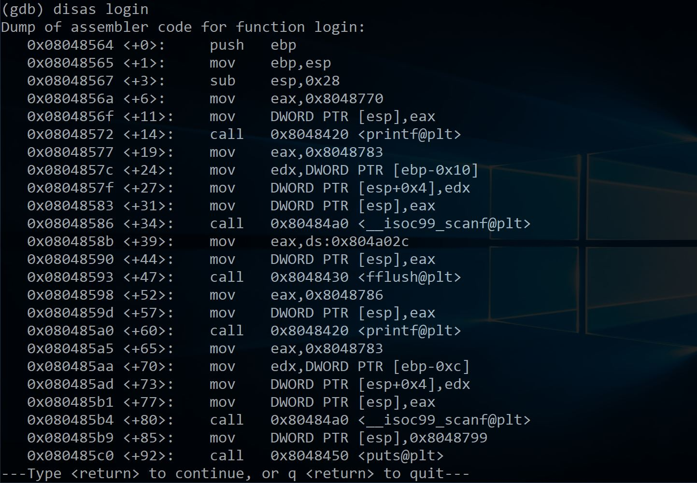

 scanf() 함수로 전달되는 인자를 보면 passcode1은 ebp-0x10의 위치에, passcode2는 ebp-0xc의 위치에 있는 것을 알 수 있다. 여기에 저장되어 있는 값들이 주소로 사용되어 값을 입력 받는 것이다.

 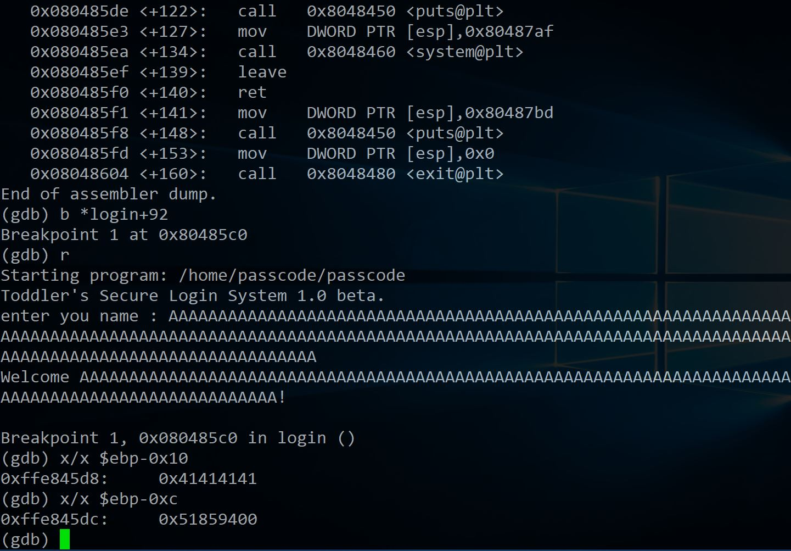

 두 번의 scanf()가 모두 끝난 지점에 break point를 걸고 실행 시켰다. name을 입력해주면 break point를 만난다.

 passcode1의 주소는 0xffe845d8이다. 정상적인 동작이였다면 이 주소에 값을 입력 받지만 현재는 &(역참조 연산자)가 없는 상태이므로 passcode1의 변수 값인 0x41414141에 값을 입력받게 된다.

 

 벌써, 눈치챘겠지만 0x41414141은 AAAA의 ASCII code이다. 그 말은 passcode1은 name 배열 어딘가와 같은 위치에 있다는 것이다. 또, 더 나아가 name 배열의 어딘가를 알아내면 그 곳에 우리가 원하는 주소를 대입 할 수 있고 scanf("%d", passcode1);의 취약점을 이용하여 원하는 값을 입력 할 수 있다.

 반면에 passcode2의 주소는 0xffe845dc이고, 저장된 값 0x51859400이 보인다. AAAA가 저장된 바로 다음 4 byte의 주소인 점과 첫 byte가 NULL인 것을 미루어 짐작 해보았을 때 name 베열 영역의 다음 4 byte인 것 같다.

 그 말은 즉, passcode1의 위치 0xffe845d8은 name[96]과 같다고 할 수 있다.

 코드에서 cat flag를 실행 시켜주는 조건인 passcode1\=\=338150 && passcode2\=\=13371337을 만족시키기 위해 특정 주소에 이 값들을 담아 놓고 passcode1과 passcode2의 값을 특정 주소로 변경시켜주면 되겠지만, ASLR이 적용되어 힘들 것 같다.

 

 그럼 도대체 어떻게 풀라는 걸까?

 그러게.

 라고 하고 끝내고 싶지만 우리에겐 한 줄기 동아줄이 있기 때문에 계속 진행해보자. 썩은 건지 아닌지는 비밀 \>\_\<

 앞에서 name의 어딘가의 passcode1의 위치를 알아내면 원하는 주소에 원하는 값을 쓸 수 있다고 하였다. 이게 무슨 뜻일까?

 바로 GOT Overwrite 공격을 시도 할 수 있다는 얘기이다. 코드를 보면 1번 호출하는 fflush() 함수가 보일 것이다. stdin을 초기화 하는 함수로 프로그램 진행상 큰 영향을 주지 않으므로 이 함수의 got를 overwrite 시키자!

 앞서, passcode1은 name[96]에 위치한다는 것을 알았으므로 이 영역에 fflush@got의 주소를 넣어주면 된다. 그렇게 되면 scanf("%d", passcode1);은 passcode1의 값을 주소로 사용하여 fflush@got 주소에 값을 입력 받게 된다. 그리고 최종 목표인 system("/bin/cat flag")의 주소를 입력하게 되면 fflush@got는 system("/bin/cat flag")의 주소로 덮어쓰여 system("/bin/cat flag")를 호출하게 된다.

 페이로드를 정리해보면 name[100](dummy 96 byte + fflush@got) + scanf(system("/bin/cat flag")'s Address)가 되겠다.

 이제 fflush@got 주소와 system("/bin/cat flag")의 주소만 알아내면 된다.

 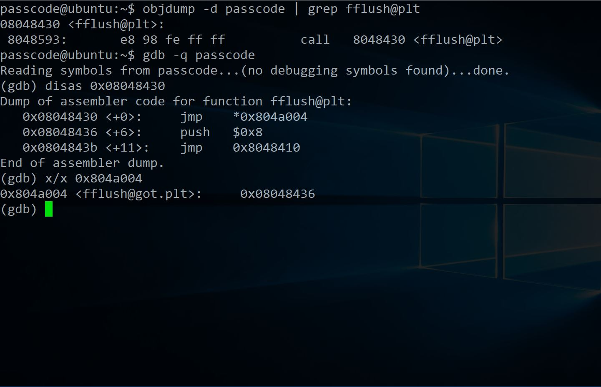

 fflush@got의 주소는 0x0804a004인 것을 확인하였다.

 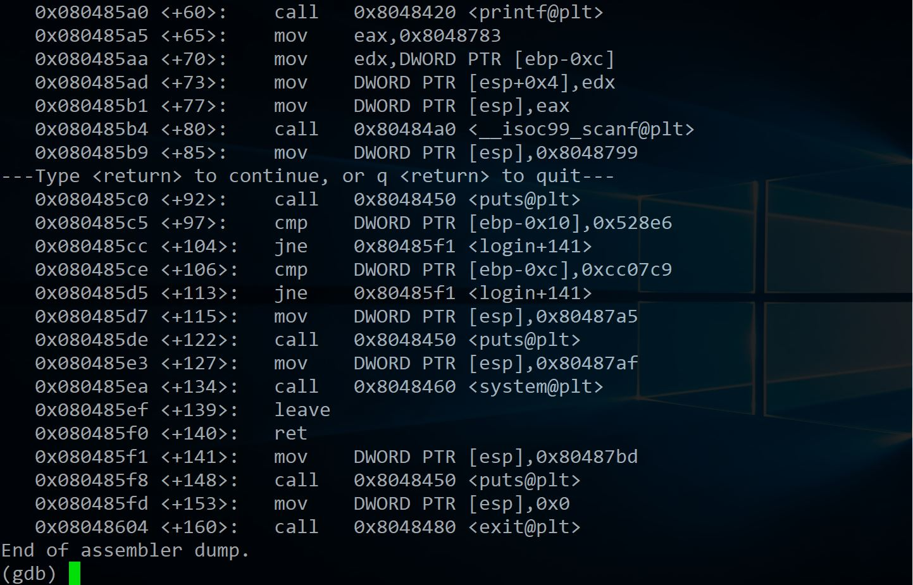

 system("/bin/cat flag")를 호출하는 login() 함수를 disassemble 하여 시작 주소 0x080485e3 얻었다.

 이제 이 주소들로 페이로드를 채워 공격을 시도하면 되는데 마지막으로 주의해야 할 점 하나가 남았다. scanf("%d", passcode1)은 입력을 정수형으로 받기 때문에 입력하는 주소 0x080485e3을 10진수로 입력 해주어야한다. 0x080485e3은 10진수 134514147이다.

 이제 드디어! 공격을 시도해보자.

 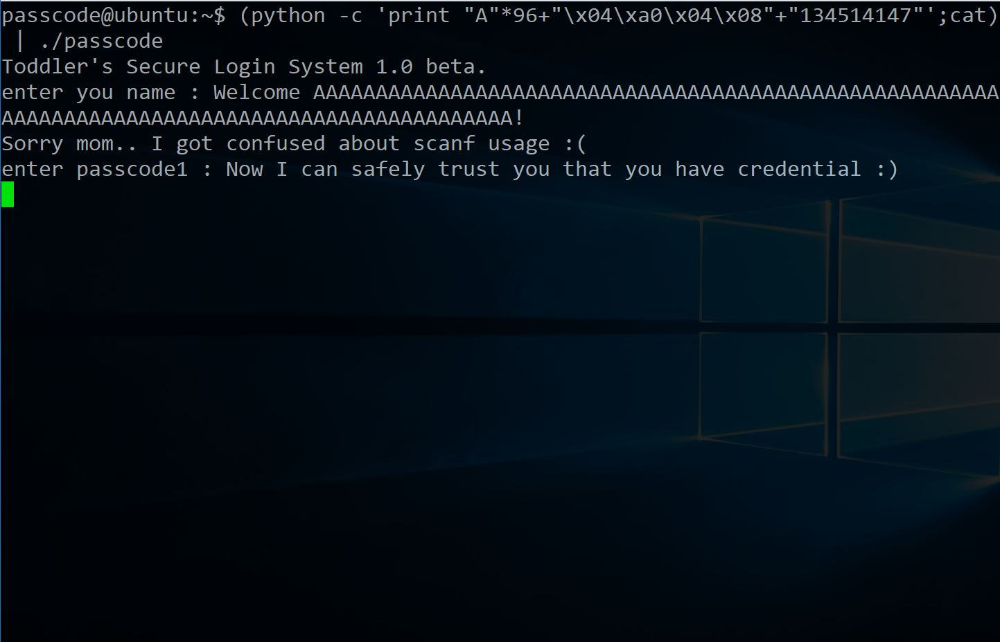

 login에 실패 하였을 때 출력되는 login failed가 출력되지 않고 올바르게 cat flag 명령이 실행 되었다!

 

 다행히도 썩은 동아줄이 아니였다. flag를 제출하고 다음 단계로 넘어가자!

---

random
======

 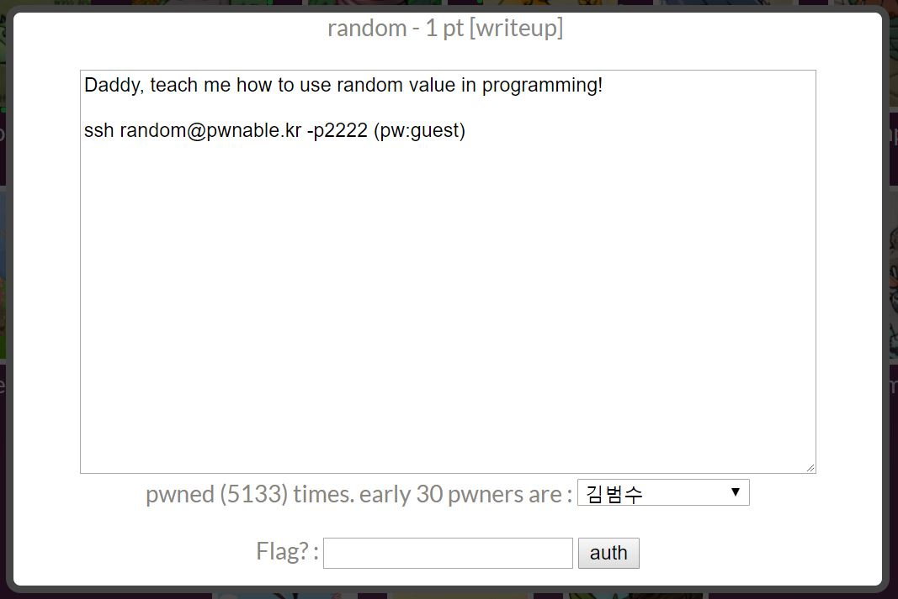

 아빠, 프로그램에서 random value를 사용하는 법을 가르쳐주세요!

 
